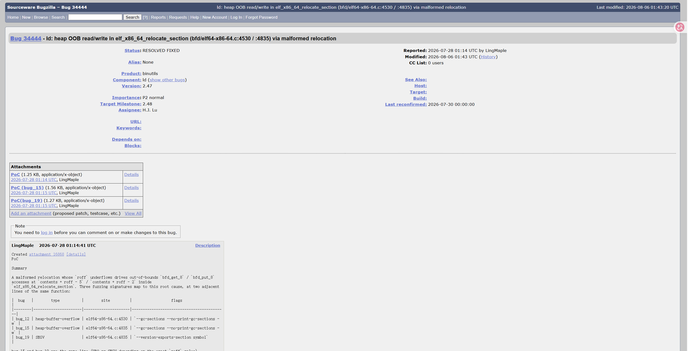
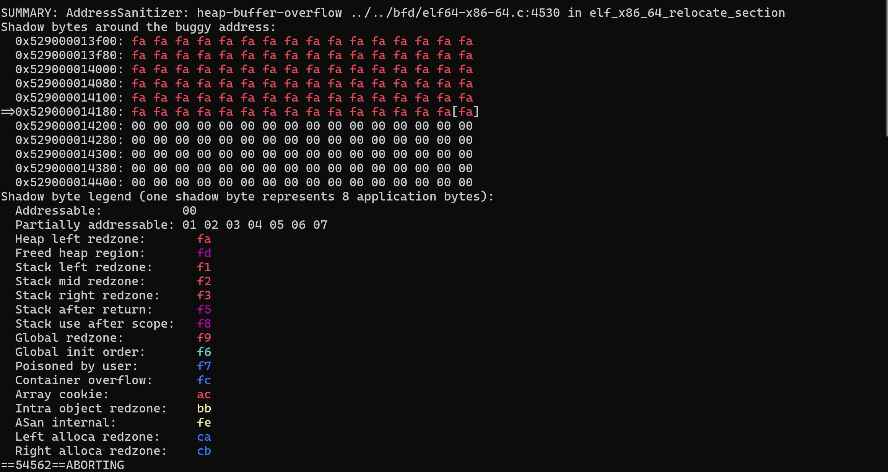
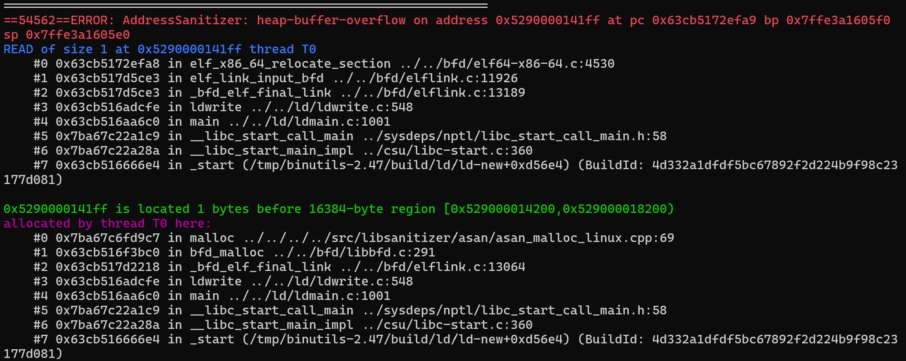
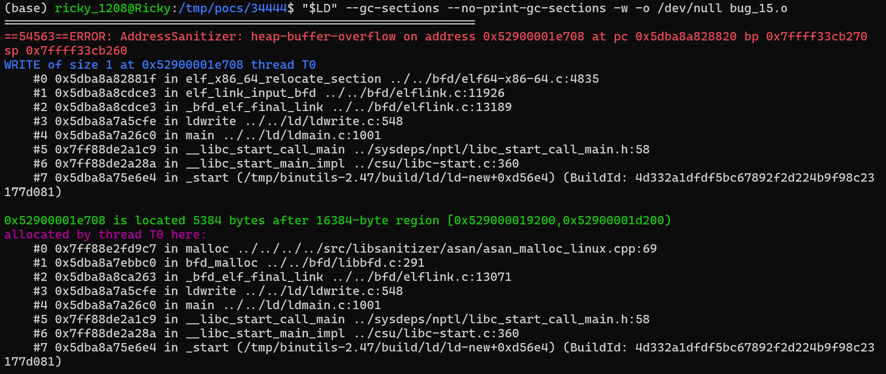
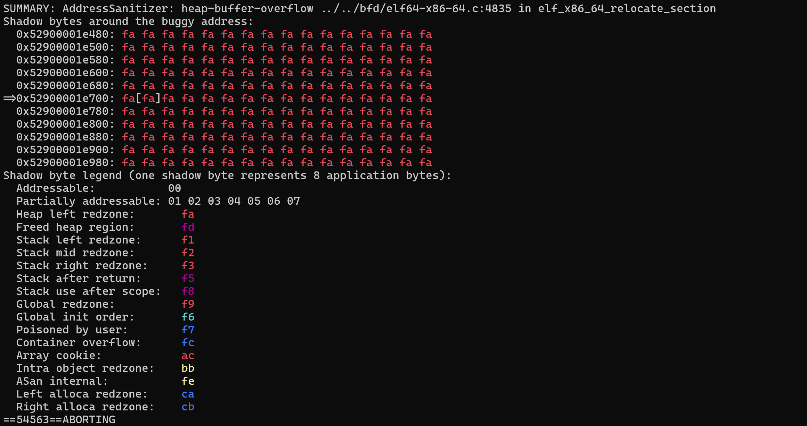
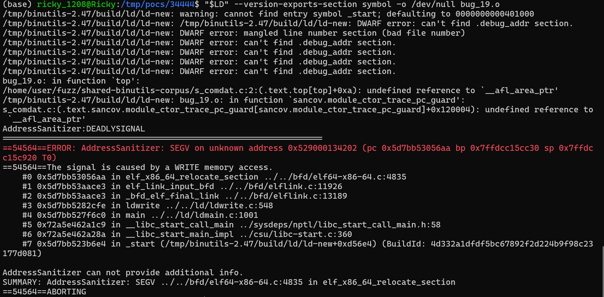

# Heap OOB read/write and SEGV in `elf_x86_64_relocate_section` (bfd/elf64-x86-64.c:4530 / :4835) via malformed relocation

- **Project:** GNU Binutils
- **Component:** `ld` (GNU linker)
- **Affected version:** 2.47 (version date `20260726`)
- **Bugzilla:** https://sourceware.org/bugzilla/show_bug.cgi?id=34444
- **Crash site:** `bfd/elf64-x86-64.c:4530` and `:4835` (`elf_x86_64_relocate_section`)
- **Bug class:** Heap out-of-bounds read, heap out-of-bounds write, NULL/invalid pointer write (SEGV)
- **Discoverer:** r1ck9
- **Date:** 2026-08-09
- **Related:** bug 33502 (same crash site)
- **Fix:** commit `471130b39c03623ec6d78ece377ff4da3f6bfe7b` (PR ld/34444, PR ld/34448) — fixed for 2.48

## Summary

A malformed relocation whose `roff` underflows drives out-of-bounds `bfd_get_8` / `bfd_put_8` accesses at `contents + roff - 5` / `contents + roff - 2` inside `elf_x86_64_relocate_section`. Three fuzzing signatures map to this root cause, at two adjacent lines of the same function:

| bug | type | site | flags |
|--------|----------------------|---------------------|-------------------------------------------|
| bug_12 | heap-buffer-overflow | elf64-x86-64.c:4530 | `--gc-sections --no-print-gc-sections -w` |
| bug_15 | heap-buffer-overflow | elf64-x86-64.c:4835 | `--gc-sections --no-print-gc-sections -w` |
| bug_19 | SEGV | elf64-x86-64.c:4835 | `--version-exports-section symbol` |

`bug_15` and `bug_19` are the same line (HBO vs SEGV depending on the exact `roff` value).

Likely one root cause (unvalidated `roff` against `contents` size); filed as a single issue listing all three sites. Security-relevant — heap OOB write on the relocation contents buffer.

This is the same crash site as previously-reported bug 33502.

## Affected versions

- binutils 2.47 (release tarball, version date `20260726`) — all three reproduced.
- Originally triaged on dev snapshot `2.47.50.20260722` (commit `640a79623`).

## Reproduction

### Build (ASAN)

```bash
wget https://ftp.gnu.org/gnu/binutils/binutils-2.47.tar.gz
tar xzf binutils-2.47.tar.gz
cd binutils-2.47
mkdir build && cd build

CC=gcc CFLAGS='-g -O1 -fsanitize=address -fno-omit-frame-pointer -fno-common' \
LDFLAGS='-fsanitize=address' \
../configure --disable-gdb --disable-gdbserver --disable-sim --disable-cet \
            --disable-werror --disable-nls --enable-targets=x86_64-linux-gnu MAKEINFO=true
make -j
```

### Run

```bash
export ASAN_OPTIONS="abort_on_error=0:symbolize=1:detect_leaks=0:allocator_may_return_null=1:halt_on_error=1"
ld --gc-sections --no-print-gc-sections -w -o /dev/null bug_12.o   # :4530 HBO
ld --gc-sections --no-print-gc-sections -w -o /dev/null bug_15.o   # :4835 HBO
ld --version-exports-section symbol -o /dev/null bug_19.o          # :4835 SEGV
```

(Use the freshly-built `ld-new` from `build/ld/ld-new`.)

### ASAN output

`bug_12` (:4530 HBO — read):

```
==54562==ERROR: AddressSanitizer: heap-buffer-overflow on address 0x5290000141ff at pc 0x63cb5172efa9 bp 0x7ffe3a1605f0 sp 0x7ffe3a1605e0
READ of size 1 at 0x5290000141ff thread T0
    #0 elf_x86_64_relocate_section ../../bfd/elf64-x86-64.c:4530
    #1 elf_link_input_bfd          ../../bfd/elflink.c:11926
    #2 _bfd_elf_final_link         ../../bfd/elflink.c:13189
    #3 ldwrite                     ../../ld/ldwrite.c:548

0x5290000141ff is located 1 bytes before 16384-byte region [0x529000014200,0x529000018200)
SUMMARY: AddressSanitizer: heap-buffer-overflow ../../bfd/elf64-x86-64.c:4530 in elf_x86_64_relocate_section
```

`bug_15` (:4835 HBO — write):

```
==54563==ERROR: AddressSanitizer: heap-buffer-overflow on address 0x52900001e708 at pc 0x5dba8a828820 bp 0x7ffff33cb270 sp 0x7ffff33cb260
WRITE of size 1 at 0x52900001e708 thread T0
    #0 elf_x86_64_relocate_section ../../bfd/elf64-x86-64.c:4835
    #1 elf_link_input_bfd          ../../bfd/elflink.c:11926
    #2 _bfd_elf_final_link         ../../bfd/elflink.c:13189
    #3 ldwrite                     ../../ld/ldwrite.c:548

0x52900001e708 is located 5384 bytes after 16384-byte region [0x529000019200,0x52900001d200)
SUMMARY: AddressSanitizer: heap-buffer-overflow ../../bfd/elf64-x86-64.c:4835 in elf_x86_64_relocate_section
```

`bug_19` (:4835 SEGV):

```
==54564==ERROR: AddressSanitizer: SEGV on unknown address 0x529000134202 (pc 0x5d7bb53056aa bp 0x7ffdcc15cc30 sp 0x7ffdcc15c920 T0)
==54564==The signal is caused by a WRITE memory access.
    #0 elf_x86_64_relocate_section ../../bfd/elf64-x86-64.c:4835
    #1 elf_link_input_bfd          ../../bfd/elflink.c:11926
    #2 _bfd_elf_final_link         ../../bfd/elflink.c:13189
    #3 ldwrite                     ../../ld/ldwrite.c:548
SUMMARY: AddressSanitizer: SEGV ../../bfd/elf64-x86-64.c:4835 in elf_x86_64_relocate_section
```

### Screenshots













## Root cause

`elf_x86_64_relocate_section` derives `roff` from `rela.r_offset` and uses it to index into the section contents buffer:

```c
// bfd/elf64-x86-64.c:4530 / :4835
bfd_get_8 (input_bfd, contents + roff - 5);    // :4530
bfd_put_8 (input_bfd, ..., contents + roff - 2); // :4835
```

When the input ELF's relocation entry yields a `roff` smaller than 5 (or 2), `roff - 5` / `roff - 2` underflows unsigned, causing access to memory before the `contents` buffer.

## Impact

- `bug_15` / `bug_19`: heap OOB write — controlled-write primitive potentially achievable, may escalate to code execution.
- `bug_12`: heap OOB read — can leak adjacent heap memory.
- Affects any pipeline that links untrusted object files: CI/CD, distro build systems, source-audit sandboxes.
- Since `ld` typically runs as the build account, compromise can poison build artifacts and affect downstream users.

## Workaround

- Do not pass `--gc-sections -w` or `--version-exports-section` against untrusted `.o`/`.a` files.
- Audit object-file provenance in CI/CD and build systems.
- Run linking steps inside a sandboxed/containerized environment.

## Fix

Fixed upstream for 2.48 by commit `471130b39c03623ec6d78ece377ff4da3f6bfe7b` (H.J. Lu):

> x86: Check invalid GOT/PLT/TLS relocations
>
> 1. Since non-alloc sections aren't checked for TLS, GOT and PLT usages,
>    relocate_section should issue error for TLS, GOT and PLT relocations in
>    non-alloc and non-debugging sections.
> 2. Since TLS relocations must be against thread local symbols, scan_relocs
>    should issue an error for TLS relocation against non-thread local symbol.
>
>     PR ld/34444
>     PR ld/34448

Patch URL: https://sourceware.org/git/gitweb.cgi?p=binutils-gdb.git;h=471130b39c03623ec6d78ece377ff4da3f6bfe7b

## References

- Bugzilla: https://sourceware.org/bugzilla/show_bug.cgi?id=34444
- Fix commit: https://sourceware.org/git/gitweb.cgi?p=binutils-gdb.git;h=471130b39c03623ec6d78ece377ff4da3f6bfe7b
- Related bug 33502: https://sourceware.org/bugzilla/show_bug.cgi?id=33502
- binutils 2.47: https://ftp.gnu.org/gnu/binutils/binutils-2.47.tar.gz
