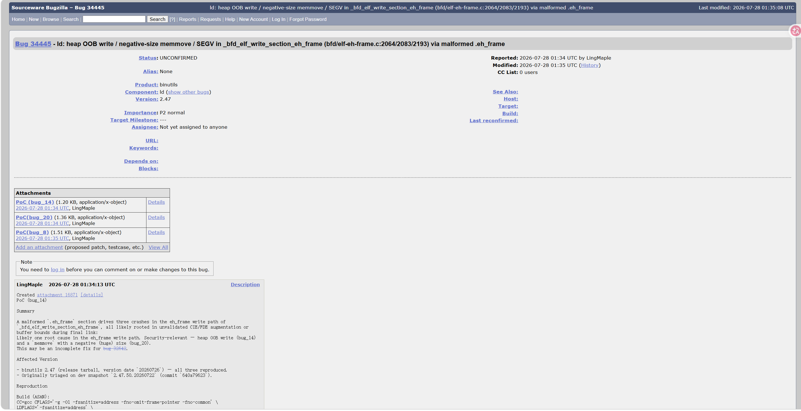
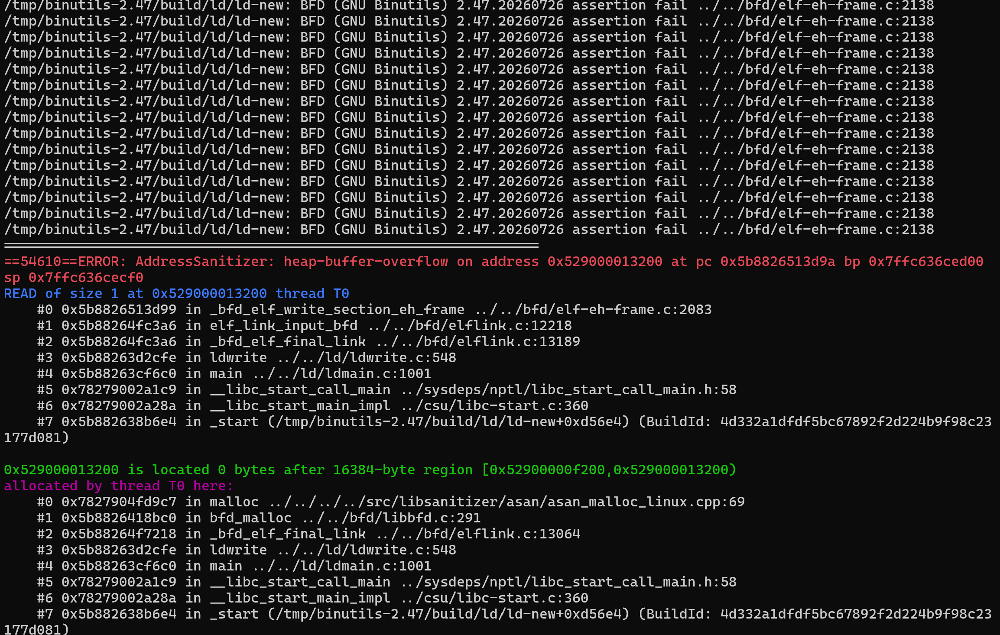
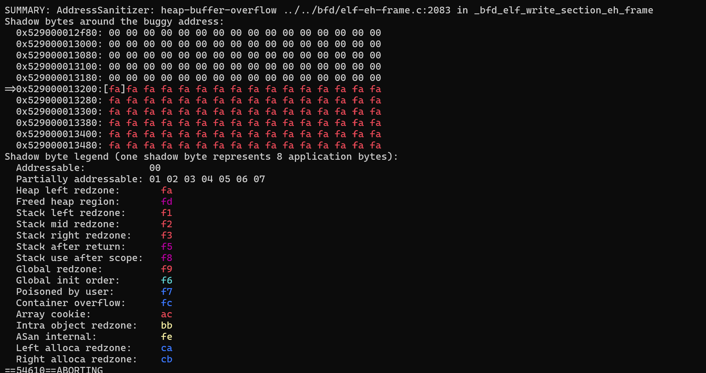
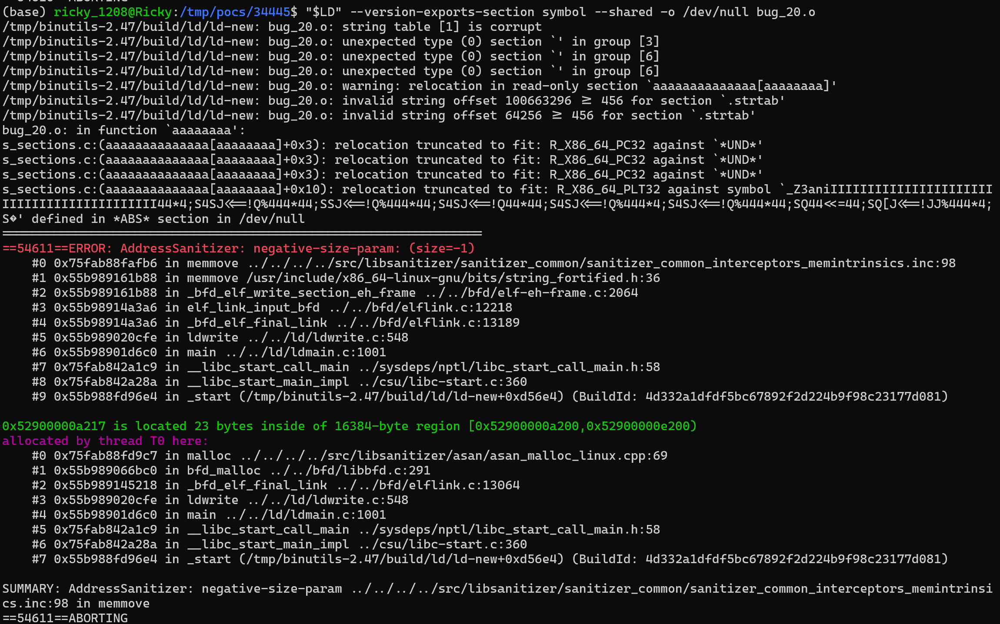
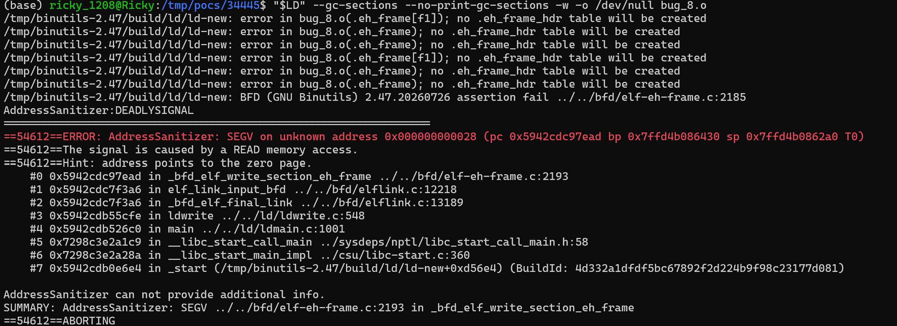

# Heap OOB write / negative-size `memmove` / SEGV in `_bfd_elf_write_section_eh_frame` (bfd/elf-eh-frame.c:2064 / :2083 / :2193) via malformed `.eh_frame`

- **Project:** GNU Binutils
- **Component:** `ld` (GNU linker)
- **Affected version:** 2.47 (version date `20260726`)
- **Bugzilla:** https://sourceware.org/bugzilla/show_bug.cgi?id=34445
- **Crash site:** `bfd/elf-eh-frame.c:2064`, `:2083`, `:2193` (`_bfd_elf_write_section_eh_frame`)
- **Bug class:** Heap out-of-bounds write (read at :2083), negative-size `memmove` (size = -1), NULL/invalid pointer write (SEGV)
- **Discoverer:** r1ck9
- **Date:** 2026-08-09
- **Related:** bug 32642 (likely an incomplete fix)

## Summary

A malformed `.eh_frame` section drives three crashes in the eh_frame write path of `_bfd_elf_write_section_eh_frame`, all likely rooted in unvalidated CIE/FDE augmentation or buffer bounds during final link:

| bug | type | site | flags |
|--------|-------------------------------|---------------------|-------------------------------------------------|
| bug_14 | heap-buffer-overflow (read) | elf-eh-frame.c:2083 | `--shared -z relro` |
| bug_20 | negative-size-param (memmove) | elf-eh-frame.c:2064 | `--version-exports-section symbol --shared` |
| bug_8 | SEGV (read) | elf-eh-frame.c:2193 | `--gc-sections --no-print-gc-sections -w` |

Likely one root cause in the eh_frame write path. Security-relevant — heap OOB write (`bug_14`) and a `memmove` with a negative (huge) size (`bug_20`).

This may be an incomplete fix for bug 32642.

## Affected versions

- binutils 2.47 (release tarball, version date `20260726`) — all three reproduced.
- Originally triaged on dev snapshot `2.47.50.20260722` (commit `640a79623`).

## Reproduction

### Build (ASAN)

```bash
wget https://ftp.gnu.org/gnu/binutils/binutils-2.47.tar.gz
tar xzf binutils-2.47.tar.gz
cd binutils-2.47
mkdir build && cd build

CC=gcc CFLAGS='-g -O1 -fsanitize=address -fno-omit-frame-pointer -fno-common' \
LDFLAGS='-fsanitize=address' \
../configure --disable-gdb --disable-gdbserver --disable-sim --disable-cet \
            --disable-werror --disable-nls --enable-targets=x86_64-linux-gnu MAKEINFO=true
make -j
```

### Run

```bash
export ASAN_OPTIONS="abort_on_error=0:symbolize=1:detect_leaks=0:allocator_may_return_null=1:halt_on_error=1"
ld --shared -z relro -o /dev/null bug_14.o                                # :2083 HBO
ld --version-exports-section symbol --shared -o /dev/null bug_20.o        # :2064 neg-size
ld --gc-sections --no-print-gc-sections -w -o /dev/null bug_8.o           # :2193 SEGV
```

(Use the freshly-built `ld-new` from `build/ld/ld-new`.)

### ASAN output

`bug_14` (:2083 HBO — read):

```
[preceded by a large number (tens of thousands) of "BFD assertion fail elf-eh-frame.c:2138"]
==54610==ERROR: AddressSanitizer: heap-buffer-overflow on address 0x529000013200 at pc 0x5b8826513d9a bp 0x7ffc636ced00 sp 0x7ffc636cecf0
READ of size 1 at 0x529000013200 thread T0
    #0 _bfd_elf_write_section_eh_frame ../../bfd/elf-eh-frame.c:2083
    #1 elf_link_input_bfd            ../../bfd/elflink.c:12218
    #2 _bfd_elf_final_link           ../../bfd/elflink.c:13189
    #3 ldwrite                       ../../ld/ldwrite.c:548

0x529000013200 is located 0 bytes after 16384-byte region [0x52900000f200,0x529000013200)
SUMMARY: AddressSanitizer: heap-buffer-overflow ../../bfd/elf-eh-frame.c:2083 in _bfd_elf_write_section_eh_frame
```

`bug_20` (:2064 negative-size-param):

```
==54611==ERROR: AddressSanitizer: negative-size-param: (size=-1)
    #0 __interceptor_memmove
    #1 memmove                       /usr/include/x86_64-linux-gnu/bits/string_fortified.h:36
    #2 _bfd_elf_write_section_eh_frame ../../bfd/elf-eh-frame.c:2064
    #3 elf_link_input_bfd            ../../bfd/elflink.c:12218
    #4 _bfd_elf_final_link           ../../bfd/elflink.c:13189
SUMMARY: AddressSanitizer: negative-size-param in __interceptor_memmove (caller: elf-eh-frame.c:2064)
```

`bug_8` (:2193 SEGV — read):

```
[preceded by several "error in bug_8.o(.eh_frame)" messages and one BFD assertion fail at elf-eh-frame.c:2185]
==54612==ERROR: AddressSanitizer: SEGV on unknown address 0x000000000028 (pc 0x5942cdc97ead bp 0x7ffd4b086430 sp 0x7ffd4b0862a0 T0)
==54612==The signal is caused by a READ memory access.
==54612==Hint: address points to the zero page.
    #0 _bfd_elf_write_section_eh_frame ../../bfd/elf-eh-frame.c:2193
    #1 elf_link_input_bfd            ../../bfd/elflink.c:12218
    #2 _bfd_elf_final_link           ../../bfd/elflink.c:13189
    #3 ldwrite                       ../../ld/ldwrite.c:548
SUMMARY: AddressSanitizer: SEGV ../../bfd/elf-eh-frame.c:2193 in _bfd_elf_write_section_eh_frame
```

> Note: `bug_14` also emits a large number (tens of thousands) of BFD assertion failures at `elf-eh-frame.c:2138` before the ASAN report. `bug_8` emits one BFD assertion failure at `elf-eh-frame.c:2185` before the SEGV.

### Screenshots











## Root cause

`_bfd_elf_write_section_eh_frame` parses CIE/FDE entries from the input `.eh_frame` section during final link and writes back the transformed contents. Lengths, augmentation-data sizes, and write offsets derived from a malformed CIE/FDE entry are not validated:

- :2083 — read at `contents + offset`, `offset` past buffer end;
- :2064 — `memmove` invoked with `size = -1` (unsigned underflow to `0xFFFFFFFFFFFFFFFF`);
- :2193 — write through an unchecked pointer (`0x28`), SEGV.

## Impact

- `bug_20`: `memmove` with `size = -1` is equivalent to an enormous write — large-scale heap corruption, potentially exploitable for code execution.
- `bug_14`: heap OOB read — can leak adjacent heap memory.
- `bug_8`: process crash / denial of service.
- Affects any pipeline that links untrusted object files: CI/CD, distro build systems, source-audit sandboxes.

## Workaround

- Do not pass `--shared -z relro`, `--version-exports-section`, or `--gc-sections -w` against untrusted `.o`/`.a` files.
- Audit object-file provenance in CI/CD and build systems.
- Run linking steps inside a sandboxed/containerized environment.

## Fix

Track upstream 2.48 release. The fix should validate all CIE/FDE lengths, augmentation-data lengths, and write offsets in `_bfd_elf_write_section_eh_frame`, and explicitly check that `size` is non-negative before calling `memmove`.

## References

- Bugzilla: https://sourceware.org/bugzilla/show_bug.cgi?id=34445
- Related bug 32642: https://sourceware.org/bugzilla/show_bug.cgi?id=32642
- binutils 2.47: https://ftp.gnu.org/gnu/binutils/binutils-2.47.tar.gz
