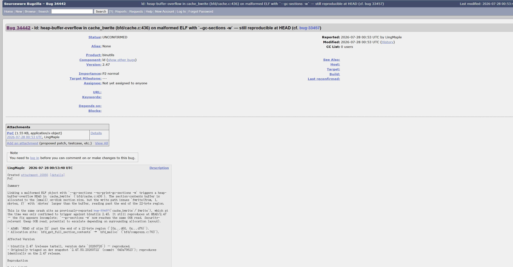

# Heap-buffer-overflow in `cache_bwrite` (bfd/cache.c:436) via malformed ELF with `--gc-sections -w`

- **Project:** GNU Binutils
- **Component:** `ld` (GNU linker)
- **Affected version:** 2.47 (version date `20260726`)
- **Bugzilla:** https://sourceware.org/bugzilla/show_bug.cgi?id=34442
- **Crash site:** `bfd/cache.c:436` (`cache_bwrite`)
- **Bug class:** Heap out-of-bounds read
- **Discoverer:** r1ck9
- **Date:** 2026-08-09
- **Related:** bug 33457 (same crash site, previously only confirmed on 2.45)

## Summary

Linking a malformed ELF object with `ld --gc-sections --no-print-gc-sections -w` triggers a heap-buffer-overflow **READ** in `cache_bwrite` (`bfd/cache.c:436`). The section-contents buffer is allocated to the (small) on-disk section size, but the write path issues `fwrite(from, 1, nbytes, f)` with `nbytes` larger than the buffer, reading past the end of the 22-byte region.

This is the same crash site as previously-reported bug 33457 (`cache_bwrite`/`fwrite`), which at the time was only confirmed to trigger against binutils 2.45. It still reproduces at HEAD/2.47 — the fix appears incomplete; `--gc-sections -w` now reaches the same OOB read.

Security-relevant (heap OOB read; potential to escalate depending on surrounding allocation layout).

## Affected versions

- binutils 2.47 (release tarball, version date `20260726`) — reproduced.
- Originally triaged on dev snapshot `2.47.50.20260722` (commit `640a79623`); reproduces identically on the 2.47 release.

## Reproduction

### Build (ASAN)

```bash
wget https://ftp.gnu.org/gnu/binutils/binutils-2.47.tar.gz
tar xzf binutils-2.47.tar.gz
cd binutils-2.47
mkdir build && cd build

CC=gcc CFLAGS='-g -O1 -fsanitize=address -fno-omit-frame-pointer -fno-common' \
LDFLAGS='-fsanitize=address' \
../configure --disable-gdb --disable-gdbserver --disable-sim --disable-cet \
            --disable-werror --disable-nls --enable-targets=x86_64-linux-gnu MAKEINFO=true
make -j
```

### Run

```bash
export ASAN_OPTIONS="abort_on_error=0:symbolize=1:detect_leaks=0:allocator_may_return_null=1:halt_on_error=1"
ld --gc-sections --no-print-gc-sections -w -o /dev/null bug_3.o
```

(Use the freshly-built `ld-new` from `build/ld/ld-new`.)

### ASAN output

```
==54489==ERROR: AddressSanitizer: heap-buffer-overflow on address 0x503000000c86 at pc 0x76dc8e47f05f bp 0x7ffe5e6ae9e0 sp 0x7ffe5e6ae188
READ of size 32 at 0x503000000c86 thread T0
    #0 fwrite                                       sanitizer_common_interceptors.inc:1110
    #1 cache_bwrite                                 ../../bfd/cache.c:436
    #2 bfd_write                                    ../../bfd/bfdio.c:417
    #3 _bfd_generic_set_section_contents            ../../bfd/libbfd.c:1348
    #4 _bfd_elf_set_section_contents                ../../bfd/elf.c:10072
    #5 bfd_set_section_contents                     ../../bfd/section.c:1509
    #6 elf_link_input_bfd                           ../../bfd/elflink.c:12284
    #7 _bfd_elf_final_link                          ../../bfd/elflink.c:13189
    #8 ldwrite                                      ../../ld/ldwrite.c:548
    #9 main                                         ../../ld/ldmain.c:1001

0x503000000c86 is located 0 bytes after 22-byte region [0x503000000c70,0x503000000c86)
allocated by thread T0 here:
    #0 malloc
    #1 bfd_malloc                                   ../../bfd/libbfd.c:291
    #2 bfd_get_full_section_contents                ../../bfd/compress.c:763

SUMMARY: AddressSanitizer: heap-buffer-overflow in fwrite (cache_bwrite, cache.c:436)
==54489==ABORTING
```

### Screenshots




## Root cause

`bfd_get_full_section_contents` allocates the section-contents buffer via `bfd_malloc` to the on-disk section size (22 bytes). The write path then calls `fwrite(from, 1, nbytes, f)` in `cache_bwrite` with `nbytes` larger than the allocation, performing an OOB read of size 32 past the 22-byte region `[0x...d60, 0x...d76)`.

The size mismatch between the allocation (`bfd_get_full_section_contents` / `bfd_malloc`) and the write (`cache_bwrite` / `fwrite`) is not validated.

## Impact

- Heap OOB read; can leak adjacent heap memory.
- Depending on surrounding allocation layout, may escalate to other memory-corruption primitives.
- Affects any pipeline that links untrusted object files: CI/CD, distro build systems, source-audit sandboxes.

## Workaround

- Do not pass `--gc-sections -w` against untrusted `.o`/`.a` files.
- Audit object-file provenance in CI/CD and build systems.
- Run linking steps inside a sandboxed/containerized environment.

## Fix

Track upstream 2.48 release. The fix should validate that `nbytes` does not exceed the buffer's actual allocation length in `cache_bwrite`, and reconcile the allocation size in `bfd_get_full_section_contents` with the write length.

## References

- Bugzilla: https://sourceware.org/bugzilla/show_bug.cgi?id=34442
- Related bug 33457: https://sourceware.org/bugzilla/show_bug.cgi?id=33457
- binutils 2.47: https://ftp.gnu.org/gnu/binutils/binutils-2.47.tar.gz
