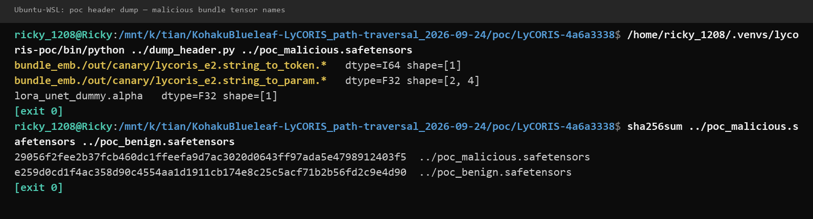
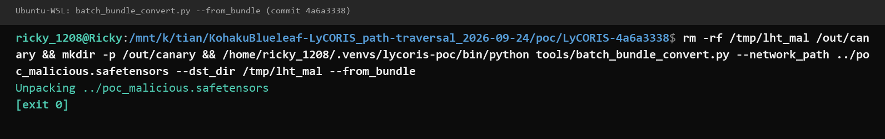
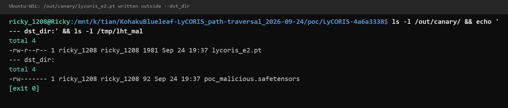
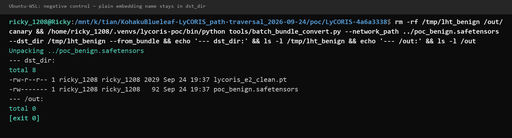

# LyCORIS 4.0.0 — Path Traversal Arbitrary File Write in tools/batch_bundle_convert.py

## Summary
KohakuBlueleaf LyCORIS 4.0.0 (git commit 4a6a333819356795d22170fe661a84f16b299b6b;
identical code on current `main`) is affected by a path traversal in the official
bundle conversion CLI `tools/batch_bundle_convert.py` (`--from_bundle` mode). The
embedding name is taken verbatim from the second segment of `bundle_emb.*` tensor
keys stored in the safetensors header — data fully controlled by whoever produced
the bundle file — and is joined into the output path with `os.path.join()`. An
absolute-path name makes `os.path.join()` silently discard the user-specified
destination directory, so `torch.save()` writes attacker-named `.pt` files anywhere
the invoking user can write. A crafted bundle shared as an ordinary LoRA bundle file
therefore turns the unpack CLI into an arbitrary-file-write primitive; because the
written `.pt` is a pickle, overwriting a model file that is loaded later yields code
execution.

## Affected Product

| Field | Value |
|---|---|
| Vendor | KohakuBlueleaf (Shih-Ying Yeh) |
| Product | LyCORIS (PyPI package `lycoris_lora`) |
| Affected versions | 4.0.0, git commit 4a6a333819356795d22170fe661a84f16b299b6b; `tools/batch_bundle_convert.py` identical on `main` as of 2026-09-24 (latest release v4.0.0 published 2026-09-01). Older releases: [unknown] |
| Component | `tools/batch_bundle_convert.py` — `load_state_dict()`, `unpack_bundle()`, `__main__` save loop |
| Platform | Cross-platform (Python / PyTorch / safetensors); verified in Docker on Linux |
| Vulnerability type | CWE-22: Improper Limitation of a Pathname to a Restricted Directory ('Path Traversal') |

## Root Cause

**Location:** `tools/batch_bundle_convert.py:60` (`unpack_bundle`) and
`tools/batch_bundle_convert.py:305-306` (`__main__ --from_bundle` branch)

Three unchecked steps chain the safetensors header to the filesystem:

1. `load_state_dict()` (`tools/batch_bundle_convert.py:17-19`) trusts every tensor
   name in the file header and indexes the tensor by it:
   ```python
   with safe_open(file_path, framework="pt", device="cpu") as f:
       for key in f.keys():
           state_dict[key] = f.get_tensor(key)
   ```
2. `unpack_bundle()` (`tools/batch_bundle_convert.py:57-61`) splits each
   `bundle_emb.*` key on `.` and promotes the second segment to the embedding name
   without validating that it is a bare filename:
   ```python
   for lora_key, value in lora.items():
       if lora_key.startswith("bundle_emb"):
           bundle_keys.append(lora_key)
           _, emb, *rest = lora_key.split(".")   # emb = attacker-controlled
           emb = emb + step
   ```
   An embedding name may legitimately contain `.`-free path characters, so nothing in
   the format prevents a name such as `/out/canary/lycoris_e2` (absolute) or
   `../../canary` (relative).
3. The save loop (`tools/batch_bundle_convert.py:304-306`) joins that name into the
   destination and writes it:
   ```python
   for emb, emb_sd in emb_dict.items():
       emb_save_path = os.path.join(dst_dir, emb + args.emb_ext[0])
       save_state_dict(emb_sd, emb_save_path)   # torch.save() for .pt
   ```
   For an absolute `emb`, `os.path.join(dst_dir, "/out/canary/lycoris_e2.pt")`
   returns `/out/canary/lycoris_e2.pt` — `dst_dir` is silently discarded and
   `torch.save()` writes outside the destination directory. No containment check
   exists anywhere in the path.

## Proof of Concept

### Prerequisites
- Victim obtains a crafted LyCORIS bundle `.safetensors` (e.g. shared on a model hub
  as an ordinary LoRA bundle) and unpacks it with the official CLI:
  `python tools/batch_bundle_convert.py --network_path <file> --dst_dir <dir> --from_bundle`
- The attacker-chosen target parent directory must already exist and be writable by
  the user running the tool (`torch.save()` does not create parent directories).
  Every real-world target satisfies this (`/tmp/<name>`, `~/.ssh`, autostart dirs, ...).

### Steps to Reproduce
1. Build a format-normal bundle whose safetensors header declares tensors named:

   ```text
   lora_unet_dummy.alpha
   bundle_emb./out/canary/lycoris_e2.string_to_param.<sub>
   bundle_emb./out/canary/lycoris_e2.string_to_token.<sub>
   ```

   `<sub>` is any sub-key; only the tensor names matter. The malicious sample used
   for the original Docker verification has SHA-256
   `f017926c490a1ebd509ab6241bd92cdf348a6c5d5e2c8ff1b86a273124af7aed`. The
   screenshots below are from an independent reproduction on Ubuntu 24.04 (WSL2)
   running the same pinned source tree, with an equivalent regenerated bundle pair
   (SHA-256 `29056f2f…` / `e259d0cd…`, see `poc/SHA256SUMS.txt`; only the tensor
   payload bytes differ, the attack-carrying tensor names are identical).

   
   Raw safetensors header dump of the malicious bundle: the two
   `bundle_emb./out/canary/lycoris_e2.*` tensor names (highlighted) carry the
   traversal payload, plus SHA-256 of both samples.

2. Unpack it with the official CLI pinned to commit 4a6a3338 (the original
   verification used a `--network none` Docker container; the screenshot run is the
   WSL2 reproduction):

   ```bash
   python tools/batch_bundle_convert.py \
       --network_path poc_malicious.safetensors \
       --dst_dir /tmp/lht_mal \
       --from_bundle
   ```

   
   The official pinned CLI unpacks the malicious bundle and exits cleanly
   (`Unpacking ../poc_malicious.safetensors`, exit 0) — no error, no warning.

3. Observe the output: `/out/canary/lycoris_e2.pt` has been created — outside the
   user-specified `--dst_dir /tmp/lht_mal` — because `os.path.join()` dropped the
   destination when the embedding-name segment is absolute.

   
   Listing proving `/out/canary/lycoris_e2.pt` (1981 bytes) exists outside
   `--dst_dir`, while `/tmp/lht_mal` contains only the unpacked LoRA.

4. Negative control: the same bundle with the embedding name replaced by a plain
   filename (`bundle_emb.lycoris_e2_clean.string_to_param.<sub>`, original sample
   SHA-256 `1a47638dc4d0716d8769ccd215a98c4c71a80cb4b0524c7172f4a58352ea3618`)
   writes only into `--dst_dir`, confirming the tensor name is the sole
   differentiator.

   
   Negative-control run: the benign bundle produced only `lycoris_e2_clean.pt`
   inside its `--dst_dir`, and `/out` remains empty.

The original verification ran the pinned CLI twice in the container with
byte-identical results (`artifact_verified=1`, `pin_verified=1`,
`negative_control_clean=1`, `verdict=PASS`); the screenshot reproduction reproduces
the same behavior on WSL2.

### Expected vs Actual
- Expected: every output file is written inside `--dst_dir`, regardless of tensor
  names in the input file.
- Actual: `torch.save()` writes `.pt` files at attacker-chosen paths outside
  `--dst_dir`; the destination directory only constrains names without path
  separators.

### Sanitized PoC input
```text
Tensor-name payload (safetensors header):
  bundle_emb./out/canary/lycoris_e2.string_to_param.*
  bundle_emb./out/canary/lycoris_e2.string_to_token.*
Resulting write:
  os.path.join("/tmp/lht_mal", "/out/canary/lycoris_e2" + ".pt")
  -> /out/canary/lycoris_e2.pt
Relative-traversal variant (equivalent defect):
  bundle_emb.../..../canary.string_to_param.*   ->  write outside dst_dir
```

## Impact
- Confidentiality: High — under the assumption noted below (overwritten `.pt` loaded
  later via pickle-based `torch.load`), code execution grants full access to the
  victim's data; the bare write primitive alone has no direct read effect.
- Integrity: High — arbitrary files writable by the user can be overwritten with
  attacker-controlled content.
- Availability: High — overwriting model files, configs, or startup scripts can
  render the user's toolchain or system unusable.
- Scope: arbitrary file write outside the intended directory; escalates to code
  execution wherever a written pickle file is later deserialized.

## Attack Vector and Severity (CVSS v3.1)

| Metric | Value | Rationale |
|---|---|---|
| Attack Vector | Network (N) | Crafted bundle is distributed remotely (model hub, download); exploitation itself is offline file processing |
| Attack Complexity | Low (L) | No special conditions; standard CLI invocation on a normal-looking file |
| Privileges Required | None (N) | No authentication; victim's own user privileges suffice |
| User Interaction | Required (R) | Victim must run `--from_bundle` on the malicious file |
| Scope | Unchanged (U) | Impact stays within the victim's user/security context |
| Confidentiality | High (H) | Assumed code-execution escalation via overwritten pickle (see note) |
| Integrity | High (H) | Arbitrary file overwrite with controlled content |
| Availability | High (H) | Arbitrary overwrite can disable the toolchain/system |

```
Score: 8.8 (High)
Vector: CVSS:3.1/AV:N/AC:L/PR:N/UI:R/S:U/C:H/I:H/A:H
```

> Assumption note: the demonstrated primitive is arbitrary file write (integrity and
> availability are High on that evidence alone). Confidentiality is rated High — the
> conservative choice — because `.pt` files are pickles: any overwritten model file
> that is later loaded with `torch.load` executes attacker code, giving C:H/I:H/A:H.
> Scoring only the demonstrated write primitive would yield approximately 7.7
> (AV:N/AC:L/PR:N/UI:R/S:U/C:L/I:H/A:H), still High.

## Remediation
Sanitize the embedding name at its source and add a containment check before writing:

- In `unpack_bundle()` (`tools/batch_bundle_convert.py:60`), reduce the name to a
  bare filename (`os.path.basename`) and reject empty/`..`/separator-bearing values.
- Before `save_state_dict()` (`tools/batch_bundle_convert.py:305`), verify the
  absolute save path stays inside `dst_dir`
  (`os.path.commonpath` containment check).
- Optionally validate the full `bundle_emb.<name>.<key>[.<subkey>]` key shape at
  load time so malformed bundles fail fast.

Workaround until patched: do not unpack bundles from untrusted sources, or pre-inspect
tensor names and reject any `bundle_emb.*` key whose second segment contains `/`, `\`,
or `..`.

## Timeline

| Date | Event |
|---|---|
| 2026-09-24 | Vulnerability verified against pinned commit 4a6a3338 (Docker, `--network none`, reproducible, negative control clean) |
| 2026-09-24 | Report prepared for the maintainer |
| [pending] | Report sent to the maintainer |
| [pending] | Maintainer acknowledged |
| [pending] | Fix released |

## References
- Source repository: https://github.com/KohakuBlueleaf/LyCORIS
- Pinned commit: https://github.com/KohakuBlueleaf/LyCORIS/commit/4a6a333819356795d22170fe661a84f16b299b6b
- Vulnerable file: https://github.com/KohakuBlueleaf/LyCORIS/blob/4a6a333819356795d22170fe661a84f16b299b6b/tools/batch_bundle_convert.py
- Latest release: https://github.com/KohakuBlueleaf/LyCORIS/releases/tag/v4.0.0
- CWE: https://cwe.mitre.org/data/definitions/22.html
- Upstream report: [pending publication]
- Vendor advisory: [none]

## Disclaimer
This report is provided for defensive and coordination purposes. It contains no
ready-to-run exploit beyond the minimum reproduction information, and no sensitive
infrastructure details. Do not disclose it publicly before the maintainer has had a
reasonable window to fix the issue.

## 
