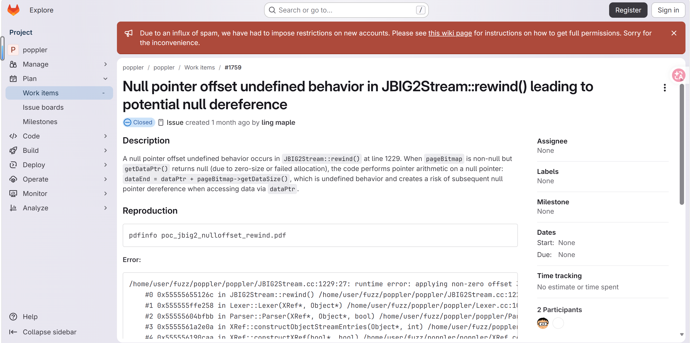
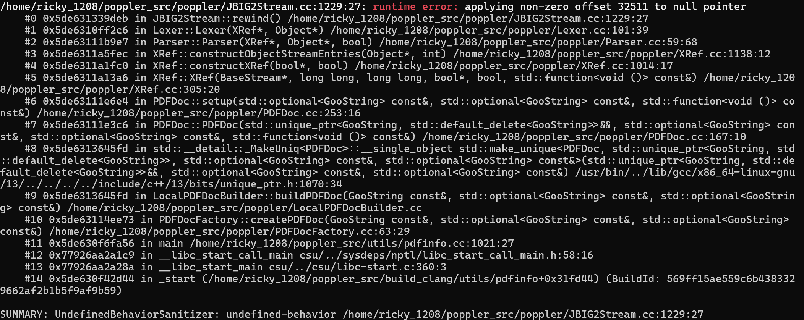

# Null-pointer-offset undefined behavior in `JBIG2Stream::rewind` (JBIG2Stream.cc:1229) via malformed PDF

- **Project:** Poppler
- **Component:** `JBIG2Stream` (JBIG2 image stream decoder)
- **Affected version:** 26.07.0
- **GitLab work item:** https://gitlab.freedesktop.org/poppler/poppler/-/work_items/1759
- **Crash site:** `poppler/JBIG2Stream.cc:1229` (`JBIG2Stream::rewind`)
- **Bug class:** Null pointer offset undefined behavior
- **Discoverer:** r1ck9
- **Date:** 2026-07-20
- **Fix:** commit `5e49250f` (2026-07-26, "Fix nullptr + number"), first released in 26.08.0

## Summary

Processing a malformed PDF containing a JBIG2 image stream with `pdfinfo` triggers a null-pointer-offset undefined behavior in `JBIG2Stream::rewind()` (`poppler/JBIG2Stream.cc:1229`). When `pageBitmap` is non-null but `getDataPtr()` returns null (due to zero-size allocation or allocation failure), the expression `dataPtr + pageBitmap->getDataSize()` applies a non-zero offset (32511) to a null pointer, which is undefined behavior in C++. UBSan detects this at runtime.

## Affected versions

- Poppler 26.07.0 — reproduced with UBSan (Clang).
- Fixed in 26.08.0 (commit `5e49250f`).

## Reproduction

### Build (UBSan)

```bash
git clone https://gitlab.freedesktop.org/poppler/poppler.git ~/poppler_src
cd ~/poppler_src && git checkout poppler-26.07.0
mkdir build_clang && cd build_clang
CC=clang CXX=clang++ cmake .. -DCMAKE_CXX_FLAGS="-g -O1 -fsanitize=undefined -fno-sanitize-recover=undefined -fno-omit-frame-pointer" \
  -DCMAKE_EXE_LINKER_FLAGS="-fsanitize=undefined" \
  -DBUILD_SHARED_LIBS=OFF -DENABLE_UTILS=ON \
  -DENABLE_GLIB=OFF -DENABLE_QT5=OFF -DENABLE_QT6=OFF -DENABLE_CPP=OFF \
  -DENABLE_BOOST=OFF -DENABLE_NSS3=OFF -DENABLE_LCMS=OFF \
  -DENABLE_LIBCURL=OFF -DENABLE_GPGME=OFF
make -j$(nproc) pdfinfo
```

### Run

```bash
export UBSAN_OPTIONS='halt_on_error=0:print_stacktrace=1'
~/poppler_src/build_clang/utils/pdfinfo poc_1759.pdf
```

### UBSan output

```
/home/ricky_1208/poppler_src/poppler/JBIG2Stream.cc:1229:27: runtime error: applying non-zero offset 32511 to null pointer
    #0 0x5de631339deb in JBIG2Stream::rewind() /home/ricky_1208/poppler_src/poppler/JBIG2Stream.cc:1229:27
    #1 0x5de6310ff2c6 in Lexer::Lexer(XRef*, Object*) /home/ricky_1208/poppler_src/poppler/Lexer.cc:101:39
    #2 0x5de63111b9e7 in Parser::Parser(XRef*, Object*, bool) /home/ricky_1208/poppler_src/poppler/Parser.cc:59:68
    #3 0x5de6311a5fec in XRef::constructObjectStreamEntries(Object*, int) /home/ricky_1208/poppler_src/poppler/XRef.cc:1138:12
    #4 0x5de6311a1fc0 in XRef::constructXRef(bool*, bool) /home/ricky_1208/poppler_src/poppler/XRef.cc:1014:17
    #5 0x5de6311a13a6 in XRef::XRef(BaseStream*, long long, long long, bool*, bool, std::function<void ()> const&) /home/ricky_1208/poppler_src/poppler/XRef.cc:305:20
    #6 0x5de63111e6e4 in PDFDoc::setup(...) /home/ricky_1208/poppler_src/poppler/PDFDoc.cc:253:16
    #7 0x5de63111e3c6 in PDFDoc::PDFDoc(...) /home/ricky_1208/poppler_src/poppler/PDFDoc.cc:167:10
    #8 0x5de6313645fd in LocalPDFDocBuilder::buildPDFDoc(...) /home/ricky_1208/poppler_src/poppler/LocalPDFDocBuilder.cc
    #9 0x5de6313645fd in std::__detail::_MakeUniq<PDFDoc>::__single_object std::make_unique<PDFDoc, ...>(...) /usr/bin/../lib/gcc/x86_64-linux-gnu/13/../../../../include/c++/13/bits/unique_ptr.h:1070:34
    #10 0x5de63114ee73 in PDFDocFactory::createPDFDoc(...) /home/ricky_1208/poppler_src/poppler/PDFDocFactory.cc:63:29
    #11 0x5de630f6fa56 in main /home/ricky_1208/poppler_src/utils/pdfinfo.cc:1021:27
    #12 0x77926aa2a1c9 in __libc_start_call_main ../sysdeps/nptl/libc_start_call_main.h:58:16
    #13 0x77926aa2a28a in __libc_start_main ../csu/libc-start.c:360:3
    #14 0x5de630f42d44 in _start (/home/ricky_1208/poppler_src/build_clang/utils/pdfinfo+0x31fd44)

SUMMARY: UndefinedBehaviorSanitizer: undefined-behavior /home/ricky_1208/poppler_src/poppler/JBIG2Stream.cc:1229:27
```






## Root cause

```cpp
// JBIG2Stream.cc, JBIG2Stream::rewind(), line 1227-1229 (26.07.0)
if (pageBitmap) {
    dataPtr = pageBitmap->getDataPtr();
    dataEnd = dataPtr + pageBitmap->getDataSize();  // UB if getDataPtr() returns null
}
```

When `pageBitmap` is non-null but its internal data allocation failed (zero-size allocation or `malloc` failure), `getDataPtr()` returns null while `getDataSize()` returns a non-zero value (32511). The expression `dataPtr + pageBitmap->getDataSize()` then applies offset 32511 to a null pointer, which is undefined behavior per the C++ standard ([expr.add]/4).

The missing check is `pageBitmap->isOk()`, which validates that the bitmap's internal data is valid before accessing it.

## Impact

- Undefined behavior may lead to null pointer dereference when `dataPtr` is subsequently dereferenced.
- Potential application crash (denial of service).
- Compiler optimizations based on UB assumptions may lead to unpredictable behavior.
- Affects any application using Poppler to render or process untrusted PDF files.

CVSS v3.1: 3.3 (Low) — CVSS:3.1/AV:L/AC:L/PR:N/UI:R/S:U/C:N/I:N/A:L

## Workaround

- Do not open PDF files from untrusted sources.
- Process untrusted PDF files in a sandboxed/containerized environment.
- Upgrade to Poppler 26.08.0 or later.

## Fix

Commit `5e49250f` (2026-07-26, "Fix nullptr + number") adds an `isOk()` check before accessing the bitmap data:

```cpp
if (pageBitmap && pageBitmap->isOk()) {  // added isOk() check
    dataPtr = pageBitmap->getDataPtr();
    dataEnd = dataPtr + pageBitmap->getDataSize();
}
```

`isOk()` validates that the bitmap's internal data is valid (including non-null data pointer), preventing the null-pointer offset. This fix is first included in the 26.08.0 release.

## References

- GitLab work item: https://gitlab.freedesktop.org/poppler/poppler/-/work_items/1759
- Fix commit: https://gitlab.freedesktop.org/poppler/poppler/-/commit/5e49250f
- Poppler homepage: https://poppler.freedesktop.org/
