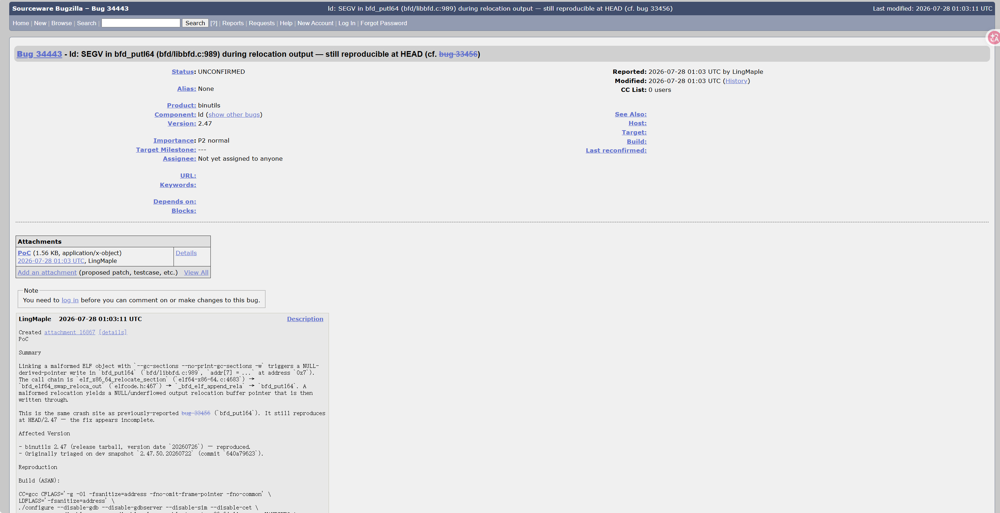

# SEGV in `bfd_putl64` (bfd/libbfd.c:989) during relocation output via malformed ELF

- **Project:** GNU Binutils
- **Component:** `ld` (GNU linker)
- **Affected version:** 2.47 (version date `20260726`)
- **Bugzilla:** https://sourceware.org/bugzilla/show_bug.cgi?id=34443
- **Crash site:** `bfd/libbfd.c:989` (`bfd_putl64`)
- **Bug class:** NULL-derived-pointer write (SEGV)
- **Discoverer:** r1ck9
- **Date:** 2026-08-09
- **Related:** bug 33456 (same crash site, fix incomplete)

## Summary

Linking a malformed ELF object with `ld --gc-sections --no-print-gc-sections -w` triggers a NULL-derived-pointer write in `bfd_putl64` (`bfd/libbfd.c:989`, `addr[7] = ...` at address `0x7`). The call chain is `elf_x86_64_relocate_section` (`elf64-x86-64.c:4683`) → `bfd_elf64_swap_reloca_out` (`elfcode.h:467`) → `_bfd_elf_append_rela` → `bfd_putl64`. A malformed relocation yields a NULL/underflowed output relocation buffer pointer that is then written through.

This is the same crash site as previously-reported bug 33456 (`bfd_putl64`). It still reproduces at HEAD/2.47 — the fix appears incomplete.

## Affected versions

- binutils 2.47 (release tarball, version date `20260726`) — reproduced.
- Originally triaged on dev snapshot `2.47.50.20260722` (commit `640a79623`).

## Reproduction

### Build (ASAN)

```bash
wget https://ftp.gnu.org/gnu/binutils/binutils-2.47.tar.gz
tar xzf binutils-2.47.tar.gz
cd binutils-2.47
mkdir build && cd build

CC=gcc CFLAGS='-g -O1 -fsanitize=address -fno-omit-frame-pointer -fno-common' \
LDFLAGS='-fsanitize=address' \
../configure --disable-gdb --disable-gdbserver --disable-sim --disable-cet \
            --disable-werror --disable-nls --enable-targets=x86_64-linux-gnu MAKEINFO=true
make -j
```

### Run

```bash
export ASAN_OPTIONS="abort_on_error=0:symbolize=1:detect_leaks=0:allocator_may_return_null=1:halt_on_error=1"
ld --gc-sections --no-print-gc-sections -w -o /dev/null bug_10.o
```

(Use the freshly-built `ld-new` from `build/ld/ld-new`.)

### ASAN output

```
ld-new: BFD (GNU Binutils) 2.47.20260726 assertion fail ../../bfd/elf64-x86-64.c:5028
ld-new: BFD (GNU Binutils) 2.47.20260726 assertion fail ../../bfd/elflink.c:15624
AddressSanitizer:DEADLYSIGNAL
==54520==ERROR: AddressSanitizer: SEGV on unknown address 0x000000000007 (pc 0x5a3535d0718a bp 0x7ffe3d197850 sp 0x7ffe3d197850 T0)
==54520==The signal is caused by a WRITE memory access.
==54520==Hint: address points to the zero page.
    #0 bfd_putl64                       ../../bfd/libbfd.c:989
    #1 bfd_elf64_swap_reloca_out        ../../bfd/elfcode.h:467
    #2 _bfd_elf_append_rela             ../../bfd/elflink.c:15625
    #3 elf_x86_64_relocate_section      ../../bfd/elf64-x86-64.c:4683
    #4 elf_link_input_bfd               ../../bfd/elflink.c:11926
    #5 _bfd_elf_final_link              ../../bfd/elflink.c:13189
    #6 ldwrite                          ../../ld/ldwrite.c:548
    #7 main                             ../../ld/ldmain.c:1001

SUMMARY: AddressSanitizer: SEGV ../../bfd/libbfd.c:989 in bfd_putl64
==54520==ABORTING
```

The linker also emits BFD assertion failures immediately before the crash:

```
ld-new: BFD (GNU Binutils) 2.47.20260726 assertion fail ../../bfd/elf64-x86-64.c:5028
ld-new: BFD (GNU Binutils) 2.47.20260726 assertion fail ../../bfd/elflink.c:15624
```

### Screenshots




## Root cause

`elf_x86_64_relocate_section` calls `_bfd_elf_append_rela` to append a relocation entry to the output relocation section. `_bfd_elf_append_rela` invokes `bfd_elf64_swap_reloca_out`, which calls `bfd_putl64` to write the 8-byte little-endian relocation record:

```c
// bfd/libbfd.c:989
addr[7] = ...
```

When the input ELF contains a malformed relocation, the output relocation buffer pointer is not validated and is derived as NULL or an underflowed value (e.g., `0x7`). Dereferencing it for a write triggers the SEGV.

## Impact

- Process crash / denial of service.
- Depending on heap layout and the underflowed pointer value, the issue may in principle be turned into a controlled write primitive.
- Affects any pipeline that links untrusted object files: CI/CD, distro build systems, source-audit sandboxes.

## Workaround

- Do not pass `--gc-sections -w` against untrusted `.o`/`.a` files.
- Audit object-file provenance in CI/CD and build systems.
- Run linking steps inside a sandboxed/containerized environment.

## Fix

Track upstream 2.48 release. The fix should validate the output relocation buffer pointer and remaining writable size before calling `_bfd_elf_append_rela` and `bfd_putl64`.

## References

- Bugzilla: https://sourceware.org/bugzilla/show_bug.cgi?id=34443
- Related bug 33456: https://sourceware.org/bugzilla/show_bug.cgi?id=33456
- binutils 2.47: https://ftp.gnu.org/gnu/binutils/binutils-2.47.tar.gz
