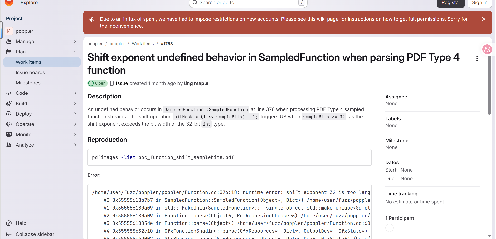

# Shift-exponent undefined behavior in `SampledFunction` (Function.cc:376) via malformed PDF

- **Project:** Poppler
- **Component:** `pdfimages` (and any tool invoking `Function::parse`)
- **Affected version:** 26.07.0 (still present at master 26.08.90)
- **GitLab work item:** https://gitlab.freedesktop.org/poppler/poppler/-/work_items/1758
- **Crash site:** `poppler/Function.cc:376` (`SampledFunction::SampledFunction`)
- **Bug class:** Shift exponent undefined behavior (C++ [expr.shift])
- **Discoverer:** r1ck9
- **Date:** 2026-07-20

## Summary

Processing a malformed PDF with `pdfimages -list` triggers a shift-exponent undefined behavior in `SampledFunction::SampledFunction` (`poppler/Function.cc:376`). The constructor reads `BitsPerSample` directly from the PDF stream dictionary into `sampleBits` without upper-bound validation, then executes `bitMask = (1 << sampleBits) - 1;`. When `sampleBits >= 32`, the shift exponent exceeds the width of the 32-bit `int` type, invoking C++ undefined behavior per `[expr.shift]`.



## Affected versions

- Poppler 26.07.0 — reproduced with UBSan.
- Poppler master 26.08.90 — still present (unfixed).

## Reproduction

### Build (UBSan)

```bash
git clone https://gitlab.freedesktop.org/poppler/poppler.git ~/poppler_src
cd ~/poppler_src && git checkout poppler-26.07.0
mkdir build && cd build
cmake .. -DCMAKE_CXX_FLAGS="-g -O1 -fsanitize=undefined -fno-sanitize-recover=undefined -fno-omit-frame-pointer" \
  -DCMAKE_EXE_LINKER_FLAGS="-fsanitize=undefined" \
  -DBUILD_SHARED_LIBS=OFF -DENABLE_UTILS=ON -DENABLE_GLIB=OFF \
  -DENABLE_QT5=OFF -DENABLE_QT6=OFF -DENABLE_CPP=OFF -DENABLE_BOOST=OFF \
  -DENABLE_NSS3=OFF -DENABLE_LCMS=OFF -DENABLE_LIBCURL=OFF -DENABLE_GPGME=OFF
make -j$(nproc) pdfimages
```

### Run

```bash
export UBSAN_OPTIONS='halt_on_error=0:print_stacktrace=1'
~/poppler_src/build/utils/pdfimages -list poc_1758.pdf
```

### UBSan output

```
/home/ricky_1208/poppler_src/poppler/Function.cc:376:18: runtime error: shift exponent 32 is too large for 32-bit type 'int'
    #0 0x5b920d43993c in SampledFunction::SampledFunction(Object*, Dict*) /home/ricky_1208/poppler_src/poppler/Function.cc:376
    #1 0x5b920d43ef9a in Function::parse(Object*, RefRecursionChecker&) /home/ricky_1208/poppler_src/poppler/Function.cc:87
    #2 0x5b920d43f368 in Function::parse(Object*) /home/ricky_1208/poppler_src/poppler/Function.cc:60
    #3 0x5b920d19d1f1 in GfxFunctionShading::parse(...) /home/ricky_1208/poppler_src/poppler/GfxState.cc:3571
    #4 0x5b920d1ae8e4 in GfxShading::parse(...) /home/ricky_1208/poppler_src/poppler/GfxState.cc:3390
    #5 0x5b920d1af06b in GfxShadingPattern::parse(...) /home/ricky_1208/poppler_src/poppler/GfxState.cc:3303
    #6 0x5b920d1afb3b in GfxPattern::parse(...) /home/ricky_1208/poppler_src/poppler/GfxState.cc:3177
    #7 0x5b920d45e1a6 in GfxResources::lookupPattern(...) /home/ricky_1208/poppler_src/poppler/Gfx.cc:387
    #8 0x5b920d467f64 in Gfx::opSetStrokeColorN(Object*, int) /home/ricky_1208/poppler_src/poppler/Gfx.cc:1642
    #9 0x5b920d44986e in Gfx::execOp(Object*, Object*, int) /home/ricky_1208/poppler_src/poppler/Gfx.cc:786
    #10 0x5b920d478c42 in Gfx::go(Gfx::DisplayType) /home/ricky_1208/poppler_src/poppler/Gfx.cc:657
    #11 0x5b920d47ae95 in Gfx::display(Object*, Gfx::DisplayType) /home/ricky_1208/poppler_src/poppler/Gfx.cc:614
    #12 0x5b920d4fb1e1 in Page::displaySlice(...) /home/ricky_1208/poppler_src/poppler/Page.cc:616
    #13 0x5b920d4fb8fd in Page::display(...) /home/ricky_1208/poppler_src/poppler/Page.cc:568
    #14 0x5b920d21f5df in PDFDoc::displayPage(...) /home/ricky_1208/poppler_src/poppler/PDFDoc.cc:614
    #15 0x5b920d21f811 in PDFDoc::displayPages(...) /home/ricky_1208/poppler_src/poppler/PDFDoc.cc:624
    #16 0x5b920d15a3f9 in main /home/ricky_1208/poppler_src/utils/pdfimages.cc:187
    #17 0x7a370f42a1c9 in __libc_start_call_main ../sysdeps/nptl/libc_start_call_main.h:58
    #18 0x7a370f42a28a in __libc_start_main_impl ../csu/libc-start.c:360
    #19 0x5b920d157074 in _start (/home/ricky_1208/poppler_src/build/utils/pdfimages+0x4ce074)

SUMMARY: UndefinedBehaviorSanitizer: undefined-behavior /home/ricky_1208/poppler_src/poppler/Function.cc:376:18
```


## Root cause

`SampledFunction::SampledFunction(Object*, Dict*)` parses a PDF Type 0 (sampled) function object. The `BitsPerSample` value is read from the PDF stream dictionary and stored in `sampleBits` without upper-bound validation. At `Function.cc:376`:

```cpp
bitMask = (1 << sampleBits) - 1;
```

When an attacker crafts a PDF with `BitsPerSample` set to 32 (or greater), the expression `1 << 32` invokes undefined behavior on a 32-bit `int` type per the C++ standard `[expr.shift]`, which states that the behavior is undefined if the shift exponent is greater than or equal to the width of the promoted left operand.

Practical consequences of this UB include:
- On x86, the shift may be truncated modulo 32, yielding `1 << 0 = 1` and `bitMask = 0`, silently corrupting downstream sample interpolation.
- Compilers may assume UB does not occur under optimization, potentially eliding subsequent bounds checks or dead-code-eliminating security-relevant paths.
- At certain optimization levels the program may exhibit unpredictable behavior or crash.

The value `sampleBits` is attacker-controlled via the PDF `BitsPerSample` stream dictionary entry and is not clamped or range-checked before the shift.

## Impact

- **Availability:** Low — may cause program crash or unpredictable behavior under certain compiler/optimization configurations.
- **Confidentiality:** None directly, but UB-driven incorrect mask computation could corrupt downstream memory operations.
- **Integrity:** None directly.
- Affects any application or pipeline that uses Poppler to process untrusted PDF files: desktop PDF viewers (Evince, Okular), online PDF preview/conversion services, automated document processing pipelines, email attachment scanning systems.

**CVSS v3.1:** 3.3 (Low) — `CVSS:3.1/AV:L/AC:L/PR:N/UI:R/S:U/C:N/I:N/A:L`

## Workaround

- Do not open PDF files from untrusted sources.
- Process untrusted PDF files inside a sandbox or containerized environment.
- Restrict automated server-side PDF processing with Poppler tools.
- Monitor upstream for patch releases and upgrade promptly.

## Fix

Validate `sampleBits` before the shift operation. The PDF specification permits `BitsPerSample` values of 1–32, but `1 << 32` is UB on 32-bit `int`. Recommended approaches:

1. **Range check and reject:** Before the shift, add `if (sampleBits < 1 || sampleBits >= (int)(sizeof(int) * 8)) { error(errSyntaxError, ..., "Invalid BitsPerSample"); return; }`
2. **Wider type:** Use `uint64_t` for the shift: `bitMask = (uint64_t(1) << sampleBits) - 1;` (still needs a range check for `sampleBits > 64`).
3. **Safe expression:** Use a conditional: `bitMask = (sampleBits >= 32) ? 0xFFFFFFFFu : ((1u << sampleBits) - 1);`

## References

- GitLab work item: https://gitlab.freedesktop.org/poppler/poppler/-/work_items/1758
- Poppler project: https://poppler.freedesktop.org/
- Poppler 26.07.0 tag: https://gitlab.freedesktop.org/poppler/poppler/-/tags/poppler-26.07.0
- C++ Standard [expr.shift]: https://eel.is/c++draft/expr.shift
