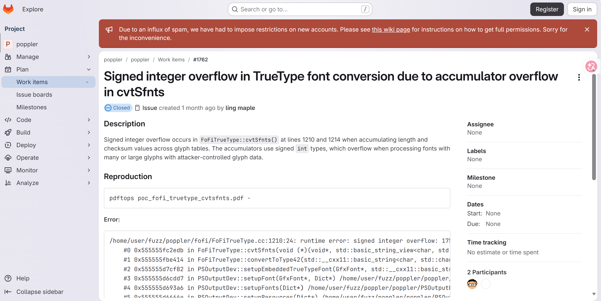
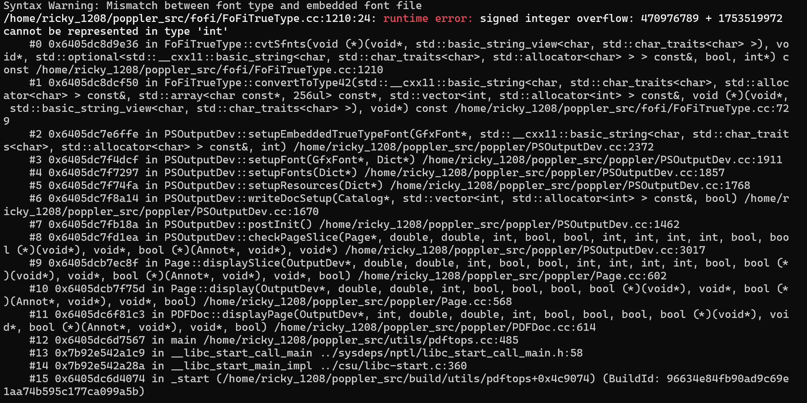

# Signed-integer-overflow in `FoFiTrueType::cvtSfnts` (FoFiTrueType.cc:1210) via malformed TrueType font in PDF

- **Project:** Poppler
- **Component:** `pdftops` (PDF to PostScript converter)
- **Affected version:** 26.07.0
- **GitLab work item:** https://gitlab.freedesktop.org/poppler/poppler/-/work_items/1762
- **Crash site:** `fofi/FoFiTrueType.cc:1210` (`FoFiTrueType::cvtSfnts`)
- **Bug class:** Signed integer overflow
- **Discoverer:** r1ck9
- **Date:** 2026-07-20
- **Fix:** commit `245d3c68` (2026-08-08, "Fix integer overflow in FoFiTrueType::cvtSfnts"), not yet included in any release (post-26.08.0)

## Summary

Converting a PDF containing a malformed TrueType font with `pdftops poc_1762.pdf output.ps` triggers a signed integer overflow in `FoFiTrueType::cvtSfnts()` (`fofi/FoFiTrueType.cc:1210`). The function uses signed `int` accumulators (`length` and `checksum`) to sum glyph lengths and checksums across thousands of glyphs in a loop (`length += locaTable[j].len`). Since glyph lengths and checksums are read from attacker-controlled font data, a large or maliciously crafted font with inflated glyph sizes causes the accumulated value to exceed `INT_MAX`, triggering a signed integer overflow (`470976789 + 1753519972` cannot be represented in `int`).

The overflow produces incorrect length and checksum calculations, which can result in a corrupted TrueType-to-Type 42 font conversion and malformed PostScript output. `cvtSfnts()` is called by `convertToType42()`, which is invoked by `PSOutputDev::setupEmbeddedTrueTypeFont()` during PDF-to-PostScript conversion.

Security-relevant (signed integer overflow → corrupted font conversion → malformed PostScript output).


## Affected versions

- Poppler 26.07.0 — reproduced.
- Fixed in commit `245d3c68` (2026-08-08, "Fix integer overflow in FoFiTrueType::cvtSfnts"). The fix is not yet included in any release version (applied after 26.08.0).

## Reproduction

### Build (UBSan)

```bash
git clone https://gitlab.freedesktop.org/poppler/poppler.git ~/poppler_src
cd ~/poppler_src && git checkout poppler-26.07.0
mkdir build && cd build

cmake .. \
    -DCMAKE_CXX_FLAGS="-g -O1 -fsanitize=undefined -fno-sanitize-recover=undefined -fno-omit-frame-pointer" \
    -DCMAKE_EXE_LINKER_FLAGS="-fsanitize=undefined" \
    -DBUILD_SHARED_LIBS=OFF \
    -DENABLE_UTILS=ON \
    -DENABLE_GLIB=OFF \
    -DENABLE_QT5=OFF \
    -DENABLE_QT6=OFF \
    -DENABLE_CPP=OFF \
    -DENABLE_BOOST=OFF \
    -DENABLE_NSS3=OFF \
    -DENABLE_LCMS=OFF \
    -DENABLE_LIBCURL=OFF \
    -DENABLE_GPGME=OFF

make -j$(nproc) pdftops
```

### Run

```bash
export UBSAN_OPTIONS='halt_on_error=0:print_stacktrace=1'
~/poppler_src/build/utils/pdftops poc_1762.pdf output.ps
```

### UBSan output

```
/home/ricky_1208/poppler_src/fofi/FoFiTrueType.cc:1210:24: runtime error: signed integer overflow: 470976789 + 1753519972 cannot be represented in type 'int'
    #0 0x6405dc8d9e36 in FoFiTrueType::cvtSfnts(...) /home/ricky_1208/poppler_src/fofi/FoFiTrueType.cc:1210
    #1 0x6405dc8dcf50 in FoFiTrueType::convertToType42(...) /home/ricky_1208/poppler_src/fofi/FoFiTrueType.cc:729
    #2 0x6405dc7e6ffe in PSOutputDev::setupEmbeddedTrueTypeFont(...) /home/ricky_1208/poppler_src/poppler/PSOutputDev.cc:2372
    #3 0x6405dc7f4dcf in PSOutputDev::setupFont(GfxFont*, Dict*) /home/ricky_1208/poppler_src/poppler/PSOutputDev.cc:1911
    #4 0x6405dc7f7297 in PSOutputDev::setupFonts(Dict*) /home/ricky_1208/poppler_src/poppler/PSOutputDev.cc:1857
    #5 0x6405dc7f74fa in PSOutputDev::setupResources(Dict*) /home/ricky_1208/poppler_src/poppler/PSOutputDev.cc:1768
    #6 0x6405dc7f8a14 in PSOutputDev::writeDocSetup(...) /home/ricky_1208/poppler_src/poppler/PSOutputDev.cc:1670
    #7 0x6405dc7fb18a in PSOutputDev::postInit() /home/ricky_1208/poppler_src/poppler/PSOutputDev.cc:1462
    #8 0x6405dc7fd1ea in PSOutputDev::checkPageSlice(...) /home/ricky_1208/poppler_src/poppler/PSOutputDev.cc:3017
    #9 0x6405dcb7ec8f in Page::displaySlice(...) /home/ricky_1208/poppler_src/poppler/Page.cc:602
    #10 0x6405dcb7f75d in Page::display(...) /home/ricky_1208/poppler_src/poppler/Page.cc:568
    #11 0x6405dc6f81c3 in PDFDoc::displayPage(...) /home/ricky_1208/poppler_src/poppler/PDFDoc.cc:614
    #12 0x6405dc6d7567 in main /home/ricky_1208/poppler_src/utils/pdftops.cc:485
    #13 0x7b92e542a1c9 in __libc_start_call_main ../sysdeps/nptl/libc_start_call_main.h:58
    #14 0x7b92e542a28a in __libc_start_main_impl ../csu/libc-start.c:360
    #15 0x6405dc6d4074 in _start (/home/ricky_1208/poppler_src/build/utils/pdftops+0x4c9074)

SUMMARY: UndefinedBehaviorSanitizer: undefined-behavior /home/ricky_1208/poppler_src/fofi/FoFiTrueType.cc:1210:24
```






## Root cause

`FoFiTrueType::cvtSfnts()` converts a TrueType font to a Type 42 (PostScript) font. At `FoFiTrueType.cc:1210`, it accumulates glyph lengths and checksums in a loop:

```cpp
length += locaTable[j].len;
```

where `length` and `checksum` are declared as signed `int`.

The vulnerability chain:

1. `length` and `checksum` are declared as signed `int`, initialized to 0.
2. In the loop, `length += locaTable[j].len` and `checksum += ...` accumulate per-glyph lengths and checksums.
3. Glyph lengths and checksum values are read from attacker-controlled TrueType font data.
4. A large or maliciously crafted font with inflated glyph sizes causes the accumulated value to exceed `INT_MAX` (2147483647).
5. Signed integer overflow occurs: `470976789 + 1753519972` cannot be represented in `int`.
6. The overflowed `length` and `checksum` are used in the subsequent TrueType-to-Type 42 font conversion, producing corrupted PostScript output.

The call path is: `pdftops` → `PSOutputDev::setupEmbeddedTrueTypeFont()` → `FoFiTrueType::convertToType42()` → `FoFiTrueType::cvtSfnts()`.

## Impact

- **Confidentiality:** None — the overflow itself does not directly cause information disclosure.
- **Integrity:** Low — the overflow produces incorrect length and checksum calculations, resulting in a corrupted Type 42 font conversion and malformed PostScript output.
- **Availability:** Low — under UBSan the process aborts; without sanitizer, corrupted output is generated but the process may not crash.
- Affects any application or service that uses Poppler to convert untrusted PDF files to PostScript: document conversion services, print pipelines, archive processing.

**CVSS v3.1:** 3.3 (Low) — `CVSS:3.1/AV:L/AC:L/PR:N/UI:R/S:U/C:N/I:L/A:N`

## Workaround

- Do not open or convert PDF files from untrusted sources.
- Process untrusted PDF files in a sandboxed or containerized environment.
- Apply resource limits (e.g. cgroups memory limits) to PDF processing services.
- Validate the integrity of converted PostScript output.
- Track upstream releases and upgrade when a version containing the fix is published.

## Fix

Fixed in commit `245d3c68` (2026-08-08, "Fix integer overflow in FoFiTrueType::cvtSfnts"). The fix is not yet included in any release version (applied after 26.08.0).

The fix changes the `length` and `checksum` accumulator types from signed `int` to `uint64_t` and adds overflow checks to terminate or error out when the accumulated value is about to exceed the threshold.

## References

- GitLab work item: https://gitlab.freedesktop.org/poppler/poppler/-/work_items/1762
- Fix commit: `245d3c68`
- Poppler homepage: https://poppler.freedesktop.org/
- Poppler 26.07.0 tag: https://gitlab.freedesktop.org/poppler/poppler/-/tags/poppler-26.07.0
