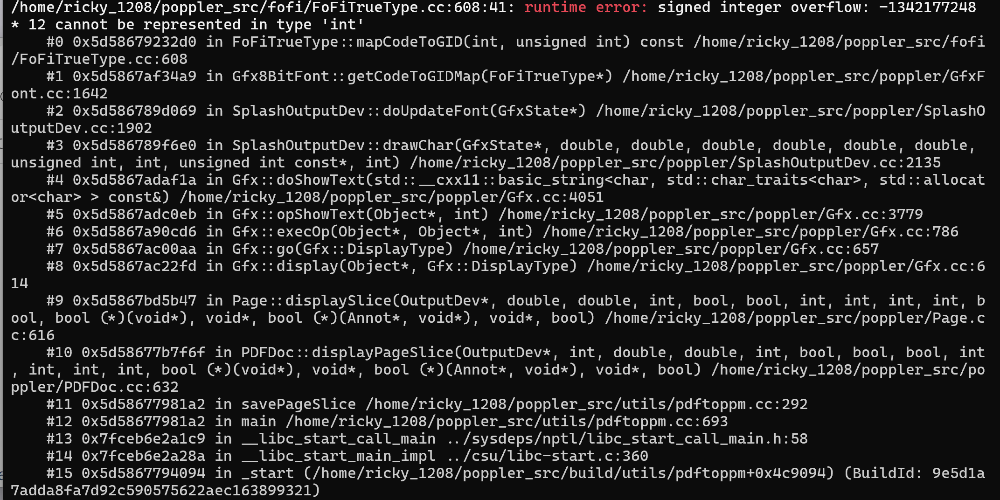

# Signed-integer-overflow in `FoFiTrueType::mapCodeToGID` (FoFiTrueType.cc:608) via malformed TrueType cmap in PDF

- **Project:** Poppler
- **Component:** `pdftoppm` (PDF to PPM/PNG/JPEG converter)
- **Affected version:** 26.07.0
- **GitLab work item:** https://gitlab.freedesktop.org/poppler/poppler/-/work_items/1761
- **Crash site:** `fofi/FoFiTrueType.cc:608` (`FoFiTrueType::mapCodeToGID`)
- **Bug class:** Signed integer overflow
- **Discoverer:** r1ck9
- **Date:** 2026-07-20
- **Fix:** commit `ed2a5538` (2026-07-26, "FoFiTrueType::mapCodeToGID: Improve b\*12 overflow check"), first released in 26.08.0

## Summary

Rendering a PDF containing a malformed TrueType font with `pdftoppm -r 10 -singlefile poc_1761.pdf output` triggers a signed integer overflow in `FoFiTrueType::mapCodeToGID()` (`fofi/FoFiTrueType.cc:608`). The function reads `segCnt` (a 32-bit unsigned value) from attacker-controlled font cmap table data and assigns it to a signed `int b`. When `segCnt > INT_MAX`, the assignment wraps `b` to a negative value (e.g. -1342177248). The existing guard `if (b > INT_MAX/12)` only checks the positive bound and fails to catch the wrapped negative. The subsequent `12 * b` multiplication overflows, producing an incorrect offset used in `getU32BE()`, which can lead to out-of-bounds memory access.

Security-relevant (signed integer overflow → incorrect offset → potential OOB read).


## Affected versions

- Poppler 26.07.0 — reproduced.
- Fixed in commit `ed2a5538` (2026-07-26), first included in release 26.08.0.

## Reproduction

### Build (UBSan)

```bash
git clone https://gitlab.freedesktop.org/poppler/poppler.git ~/poppler_src
cd ~/poppler_src && git checkout poppler-26.07.0
mkdir build && cd build

cmake .. \
    -DCMAKE_CXX_FLAGS="-g -O1 -fsanitize=undefined -fno-sanitize-recover=undefined -fno-omit-frame-pointer" \
    -DCMAKE_EXE_LINKER_FLAGS="-fsanitize=undefined" \
    -DBUILD_SHARED_LIBS=OFF \
    -DENABLE_UTILS=ON \
    -DENABLE_GLIB=OFF \
    -DENABLE_QT5=OFF \
    -DENABLE_QT6=OFF \
    -DENABLE_CPP=OFF \
    -DENABLE_BOOST=OFF \
    -DENABLE_NSS3=OFF \
    -DENABLE_LCMS=OFF \
    -DENABLE_LIBCURL=OFF \
    -DENABLE_GPGME=OFF

make -j$(nproc) pdftoppm
```

### Run

```bash
export UBSAN_OPTIONS='halt_on_error=0:print_stacktrace=1'
~/poppler_src/build/utils/pdftoppm -r 10 -singlefile poc_1761.pdf output
```

### UBSan output

```
/home/ricky_1208/poppler_src/fofi/FoFiTrueType.cc:608:41: runtime error: signed integer overflow: -1342177248 * 12 cannot be represented in type 'int'
    #0 0x5d58679232d0 in FoFiTrueType::mapCodeToGID(int, unsigned int) const /home/ricky_1208/poppler_src/fofi/FoFiTrueType.cc:608
    #1 0x5d5867af34a9 in Gfx8BitFont::getCodeToGIDMap(FoFiTrueType*) /home/ricky_1208/poppler_src/poppler/GfxFont.cc:1642
    #2 0x5d586789d069 in SplashOutputDev::doUpdateFont(GfxState*) /home/ricky_1208/poppler_src/poppler/SplashOutputDev.cc:1902
    #3 0x5d586789f6e0 in SplashOutputDev::drawChar(...) /home/ricky_1208/poppler_src/poppler/SplashOutputDev.cc:2135
    #4 0x5d5867adaf1a in Gfx::doShowText(...) /home/ricky_1208/poppler_src/poppler/Gfx.cc:4051
    #5 0x5d5867adc0eb in Gfx::opShowText(Object*, int) /home/ricky_1208/poppler_src/poppler/Gfx.cc:3779
    #6 0x5d5867a90cd6 in Gfx::execOp(Object*, Object*, int) /home/ricky_1208/poppler_src/poppler/Gfx.cc:786
    #7 0x5d5867ac00aa in Gfx::go(Gfx::DisplayType) /home/ricky_1208/poppler_src/poppler/Gfx.cc:657
    #8 0x5d5867ac22fd in Gfx::display(Object*, Gfx::DisplayType) /home/ricky_1208/poppler_src/poppler/Gfx.cc:614
    #9 0x5d5867bd5b47 in Page::displaySlice(...) /home/ricky_1208/poppler_src/poppler/Page.cc:616
    #10 0x5d58677b7f6f in PDFDoc::displayPageSlice(...) /home/ricky_1208/poppler_src/poppler/PDFDoc.cc:632
    #11 0x5d58677981a2 in savePageSlice /home/ricky_1208/poppler_src/utils/pdftoppm.cc:292
    #12 0x5d58677981a2 in main /home/ricky_1208/poppler_src/utils/pdftoppm.cc:693
    #13 0x7fceb6e2a1c9 in __libc_start_call_main ../sysdeps/nptl/libc_start_call_main.h:58
    #14 0x7fceb6e2a28a in __libc_start_main_impl ../csu/libc-start.c:360
    #15 0x5d5867794094 in _start (/home/ricky_1208/poppler_src/build/utils/pdftoppm+0x4c9094)

SUMMARY: UndefinedBehaviorSanitizer: undefined-behavior /home/ricky_1208/poppler_src/fofi/FoFiTrueType.cc:608:41
```




## Root cause

`FoFiTrueType::mapCodeToGID()` processes a TrueType font's cmap table (format 12). At `FoFiTrueType.cc:608`, it computes:

```cpp
segEnd = getU32BE(pos + 16 + 12 * b + 4, &ok);
```

where `b = segCnt - 1` and `segCnt` is read from attacker-controlled font data as a 32-bit unsigned value.

The vulnerability chain:

1. `segCnt` is read from the font's cmap table as a value greater than `INT_MAX` (e.g. `0xB0000001`).
2. `b = segCnt - 1` is assigned to a signed `int`. Since the value exceeds `INT_MAX`, integer wrapping occurs, producing a negative `b` (e.g. -1342177248).
3. The existing guard `if (b > INT_MAX/12)` only checks the positive upper bound. A negative `b` passes this check.
4. `12 * b` performs signed multiplication. `-1342177248 * 12` overflows `int`, which is undefined behavior.
5. The overflowed offset is used in the `getU32BE()` call, potentially causing an out-of-bounds read.

## Impact

- **Confidentiality:** Low — the incorrect offset from the overflow can cause an out-of-bounds read, potentially leaking adjacent memory.
- **Integrity:** Low — the overflowed offset can cause incorrect font glyph mapping, potentially producing corrupted output.
- **Availability:** Low — under UBSan the process aborts; without sanitizer, behavior is undefined (potential crash or memory corruption).
- Affects any application or service that uses Poppler to render or convert untrusted PDF files: document processing services, PDF preview pipelines, desktop PDF viewers.

**CVSS v3.1:** 5.3 (Medium) — `CVSS:3.1/AV:L/AC:L/PR:N/UI:R/S:U/C:L/I:L/A:L`

## Workaround

- Do not open PDF files from untrusted sources.
- Process untrusted PDF files in a sandboxed or containerized environment.
- Apply resource limits (e.g. cgroups memory limits) to PDF processing services.
- Upgrade to Poppler 26.08.0 or later.

## Fix

Fixed in commit `ed2a5538` (2026-07-26, "FoFiTrueType::mapCodeToGID: Improve b\*12 overflow check"), first included in release 26.08.0.

The fix validates `segCnt` before assigning it to a signed `int`, or uses an unsigned type (`size_t`) to avoid signed integer wrapping, and ensures the overflow check catches both positive and negative bounds.

## References

- GitLab work item: https://gitlab.freedesktop.org/poppler/poppler/-/work_items/1761
- Fix commit: `ed2a5538`
- Poppler homepage: https://poppler.freedesktop.org/
- Poppler 26.07.0 tag: https://gitlab.freedesktop.org/poppler/poppler/-/tags/poppler-26.07.0
