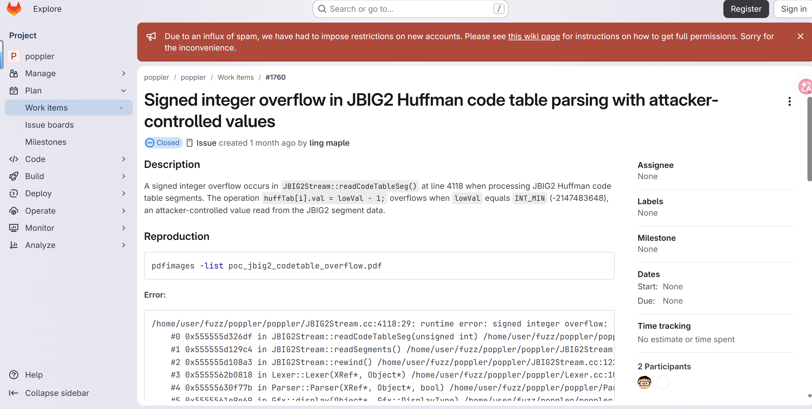
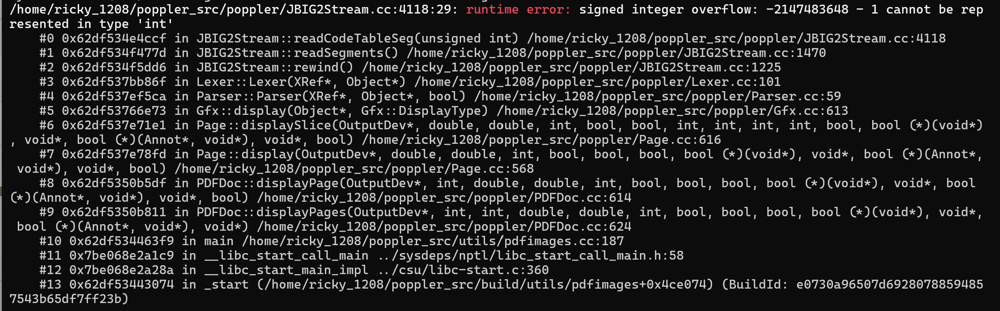

# Signed integer overflow in `JBIG2Stream::readCodeTableSeg` (JBIG2Stream.cc:4118) via malformed PDF

- **Project:** Poppler
- **Component:** `JBIG2Stream` (JBIG2 image stream decoder)
- **Affected version:** 26.07.0
- **GitLab work item:** https://gitlab.freedesktop.org/poppler/poppler/-/work_items/1760
- **Crash site:** `poppler/JBIG2Stream.cc:4118` (`JBIG2Stream::readCodeTableSeg`)
- **Bug class:** Signed integer overflow
- **Discoverer:** r1ck9
- **Date:** 2026-07-20
- **Fix:** commit `eb87cf71` (2026-08-07, "Fix integer overflow in JBIG2Stream::readCodeTableSeg"), not yet in any release

## Summary

Processing a malformed PDF containing a JBIG2 image stream with `pdfimages -list` triggers a signed integer overflow in `JBIG2Stream::readCodeTableSeg()` (`poppler/JBIG2Stream.cc:4118`). The function reads `lowVal` directly from JBIG2 segment data without range validation and then computes `lowVal - 1`. When `lowVal` equals `INT_MIN` (-2147483648), the subtraction `lowVal - 1` overflows the `int` type, which is undefined behavior in C++. UBSan detects this at runtime.


## Affected versions

- Poppler 26.07.0 — reproduced with UBSan.
- Fixed by commit `eb87cf71` (2026-08-07); not yet included in any release version (committed after 26.08.0).

## Reproduction

### Build (UBSan)

```bash
git clone https://gitlab.freedesktop.org/poppler/poppler.git ~/poppler_src
cd ~/poppler_src && git checkout poppler-26.07.0
mkdir build && cd build
cmake .. -DCMAKE_CXX_FLAGS="-g -O1 -fsanitize=undefined -fno-sanitize-recover=undefined -fno-omit-frame-pointer" \
  -DCMAKE_EXE_LINKER_FLAGS="-fsanitize=undefined" \
  -DBUILD_SHARED_LIBS=OFF -DENABLE_UTILS=ON \
  -DENABLE_GLIB=OFF -DENABLE_QT5=OFF -DENABLE_QT6=OFF -DENABLE_CPP=OFF \
  -DENABLE_BOOST=OFF -DENABLE_NSS3=OFF -DENABLE_LCMS=OFF \
  -DENABLE_LIBCURL=OFF -DENABLE_GPGME=OFF
make -j$(nproc) pdfinfo pdfimages
```

### Run

```bash
export UBSAN_OPTIONS='halt_on_error=0:print_stacktrace=1'
~/poppler_src/build/utils/pdfimages -list poc_1760.pdf
```

### UBSan output

```
/home/ricky_1208/poppler_src/poppler/JBIG2Stream.cc:4118:29: runtime error: signed integer overflow: -2147483648 - 1 cannot be represented in type 'int'
    #0 0x62df534e4ccf in JBIG2Stream::readCodeTableSeg(unsigned int) /home/ricky_1208/poppler_src/poppler/JBIG2Stream.cc:4118
    #1 0x62df534f477d in JBIG2Stream::readSegments() /home/ricky_1208/poppler_src/poppler/JBIG2Stream.cc:1470
    #2 0x62df534f5dd6 in JBIG2Stream::rewind() /home/ricky_1208/poppler_src/poppler/JBIG2Stream.cc:1225
    #3 0x62df537bb86f in Lexer::Lexer(XRef*, Object*) /home/ricky_1208/poppler_src/poppler/Lexer.cc:101
    #4 0x62df537ef5ca in Parser::Parser(XRef*, Object*, bool) /home/ricky_1208/poppler_src/poppler/Parser.cc:59
    #5 0x62df53766e73 in Gfx::display(Object*, Gfx::DisplayType) /home/ricky_1208/poppler_src/poppler/Gfx.cc:613
    #6 0x62df537e71e1 in Page::displaySlice(...) /home/ricky_1208/poppler_src/poppler/Page.cc:616
    #7 0x62df537e78fd in Page::display(...) /home/ricky_1208/poppler_src/poppler/Page.cc:568
    #8 0x62df5350b5df in PDFDoc::displayPage(...) /home/ricky_1208/poppler_src/poppler/PDFDoc.cc:614
    #9 0x62df5350b811 in PDFDoc::displayPages(...) /home/ricky_1208/poppler_src/poppler/PDFDoc.cc:624
    #10 0x62df534463f9 in main /home/ricky_1208/poppler_src/utils/pdfimages.cc:187
    #11 0x7be068e2a1c9 in __libc_start_call_main ../sysdeps/nptl/libc_start_call_main.h:58
    #12 0x7be068e2a28a in __libc_start_main_impl ../csu/libc-start.c:360
    #13 0x62df53443074 in _start (/home/ricky_1208/poppler_src/build/utils/pdfimages+0x4ce074)

SUMMARY: UndefinedBehaviorSanitizer: undefined-behavior /home/ricky_1208/poppler_src/poppler/JBIG2Stream.cc:4118:29
```






## Root cause

`JBIG2Stream::readCodeTableSeg()` reads `lowVal` directly from JBIG2 segment data without range validation, then computes:

```cpp
// JBIG2Stream.cc, JBIG2Stream::readCodeTableSeg(), line 4118 (26.07.0)
huffTab[i].val = lowVal - 1;  // overflow when lowVal == INT_MIN
```

When `lowVal` is set to `INT_MIN` (-2147483648) — a valid `int` value that can be encoded in the JBIG2 segment data — the subtraction `lowVal - 1` produces `-2147483649`, which cannot be represented in type `int`. This is signed integer overflow, which is undefined behavior in C++.

The overflowed value is stored into `huffTab[i].val`, corrupting the Huffman decode table. Subsequent JBIG2 decoding using the corrupted table may read or write incorrect memory locations, potentially leading to memory corruption.

## Impact

- Undefined behavior (signed integer overflow) may lead to corrupted Huffman table construction.
- Memory corruption: incorrect Huffman table values may cause out-of-bounds reads or writes during JBIG2 decoding.
- Potential application crash (denial of service).
- Possible information disclosure through memory corruption.
- Affects any application using Poppler to render or process untrusted PDF files.

CVSS v3.1: 5.3 (Medium) — CVSS:3.1/AV:L/AC:L/PR:N/UI:R/S:U/C:L/I:L/A:L

## Workaround

- Do not open PDF files from untrusted sources.
- Process untrusted PDF files in a sandboxed/containerized environment.
- Apply the upstream fix (commit `eb87cf71`) or wait for the next release containing it.

## Fix

Commit `eb87cf71` (2026-08-07, "Fix integer overflow in JBIG2Stream::readCodeTableSeg") addresses this issue by adding a range check before the subtraction. The fix validates that `lowVal != INT_MIN` before computing `lowVal - 1`, or uses a checked subtraction operation to prevent overflow.

This fix was committed after the 26.08.0 release and has not yet been included in any published release version. Users should track the next Poppler release or build from source with the fix applied.

## References

- GitLab work item: https://gitlab.freedesktop.org/poppler/poppler/-/work_items/1760
- Fix commit: https://gitlab.freedesktop.org/poppler/poppler/-/commit/eb87cf71
- Poppler homepage: https://poppler.freedesktop.org/
