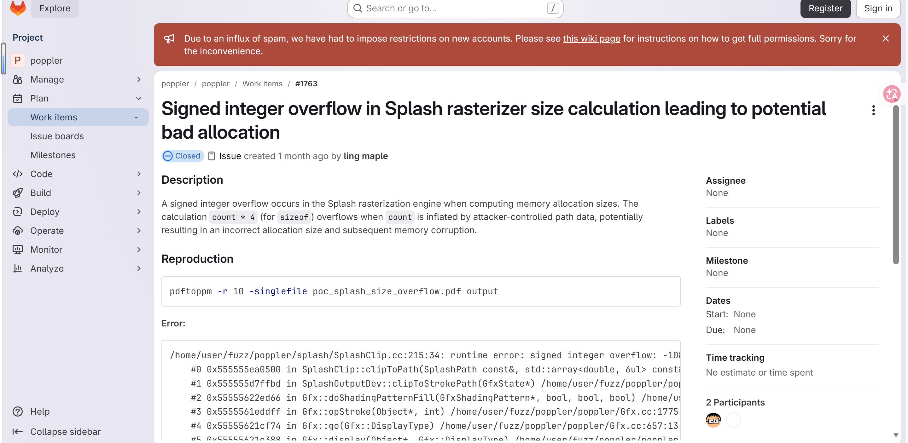
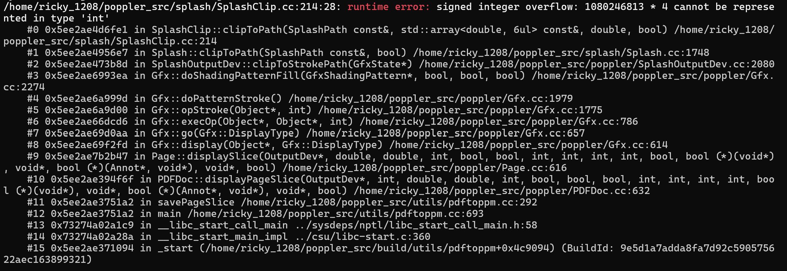

# Signed-integer-overflow in `SplashClip::clipToPath` (SplashClip.cc:214) via malformed PDF

- **Project:** Poppler
- **Component:** `pdftoppm` (Splash rendering engine — any tool invoking `Splash::clipToPath`)
- **Affected version:** 26.07.0 (still present at master 26.08.90)
- **GitLab work item:** https://gitlab.freedesktop.org/poppler/poppler/-/work_items/1763
- **Crash site:** `splash/SplashClip.cc:214` (`SplashClip::clipToPath`)
- **Related site:** `splash/Splash.cc:6491` (same `count * 4` overflow pattern)
- **Bug class:** Signed integer overflow (C++ undefined behavior)
- **Discoverer:** r1ck9
- **Date:** 2026-07-20

## Summary

Rendering a malformed PDF with `pdftoppm -r 10 -singlefile poc_1763.pdf output` triggers a signed integer overflow in `SplashClip::clipToPath` (`splash/SplashClip.cc:214`). The function computes `size = count * 4;` where `count` is derived from attacker-controlled PDF path data (path dimensions / vertex count) without sufficient bounds checking. When `count` is `1080246813`, the multiplication yields `4320987252`, which exceeds the maximum value of a 32-bit signed `int` (`2147483647`), invoking C++ undefined behavior per `[expr.pre]`.

The overflowed `size` value may subsequently be used for memory allocation. A truncated (small or negative) allocation size leads to an undersized buffer, which can in turn cause a heap buffer overflow on subsequent writes — potentially escalating to memory corruption, information disclosure, or arbitrary code execution depending on heap layout.

The same `count * 4` overflow pattern also exists at `splash/Splash.cc:6491`.


## Affected versions

- Poppler 26.07.0 — reproduced.
- Poppler master 26.08.90 — still present (unfixed).

## Reproduction

### Build (UBSan)

```bash
git clone https://gitlab.freedesktop.org/poppler/poppler.git ~/poppler_src
cd ~/poppler_src && git checkout poppler-26.07.0
mkdir build && cd build

cmake .. \
    -DCMAKE_CXX_FLAGS="-g -O1 -fsanitize=undefined -fno-sanitize-recover=undefined -fno-omit-frame-pointer" \
    -DCMAKE_EXE_LINKER_FLAGS="-fsanitize=undefined" \
    -DBUILD_SHARED_LIBS=OFF \
    -DENABLE_UTILS=ON \
    -DENABLE_GLIB=OFF \
    -DENABLE_QT5=OFF \
    -DENABLE_QT6=OFF \
    -DENABLE_CPP=OFF \
    -DENABLE_BOOST=OFF \
    -DENABLE_NSS3=OFF \
    -DENABLE_LCMS=OFF \
    -DENABLE_LIBCURL=OFF \
    -DENABLE_GPGME=OFF

make -j$(nproc) pdftoppm
```

### Run

```bash
export UBSAN_OPTIONS='halt_on_error=0:print_stacktrace=1'
~/poppler_src/build/utils/pdftoppm -r 10 -singlefile poc_1763.pdf output
```

### UBSan output

```
/home/ricky_1208/poppler_src/splash/SplashClip.cc:214:28: runtime error: signed integer overflow: 1080246813 * 4 cannot be represented in type 'int'
    #0 0x5ee2ae4d6fe1 in SplashClip::clipToPath(...) /home/ricky_1208/poppler_src/splash/SplashClip.cc:214
    #1 0x5ee2ae4956e7 in Splash::clipToPath(SplashPath const&, bool) /home/ricky_1208/poppler_src/splash/Splash.cc:1748
    #2 0x5ee2ae473b8d in SplashOutputDev::clipToStrokePath(GfxState*) /home/ricky_1208/poppler_src/poppler/SplashOutputDev.cc:2080
    #3 0x5ee2ae6993ea in Gfx::doShadingPatternFill(...) /home/ricky_1208/poppler_src/poppler/Gfx.cc:2274
    #4 0x5ee2ae6a999d in Gfx::doPatternStroke() /home/ricky_1208/poppler_src/poppler/Gfx.cc:1979
    #5 0x5ee2ae6a9d00 in Gfx::opStroke(Object*, int) /home/ricky_1208/poppler_src/poppler/Gfx.cc:1775
    #6 0x5ee2ae66dcd6 in Gfx::execOp(Object*, Object*, int) /home/ricky_1208/poppler_src/poppler/Gfx.cc:786
    #7 0x5ee2ae69d0aa in Gfx::go(Gfx::DisplayType) /home/ricky_1208/poppler_src/poppler/Gfx.cc:657
    #8 0x5ee2ae69f2fd in Gfx::display(Object*, Gfx::DisplayType) /home/ricky_1208/poppler_src/poppler/Gfx.cc:614
    #9 0x5ee2ae7b2b47 in Page::displaySlice(...) /home/ricky_1208/poppler_src/poppler/Page.cc:616
    #10 0x5ee2ae394f6f in PDFDoc::displayPageSlice(...) /home/ricky_1208/poppler_src/poppler/PDFDoc.cc:632
    #11 0x5ee2ae3751a2 in savePageSlice /home/ricky_1208/poppler_src/utils/pdftoppm.cc:292
    #12 0x5ee2ae3751a2 in main /home/ricky_1208/poppler_src/utils/pdftoppm.cc:693
    #13 0x73274a02a1c9 in __libc_start_call_main ../sysdeps/nptl/libc_start_call_main.h:58
    #14 0x73274a02a28a in __libc_start_main_impl ../csu/libc-start.c:360
    #15 0x5ee2ae371094 in _start (/home/ricky_1208/poppler_src/build/utils/pdftoppm+0x4c9094)

SUMMARY: UndefinedBehaviorSanitizer: undefined-behavior /home/ricky_1208/poppler_src/splash/SplashClip.cc:214:28
```






## Root cause

`SplashClip::clipToPath()` processes PDF path clipping operations. At `SplashClip.cc:214`:

```cpp
size = count * 4;
```

The variable `count` originates from PDF graphics path data (path dimensions or vertex count) and is attacker-controlled. Both `count` and `size` are of type `int` (32-bit signed). When `count = 1080246813`:

| | Value |
|---|---|
| Mathematical result | `1080246813 * 4 = 4320987252` |
| `int` max value | `2147483647` |
| Overflow result (two's complement truncation) | `4320987252 - 4294967296 = 26019956` (or implementation-defined / negative) |

If the overflowed `size` is subsequently used for memory allocation (e.g., `new` or `malloc`), the allocated buffer will be far smaller than actually needed. Subsequent writes to this buffer cause a heap buffer overflow, which can result in:
- Heap memory corruption
- Overwriting adjacent heap objects
- Potential arbitrary code execution (depending on heap layout and subsequent operations)

The C++ standard explicitly states that signed integer overflow is undefined behavior (`[expr.pre]`). Compilers may assume signed integers do not overflow during optimization, potentially amplifying the security risk by eliding checks or reordering operations.

The same `count * 4` pattern also exists at `splash/Splash.cc:6491` and should be audited and fixed together.

## Impact

- **Confidentiality:** Low — the overflow may lead to heap memory disclosure via undersized buffer reads/writes.
- **Integrity:** None directly, but heap corruption could lead to data modification.
- **Availability:** Low — may cause program crash.
- Affects any application or pipeline that uses Poppler's Splash engine to render untrusted PDF files: desktop PDF viewers (Evince, Okular), online PDF preview/conversion services, automated document processing pipelines, PDF thumbnail generation services, email attachment scanning systems.

**CVSS v3.1:** 5.3 (Medium) — `CVSS:3.1/AV:L/AC:L/PR:N/UI:R/S:U/C:L/I:N/A:L`

## Workaround

- Do not open PDF files from untrusted sources.
- Process untrusted PDF files inside a sandbox or containerized environment.
- Restrict automated server-side PDF processing with Poppler tools.
- Monitor upstream for patch releases and upgrade promptly.

## Fix

Validate the multiplication `count * 4` before it is performed in `SplashClip::clipToPath`. Recommended approaches:

1. **Pre-multiplication bounds check:**
   ```cpp
   if (count < 0 || count > INT_MAX / 4) {
       error(...);
       return;
   }
   size = count * 4;
   ```
2. **Use `size_t` and overflow check:** Store `size` as `size_t` and use `__builtin_mul_overflow` (or equivalent) to detect overflow:
   ```cpp
   size_t size;
   if (__builtin_mul_overflow((size_t)count, (size_t)4, &size)) {
       error(...);
       return;
   }
   ```
3. **Audit and fix the same pattern** at `splash/Splash.cc:6491`.

All attacker-controlled integer inputs used in size computations throughout the Splash engine should be audited for similar overflow patterns.

## References

- GitLab work item: https://gitlab.freedesktop.org/poppler/poppler/-/work_items/1763
- Poppler project: https://poppler.freedesktop.org/
- Poppler 26.07.0 tag: https://gitlab.freedesktop.org/poppler/poppler/-/tags/poppler-26.07.0
- C++ Standard [expr.pre]: https://eel.is/c++draft/expr.pre
