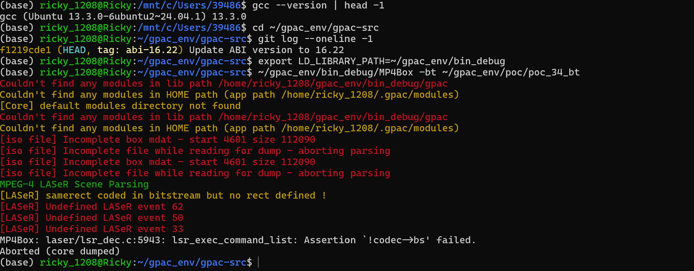
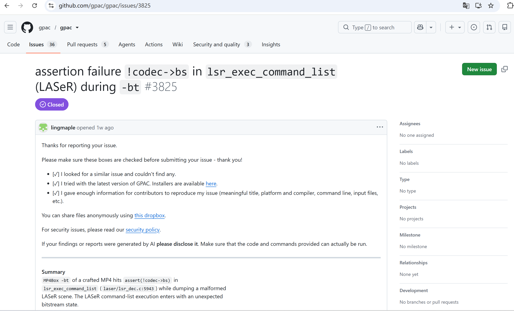

# Vuln: GPAC MP4Box Assertion Failure assert(!codec->bs)

**Project:** gpac/gpac (https://github.com/gpac/gpac)  
**Version:** Vulnerable at commit `f1219cde` (master, 2026-07-25), fixed after issue closure (2026-07-28)  
**Date:** 2026-07-27  
**Severity:** MEDIUM  
**CWE:** CWE-617 - Reachable Assertion  

---

## Affected File

```text
laser/lsr_dec.c:5943 — lsr_exec_command_list
applications/mp4box/ (trigger path via -bt)
```

## Root Cause

GPAC contains a reachable assertion `assert(!codec->bs)` in `lsr_exec_command_list` at `laser/lsr_dec.c:5943`. When MP4Box processes a crafted MP4 file with the `-bt` argument (BIFS text dump), the ISO file contains an incomplete mdat box and malformed LASeR (Lightweight Application Scene Representation) scene data with undefined event types (62, 50, 33). The LASeR decoding leaves the codec bitstream object in an uncleaned state (codec->bs not NULL), and when the command list execution completes without proper cleanup, the assertion fires.

## Steps to Reproduce

```bash
git clone https://github.com/gpac/gpac.git gpac-vuln
cd gpac-vuln
git checkout f1219cde

sudo apt install -y zlib1g-dev build-essential

./configure --enable-debug
make -j"$(nproc)"

curl -L -o poc_34_bt.zip \
  https://github.com/user-attachments/files/30402728/poc_34_bt.zip
python3 -c "import zipfile; zipfile.ZipFile('poc_34_bt.zip').extractall('.')"

export LD_LIBRARY_PATH=~/gpac_env/bin_debug
~/gpac_env/bin_debug/MP4Box -bt ~/gpac_env/poc/poc_34_bt
```

Expected result on the vulnerable commit:

```text
[iso file] Incomplete box mdat - start 4601 size 112090
[iso file] Incomplete file while reading for dump - aborting parsing
MPEG-4 LASeR Scene Parsing
[LASeR] samerect coded in bitstream but no rect defined !
[LASeR] Undefined LASeR event 62
[LASeR] Undefined LASeR event 50
[LASeR] Undefined LASeR event 33
MP4Box: laser/lsr_dec.c:5943: lsr_exec_command_list: Assertion `!codec->bs' failed.
Aborted (core dumped)
```



The public issue for this bug is:

- https://github.com/gpac/gpac/issues/3825



## Impact

A crafted MP4 file can trigger an assertion failure in MP4Box when using the `-bt` option, causing an immediate program abort and resulting in denial of service.

## Recommended Fix

Replace the reachable assertion with proper error handling that checks and cleans up existing bitstream state before re-initialization, rather than aborting the process.

---

## References

- GPAC issue #3825: https://github.com/gpac/gpac/issues/3825
