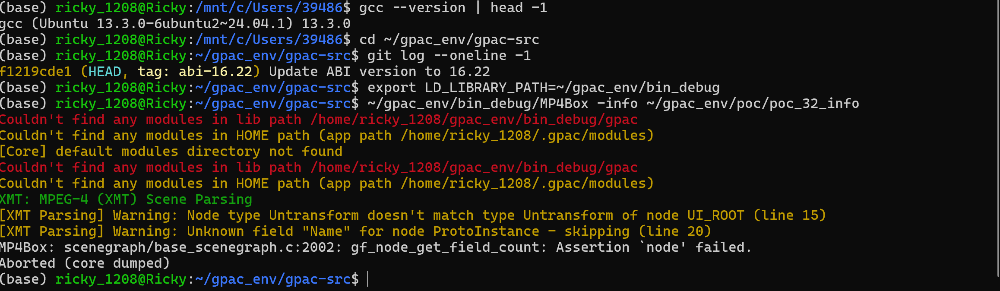
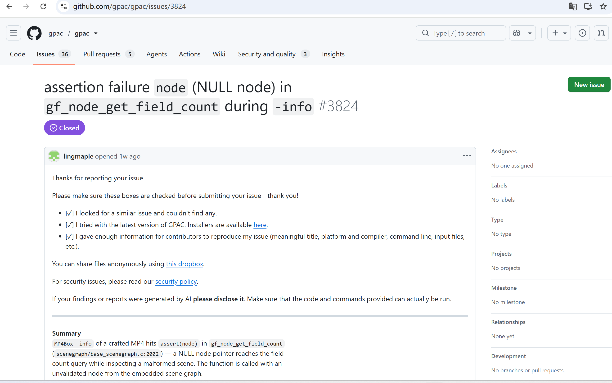

# Vuln: GPAC MP4Box Assertion Failure assert(node)

**Project:** gpac/gpac (https://github.com/gpac/gpac)  
**Version:** Vulnerable at commit `f1219cde` (master, 2026-07-25), fixed after issue closure (2026-07-28)  
**Date:** 2026-07-27  
**Severity:** MEDIUM  
**CWE:** CWE-617 - Reachable Assertion  

---

## Affected File

```text
scenegraph/base_scenegraph.c:2002 — gf_node_get_field_count
applications/mp4box/ (trigger path via -info, XMT scene parsing)
```

## Root Cause

GPAC contains a reachable assertion `assert(node)` in `gf_node_get_field_count` at `base_scenegraph.c:2002`. When MP4Box processes a crafted MP4 file with the `-info` argument, XMT scene parsing encounters problematic node type declarations (Node type mismatch warning) and an unknown field "Name" in a ProtoInstance node. The malformed scene graph causes a NULL node pointer to reach `gf_node_get_field_count`, triggering the assertion.

## Steps to Reproduce

```bash
git clone https://github.com/gpac/gpac.git gpac-vuln
cd gpac-vuln
git checkout f1219cde

sudo apt install -y zlib1g-dev build-essential

./configure --enable-debug
make -j"$(nproc)"

curl -L -o poc_32_info.zip \
  https://github.com/user-attachments/files/30402706/poc_32_info.zip
python3 -c "import zipfile; zipfile.ZipFile('poc_32_info.zip').extractall('.')"

export LD_LIBRARY_PATH=~/gpac_env/bin_debug
~/gpac_env/bin_debug/MP4Box -info ~/gpac_env/poc/poc_32_info
```

Expected result on the vulnerable commit:

```text
XMT: MPEG-4 (XMT) Scene Parsing
[XMT Parsing] Warning: Node type Untransform doesn't match type Untransform of node UI_ROOT (line 15)
[XMT Parsing] Warning: Unknown field "Name" for node ProtoInstance - skipping (line 20)
MP4Box: scenegraph/base_scenegraph.c:2002: gf_node_get_field_count: Assertion `node' failed.
Aborted (core dumped)
```



The public issue for this bug is:

- https://github.com/gpac/gpac/issues/3824



## Impact

A crafted MP4 file can trigger an assertion failure in MP4Box when using the `-info` option, causing an immediate program abort and resulting in denial of service.

## Recommended Fix

Replace the reachable assertion with proper error handling that checks node validity and returns an error rather than aborting the process.

---

## References

- GPAC issue #3824: https://github.com/gpac/gpac/issues/3824
