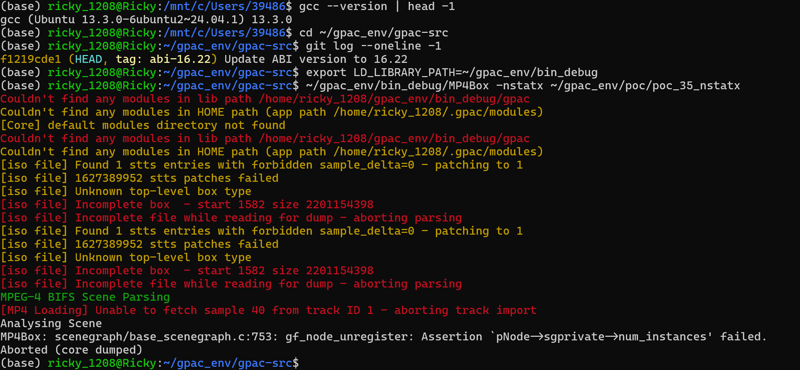
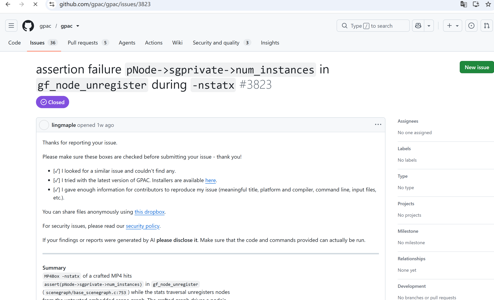

# Vuln: GPAC MP4Box Assertion Failure assert(num_instances)

**Project:** gpac/gpac (https://github.com/gpac/gpac)  
**Version:** Vulnerable at commit `f1219cde` (master, 2026-07-25), fixed after issue closure (2026-07-28)  
**Date:** 2026-07-27  
**Severity:** MEDIUM  
**CWE:** CWE-617 - Reachable Assertion  

---

## Affected File

```text
scenegraph/base_scenegraph.c:753 — gf_node_unregister
applications/mp4box/filedump.c (trigger path via -nstatx)
```

## Root Cause

GPAC contains a reachable assertion `pNode->sgprivate->num_instances` in `gf_node_unregister` at `base_scenegraph.c:753`. When MP4Box processes a crafted MP4 file with the `-nstatx` argument, the malformed ISO data (corrupted stts entries, unknown top-level box types, incomplete boxes) causes scene graph node instance tracking to become corrupted. A node whose instance counter has been decremented to zero is still accessed during scene analysis, triggering the assertion.

## Steps to Reproduce

```bash
git clone https://github.com/gpac/gpac.git gpac-vuln
cd gpac-vuln
git checkout f1219cde

sudo apt install -y zlib1g-dev build-essential

./configure --enable-debug
make -j"$(nproc)"

curl -L -o poc_35_nstatx.zip \
  https://github.com/user-attachments/files/30402353/poc_35_nstatx.zip
python3 -c "import zipfile; zipfile.ZipFile('poc_35_nstatx.zip').extractall('.')"

export LD_LIBRARY_PATH=~/gpac_env/bin_debug
~/gpac_env/bin_debug/MP4Box -nstatx ~/gpac_env/poc/poc_35_nstatx
```

Expected result on the vulnerable commit:

```text
[iso file] Found 1 stts entries with forbidden sample_delta=0 - patching to 1
[iso file] 1627389952 stts patches failed
[iso file] Unknown top-level box type
[iso file] Incomplete box  - start 1582 size 2201154398
[iso file] Incomplete file while reading for dump - aborting parsing
[MP4 Loading] Unable to fetch sample 40 from track ID 1 - aborting track import
Analysing Scene
MP4Box: scenegraph/base_scenegraph.c:753: gf_node_unregister: Assertion `pNode->sgprivate->num_instances' failed.
Aborted (core dumped)
```



The public issue for this bug is:

- https://github.com/gpac/gpac/issues/3823



## Impact

A crafted MP4 file can trigger an assertion failure in MP4Box when using the `-nstatx` option, causing an immediate program abort and resulting in denial of service.

## Recommended Fix

Replace the reachable assertion with proper error handling that validates the node instance count before access, returning an error rather than aborting.

---

## References

- GPAC issue #3823: https://github.com/gpac/gpac/issues/3823
