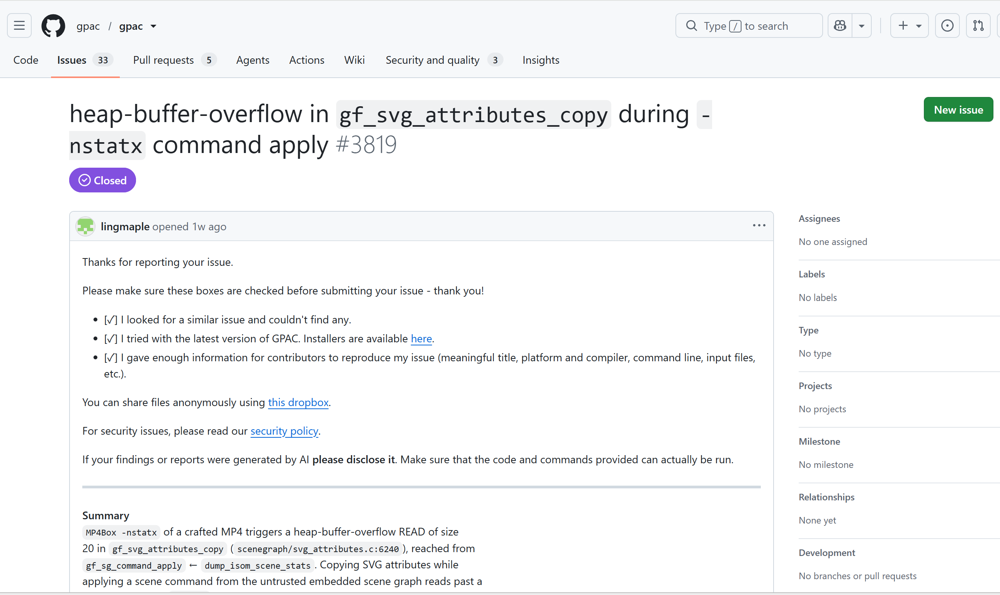

# Vuln: GPAC MP4Box Heap-Buffer-Overflow READ size 20 in gf_svg_attributes_copy

**Project:** gpac/gpac (https://github.com/gpac/gpac)  
**Version:** Vulnerable at commit `f1219cde` (master, 2026-07-25), fixed after issue closure (2026-07-28)  
**Date:** 2026-07-27  
**Severity:** MEDIUM  
**CWE:** CWE-122 - Heap-based Buffer Overflow  

---

## Affected File

```text
scenegraph/svg_attributes.c:6240 (gf_svg_attributes_copy)
scenegraph/commands.c:826 (gf_sg_command_apply)
laser/lsr_dec.c:4994 (lsr_read_update_value_indexed, allocates 4-byte buffer)
applications/mp4box/filedump.c:459 (trigger path via -nstatx)
```

## Root Cause

During LASeR scene decoding, `lsr_read_update_value_indexed` allocates only a 4-byte heap buffer for storing an update value index. However, `gf_svg_attributes_copy` (called via `gf_sg_command_apply`) reads 20 bytes from this buffer when copying SVG attributes, causing a heap-buffer-overflow read of 16 bytes beyond the allocated region.

## Steps to Reproduce

```bash
git clone https://github.com/gpac/gpac.git gpac-vuln
cd gpac-vuln
git checkout f1219cde

sudo apt install -y zlib1g-dev build-essential

./configure --enable-sanitizer
make -j"$(nproc)"

curl -L -o poc_29_nstatx.zip \
  https://github.com/user-attachments/files/30401496/poc_29_nstatx.zip
python3 -c "import zipfile; zipfile.ZipFile('poc_29_nstatx.zip').extractall('.')"

export LD_LIBRARY_PATH=~/gpac_env/bin_asan
~/gpac_env/bin_asan/MP4Box -nstatx ~/gpac_env/poc/poc_29_nstatx
```

Expected result on the vulnerable commit:

```text
==1506==ERROR: AddressSanitizer: heap-buffer-overflow on address 0x5020000014b0 at pc 0x74ef9ba3c9af bp 0x7ffe058cb270 sp 0x7ffe058cb260
READ of size 20 at 0x5020000014b0 thread T0
    #0 0x74ef9ba3c9ae in gf_svg_attributes_copy scenegraph/svg_attributes.c:6240
    #1 0x74ef9b8063eb in gf_sg_command_apply scenegraph/commands.c:826
    #2 0x5a58719b7c45 in dump_isom_scene_stats /home/ricky_1208/gpac_env/gpac-src/applications/mp4box/filedump.c:459
    #3 0x5a58719a4325 in mp4box_main /home/ricky_1208/gpac_env/gpac-src/applications/mp4box/mp4box.c:6667
    #4 0x74ef9902a1c9 in __libc_start_call_main ../sysdeps/nptl/libc_start_call_main.h:58
    #5 0x74ef9902a28a in __libc_start_main_impl ../csu/libc-start.c:360
    #6 0x5a587197a354 in _start (/home/ricky_1208/gpac_env/bin_asan/MP4Box+0xb0354)

0x5020000014b4 is located 0 bytes after 4-byte region [0x5020000014b0,0x5020000014b4)
allocated by thread T0 here:
    #0 0x74ef9f2fd9c7 in malloc ../../../../src/libsanitizer/asan/asan_malloc_linux.cpp:69
    #1 0x74ef9c405979 in lsr_read_update_value_indexed laser/lsr_dec.c:4994
    #2 0x74ef9c4285de in lsr_read_add_replace_insert laser/lsr_dec.c:5480
    #3 0x74ef9c4285de in lsr_read_command_list laser/lsr_dec.c:6007
    #4 0x74ef9c42ccb4 in lsr_decode_laser_unit laser/lsr_dec.c:6284
    #5 0x74ef9c42e1db in gf_laser_decode_command_list laser/lsr_dec.c:223
    #6 0x74ef9c1782ef in gf_sm_load_run_isom scene_manager/loader_isom.c:307
    #7 0x5a58719b7f53 in dump_isom_scene_stats applications/mp4box/filedump.c:399
    #8 0x5a58719a4325 in mp4box_main applications/mp4box/mp4box.c:6667
SUMMARY: AddressSanitizer: heap-buffer-overflow scenegraph/svg_attributes.c:6240 in gf_svg_attributes_copy
==1506==ABORTING
```


The public issue for this bug is:

- https://github.com/gpac/gpac/issues/3819



## Impact

A crafted MP4 file can trigger a heap-buffer-overflow read of 20 bytes (from a 4-byte allocation) in MP4Box when using the `-nstatx` option, potentially leading to information disclosure or a process crash resulting in denial of service.

## Recommended Fix

Apply the upstream fix that ensures buffer sizes allocated during LASeR decoding match the sizes expected by downstream SVG attribute copy operations.

---

## References

- GPAC issue #3819: https://github.com/gpac/gpac/issues/3819
