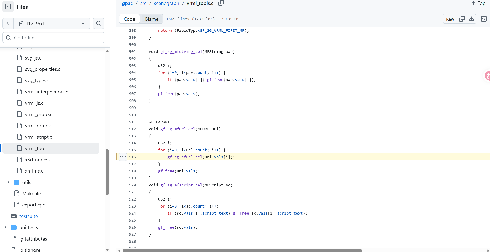
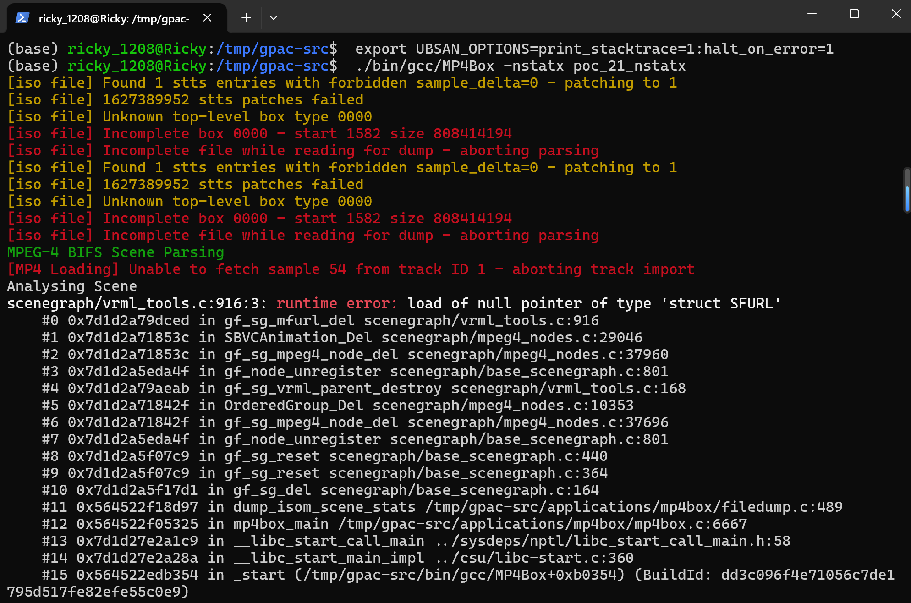
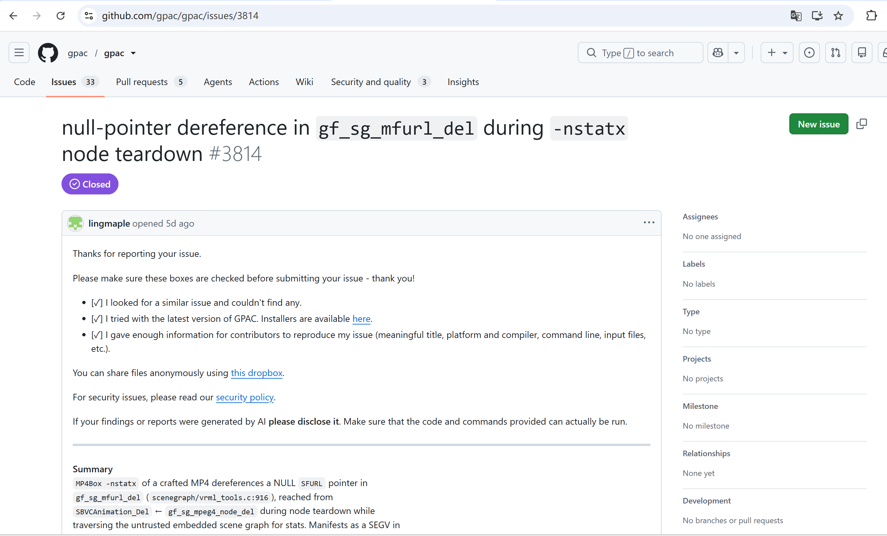

# Vuln: GPAC MP4Box gf_sg_mfurl_del NULL Pointer Dereference

**Project:** gpac/gpac (https://github.com/gpac/gpac)  
**Version:** Vulnerable at commit `f1219cde` (master, 2026-07-25), fixed by commit after issue closure (2026-07-28)  
**Date:** 2026-07-27  
**Severity:** MEDIUM  
**CWE:** CWE-476 - NULL Pointer Dereference  

---

## Affected File

```text
scenegraph/vrml_tools.c:916 (gf_sg_mfurl_del)
scenegraph/mpeg4_nodes.c:29046 (SBVCAnimation_Del)
applications/mp4box/filedump.c:489 (trigger path via -nstatx)
```

## Root Cause

GPAC does not validate that the `SFURL` pointer array inside an `MFURL` field is non-NULL before dereferencing it during node destruction. When MP4Box processes a crafted MP4 file with `-nstatx`, the embedded MPEG-4 BIFS scene graph contains a malformed `SBVCAnimation` node whose URL field was never properly initialized. During stats dump teardown, the call chain `dump_isom_scene_stats` → `gf_sg_del` → `gf_sg_reset` → node unregister → `SBVCAnimation_Del` → `gf_sg_mfurl_del` reaches line 916 of `vrml_tools.c`, which loads a NULL `SFURL` pointer, causing a segmentation fault.

This issue may be an incomplete fix for a prior commit: https://github.com/gpac/gpac/commit/3e535640b48ed3218e74929cbf3e42250fce3ddf



## Steps to Reproduce

```bash
git clone https://github.com/gpac/gpac.git gpac-vuln
cd gpac-vuln
git checkout f1219cde

sudo apt install -y zlib1g-dev build-essential

./configure --enable-sanitizer
make -j"$(nproc)"

curl -L -o poc_21_nstatx.zip \
  https://github.com/user-attachments/files/30400501/poc_21_nstatx.zip
python3 -c "import zipfile; zipfile.ZipFile('poc_21_nstatx.zip').extractall('.')"

export UBSAN_OPTIONS=print_stacktrace=1:halt_on_error=1
./bin/gcc/MP4Box -nstatx poc_21_nstatx
```

Expected result on the vulnerable commit:

```text
scenegraph/vrml_tools.c:916:3: runtime error: load of null pointer of type 'struct SFURL'
    #0 0x7d1d2a79dced in gf_sg_mfurl_del scenegraph/vrml_tools.c:916
    #1 0x7d1d2a71853c in SBVCAnimation_Del scenegraph/mpeg4_nodes.c:29046
    #2 0x7d1d2a71853c in gf_sg_mpeg4_node_del scenegraph/mpeg4_nodes.c:37960
    #3 0x7d1d2a5eda4f in gf_node_unregister scenegraph/base_scenegraph.c:801
    #4 0x7d1d2a79aeab in gf_sg_vrml_parent_destroy scenegraph/vrml_tools.c:168
    #5 0x7d1d2a71842f in OrderedGroup_Del scenegraph/mpeg4_nodes.c:10353
    #6 0x7d1d2a71842f in gf_sg_mpeg4_node_del scenegraph/mpeg4_nodes.c:37696
    #7 0x7d1d2a5eda4f in gf_node_unregister scenegraph/base_scenegraph.c:801
    #8 0x7d1d2a5f07c9 in gf_sg_reset scenegraph/base_scenegraph.c:440
    #9 0x7d1d2a5f07c9 in gf_sg_reset scenegraph/base_scenegraph.c:364
    #10 0x7d1d2a5f17d1 in gf_sg_del scenegraph/base_scenegraph.c:164
    #11 0x564522f18d97 in dump_isom_scene_stats /tmp/gpac-src/applications/mp4box/filedump.c:489
    #12 0x564522f05325 in mp4box_main /tmp/gpac-src/applications/mp4box/mp4box.c:6667
    #13 0x7d1d27e2a1c9 in __libc_start_call_main ../sysdeps/nptl/libc_start_call_main.h:58
    #14 0x7d1d27e2a28a in __libc_start_main_impl ../csu/libc-start.c:360
    #15 0x564522edb354 in _start (/tmp/gpac-src/bin/gcc/MP4Box+0xb0354) (BuildId: dd3c096f4e71056c7de1795d517fe82efe55c0e9)
```




The public issue for this bug is:

- https://github.com/gpac/gpac/issues/3814



## Impact

A crafted MP4 file can trigger a NULL pointer dereference in MP4Box when using the `-nstatx` option, causing a process crash and resulting in denial of service. Any workflow or application that automatically parses attacker-controlled MP4 files with the GPAC scene graph stats functionality may be affected.

## Recommended Fix

Apply the upstream fix that adds a NULL check for the `SFURL` pointer array in `gf_sg_mfurl_del` before dereferencing. The fix prevents malformed BIFS scene graph nodes from crashing during teardown.

It is also advisable to keep UBSan-enabled testing for malformed MP4 samples in regression coverage for the scene graph destruction path.

---

## References

- GPAC issue #3814: https://github.com/gpac/gpac/issues/3814
- Related prior fix: https://github.com/gpac/gpac/commit/3e535640b48ed3218e74929cbf3e42250fce3ddf
