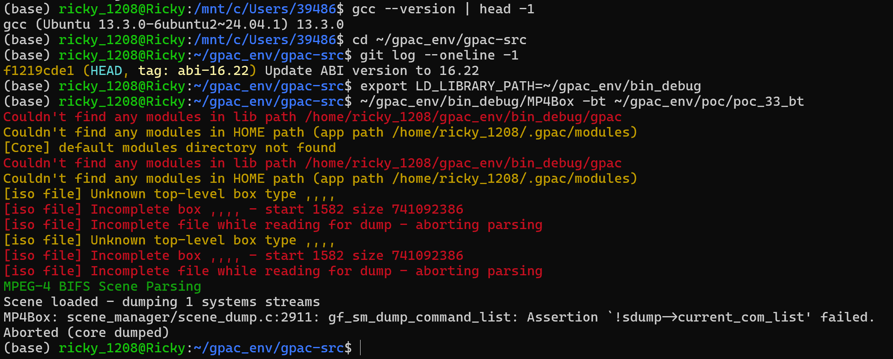
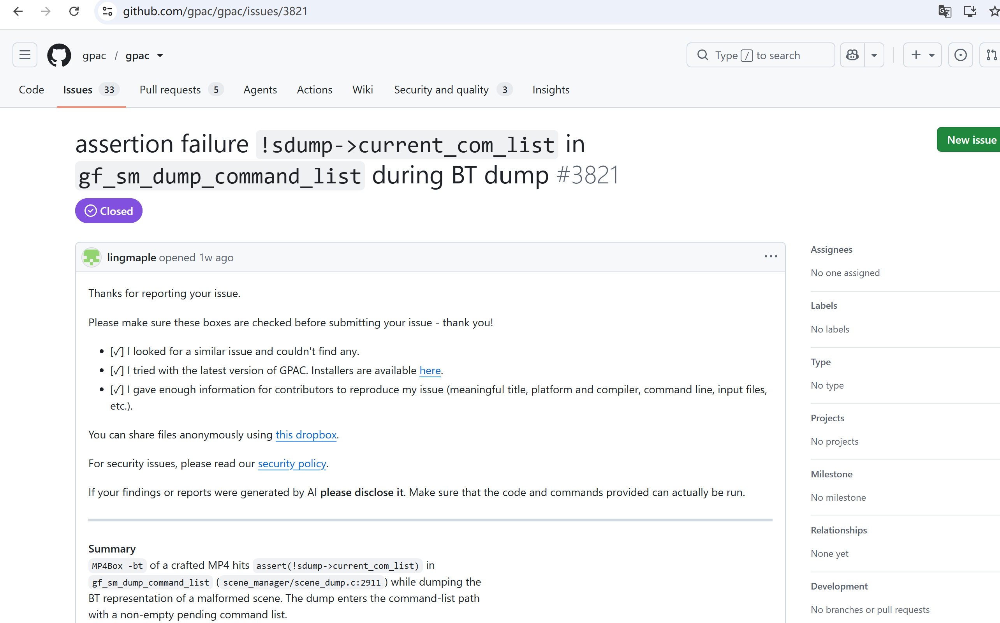

# Vuln: GPAC MP4Box Assertion Failure in scene dump (sdump->current_com_list)

**Project:** gpac/gpac (https://github.com/gpac/gpac)  
**Version:** Vulnerable at commit `f1219cde` (master, 2026-07-25), fixed after issue closure (2026-07-28)  
**Date:** 2026-07-27  
**Severity:** MEDIUM  
**CWE:** CWE-617 - Reachable Assertion  

---

## Affected File

```text
scene_manager/scene_dump.c:2911 (gf_sm_dump_command_list)
applications/mp4box/filedump.c (trigger path via -bt)
```

## Root Cause

GPAC contains a reachable assertion `assert(!sdump->current_com_list)` in the function `gf_sm_dump_command_list`. When MP4Box processes a crafted MP4 file with the `-bt` argument (BIFS text dump), the malformed ISO data (unknown box types, incomplete boxes) is parsed by the BIFS scene parser. After scene loading, `gf_sm_dump_command_list` encounters a condition where `sdump->current_com_list` has an unexpected residual non-NULL value, indicating corrupted scene dump state. The assertion fires, immediately terminating the process.

## Steps to Reproduce

```bash
git clone https://github.com/gpac/gpac.git gpac-vuln
cd gpac-vuln
git checkout f1219cde

sudo apt install -y zlib1g-dev build-essential

./configure --enable-debug
make -j"$(nproc)"

curl -L -o poc_33_bt.zip \
  https://github.com/user-attachments/files/30401871/poc_33_bt.zip
python3 -c "import zipfile; zipfile.ZipFile('poc_33_bt.zip').extractall('.')"

export LD_LIBRARY_PATH=~/gpac_env/bin_debug
~/gpac_env/bin_debug/MP4Box -bt ~/gpac_env/poc/poc_33_bt
```

Expected result on the vulnerable commit:

```text
[iso file] Unknown top-level box type ,,,,
[iso file] Incomplete box ,,,, - start 1582 size 741092386
[iso file] Incomplete file while reading for dump - aborting parsing
MPEG-4 BIFS Scene Parsing
Scene loaded - dumping 1 systems streams
MP4Box: scene_manager/scene_dump.c:2911: gf_sm_dump_command_list: Assertion `!sdump->current_com_list' failed.
Aborted (core dumped)
```



The public issue for this bug is:

- https://github.com/gpac/gpac/issues/3821



## Impact

A crafted MP4 file can trigger an assertion failure in MP4Box when using the `-bt` option, causing an immediate program abort and resulting in denial of service.

## Recommended Fix

Replace the reachable assertion with proper error handling that resets the scene dump state rather than aborting the process.

---

## References

- GPAC issue #3821: https://github.com/gpac/gpac/issues/3821
