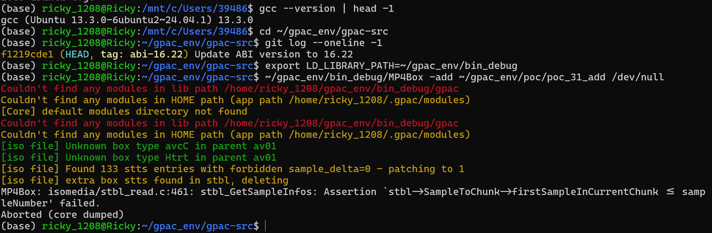
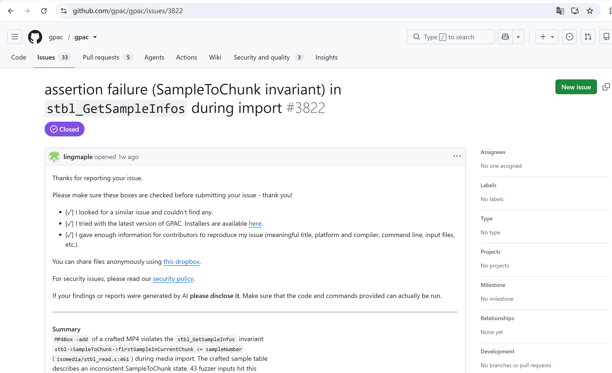

# Vuln: GPAC MP4Box Assertion Failure in stbl Handling

**Project:** gpac/gpac (https://github.com/gpac/gpac)  
**Version:** Vulnerable at commit `f1219cde` (master, 2026-07-25), fixed after issue closure (2026-07-28)  
**Date:** 2026-07-27  
**Severity:** MEDIUM  
**CWE:** CWE-617 - Reachable Assertion  

---

## Affected File

```text
isomedia/stbl_read.c:461 — stbl_GetSampleInfos
applications/mp4box/filedump.c (trigger path via -add)
```

## Root Cause

GPAC contains a reachable assertion in the sample table (stbl) reading logic. When MP4Box processes a crafted MP4 file with the `-add` argument, the malformed SampleToChunk box causes the invariant `stbl->SampleToChunk->firstSampleInCurrentChunk <= sampleNumber` to be violated at `stbl_read.c:461` in `stbl_GetSampleInfos`. The malformed ISO file also contains corrupted stts entries (133 entries with forbidden sample_delta=0) and an extra duplicate stts box, further corrupting the internal parser state before the assertion is hit.

## Steps to Reproduce

```bash
git clone https://github.com/gpac/gpac.git gpac-vuln
cd gpac-vuln
git checkout f1219cde

sudo apt install -y zlib1g-dev build-essential

./configure --enable-debug
make -j"$(nproc)"

curl -L -o poc_31_add.zip \
  https://github.com/user-attachments/files/30402020/poc_31_add.zip
python3 -c "import zipfile; zipfile.ZipFile('poc_31_add.zip').extractall('.')"

export LD_LIBRARY_PATH=~/gpac_env/bin_debug
~/gpac_env/bin_debug/MP4Box -add ~/gpac_env/poc/poc_31_add /dev/null
```

Expected result on the vulnerable commit:

```text
[iso file] Unknown box type avcC in parent av01
[iso file] Unknown box type Htrt in parent av01
[iso file] Found 133 stts entries with forbidden sample_delta=0 - patching to 1
[iso file] extra box stts found in stbl, deleting
MP4Box: isomedia/stbl_read.c:461: stbl_GetSampleInfos: Assertion `stbl->SampleToChunk->firstSampleInCurrentChunk <= sampleNumber' failed.
Aborted (core dumped)
```



The public issue for this bug is:

- https://github.com/gpac/gpac/issues/3822



## Impact

A crafted MP4 file can trigger an assertion failure in MP4Box when using the `-add` option, causing an immediate program abort and resulting in denial of service.

## Recommended Fix

Replace the reachable assertion with proper error handling that gracefully rejects malformed sample table structures rather than aborting the process.

---

## References

- GPAC issue #3822: https://github.com/gpac/gpac/issues/3822
