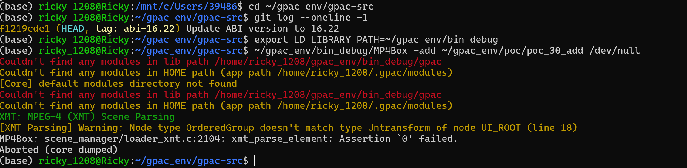
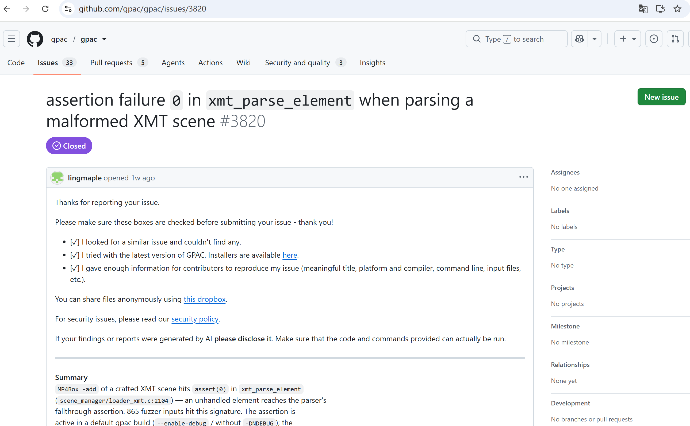

# Vuln: GPAC MP4Box Assertion Failure in xmt_parse_element

**Project:** gpac/gpac (https://github.com/gpac/gpac)  
**Version:** Vulnerable at commit `f1219cde` (master, 2026-07-25), fixed after issue closure (2026-07-28)  
**Date:** 2026-07-27  
**Severity:** MEDIUM  
**CWE:** CWE-617 - Reachable Assertion  

---

## Affected File

```text
scene_manager/loader_xmt.c:2104 (xmt_parse_element)
applications/mp4box/filedump.c (trigger path via -add)
```

## Root Cause

GPAC contains a reachable `assert(0)` in the `xmt_parse_element` function. When MP4Box processes a crafted XMT file with the `-add` argument, the parser detects a node type mismatch (OrderedGroup vs Untransform/UI_ROOT) and reaches `assert(0)`, which in a debug build causes an immediate program termination via `abort()`.

This is a reachable assertion that can be triggered by untrusted input, violating the principle that assertions should only guard against internal invariants, not external input conditions.

## Steps to Reproduce

```bash
git clone https://github.com/gpac/gpac.git gpac-vuln
cd gpac-vuln
git checkout f1219cde

sudo apt install -y zlib1g-dev build-essential

./configure --enable-debug
make -j"$(nproc)"

curl -L -o poc_30_add.zip \
  https://github.com/user-attachments/files/30401590/poc_30_add.zip
python3 -c "import zipfile; zipfile.ZipFile('poc_30_add.zip').extractall('.')"

export LD_LIBRARY_PATH=~/gpac_env/bin_debug
~/gpac_env/bin_debug/MP4Box -add ~/gpac_env/poc/poc_30_add /dev/null
```

Expected result on the vulnerable commit:

```text
XMT: MPEG-4 (XMT) Scene Parsing
[XMT Parsing] Warning: Node type OrderedGroup doesn't match type Untransform of node UI_ROOT (line 18)
MP4Box: scene_manager/loader_xmt.c:2104: xmt_parse_element: Assertion `0' failed.
Aborted (core dumped)
```



The public issue for this bug is:

- https://github.com/gpac/gpac/issues/3820



## Impact

A crafted MP4 file can trigger an assertion failure in MP4Box when using the `-add` option, causing an immediate program abort and resulting in denial of service. This affects debug builds of GPAC.

## Recommended Fix

Replace the `assert(0)` with proper error handling that gracefully rejects the unexpected element type rather than aborting the process.

---

## References

- GPAC issue #3820: https://github.com/gpac/gpac/issues/3820
