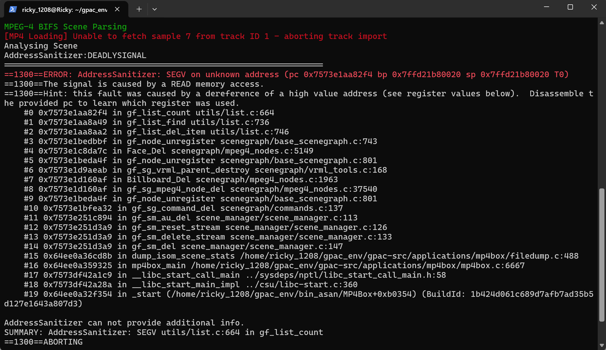
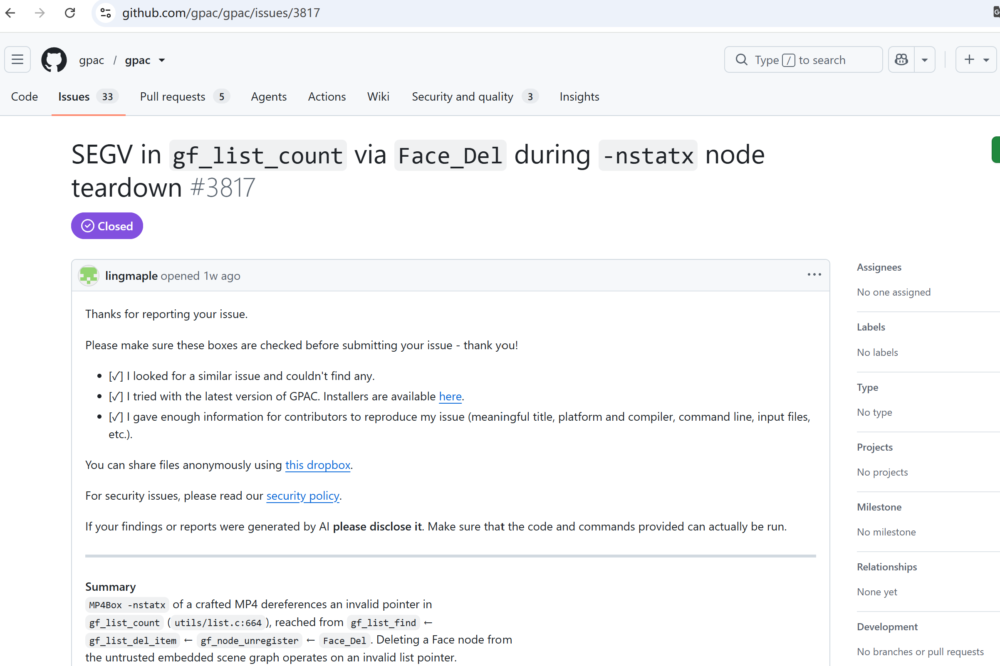

# Vuln: GPAC MP4Box SEGV in gf_list_count (Use-After-Free)

**Project:** gpac/gpac (https://github.com/gpac/gpac)  
**Version:** Vulnerable at commit `f1219cde` (master, 2026-07-25), fixed after issue closure (2026-07-28)  
**Date:** 2026-07-27  
**Severity:** MEDIUM  
**CWE:** CWE-416 - Use After Free  

---

## Affected File

```text
utils/list.c (gf_list_count)
scenegraph/commands.c (gf_sg_command_apply)
applications/mp4box/filedump.c:459 (trigger path via -nstatx)
```

## Root Cause

GPAC does not properly manage the lifetime of scene graph node lists during command application. When MP4Box processes a crafted MP4 file with `-nstatx`, a scene command frees a node list but subsequent commands still reference the freed list, causing `gf_list_count` to access freed memory and resulting in a SEGV.

## Steps to Reproduce

```bash
git clone https://github.com/gpac/gpac.git gpac-vuln
cd gpac-vuln
git checkout f1219cde

sudo apt install -y zlib1g-dev build-essential

./configure --enable-sanitizer
make -j"$(nproc)"

curl -L -o poc_27_nstatx.zip \
  https://github.com/user-attachments/files/30401089/poc_27_nstatx.zip
python3 -c "import zipfile; zipfile.ZipFile('poc_27_nstatx.zip').extractall('.')"

./bin/gcc/MP4Box -nstatx poc_27_nstatx
```

Expected result on the vulnerable commit:

```text
==1300==ERROR: AddressSanitizer: SEGV on unknown address (pc 0x7573e1aa82f4 bp 0x7ffd21b80020 sp 0x7ffd21b80020 T0)
==1300==The signal is caused by a READ memory access.
==1300==Hint: this fault was caused by a dereference of a high value address (see register values below).  Disassemble the provided pc to learn which register was used.
    #0 0x7573e1aa82f4 in gf_list_count utils/list.c:664
    #1 0x7573e1aa8a49 in gf_list_find utils/list.c:736
    #2 0x7573e1aa8aa2 in gf_list_del_item utils/list.c:746
    #3 0x7573e1bedbbf in gf_node_unregister scenegraph/base_scenegraph.c:743
    #4 0x7573e1c8da7c in Face_Del scenegraph/mpeg4_nodes.c:5149
    #5 0x7573e1beda4f in gf_node_unregister scenegraph/base_scenegraph.c:801
    #6 0x7573e1d9aeab in gf_sg_vrml_parent_destroy scenegraph/vrml_tools.c:168
    #7 0x7573e1d160af in Billboard_Del scenegraph/mpeg4_nodes.c:1963
    #8 0x7573e1d160af in gf_sg_mpeg4_node_del scenegraph/mpeg4_nodes.c:37540
    #9 0x7573e1beda4f in gf_node_unregister scenegraph/base_scenegraph.c:801
    #10 0x7573e1bfea32 in gf_sg_command_del scenegraph/commands.c:137
    #11 0x7573e251c894 in gf_sm_au_del scene_manager/scene_manager.c:113
    #12 0x7573e251d3a9 in gf_sm_reset_stream scene_manager/scene_manager.c:126
    #13 0x7573e251d3a9 in gf_sm_delete_stream scene_manager/scene_manager.c:133
    #14 0x7573e251d3a9 in gf_sm_del scene_manager/scene_manager.c:147
    #15 0x64ee0a36cd8b in dump_isom_scene_stats /home/ricky_1208/gpac_env/gpac-src/applications/mp4box/filedump.c:488
    #16 0x64ee0a359325 in mp4box_main /home/ricky_1208/gpac_env/gpac-src/applications/mp4box/mp4box.c:6667
    #17 0x7573df42a1c9 in __libc_start_call_main ../sysdeps/nptl/libc_start_call_main.h:58
    #18 0x7573df42a28a in __libc_start_main_impl ../csu/libc-start.c:360
    #19 0x64ee0a32f354 in _start (/home/ricky_1208/gpac_env/bin_asan/MP4Box+0xb0354)

AddressSanitizer can not provide additional info.
SUMMARY: AddressSanitizer: SEGV utils/list.c:664 in gf_list_count
==1300==ABORTING
```



The public issue for this bug is:

- https://github.com/gpac/gpac/issues/3817



## Impact

A crafted MP4 file can trigger a use-after-free condition in MP4Box when using the `-nstatx` option, causing a process crash and resulting in denial of service. Potential for code execution cannot be ruled out.

## Recommended Fix

Apply the upstream fix that properly manages node list lifetimes during scene command application, preventing access to freed memory.

---

## References

- GPAC issue #3817: https://github.com/gpac/gpac/issues/3817
