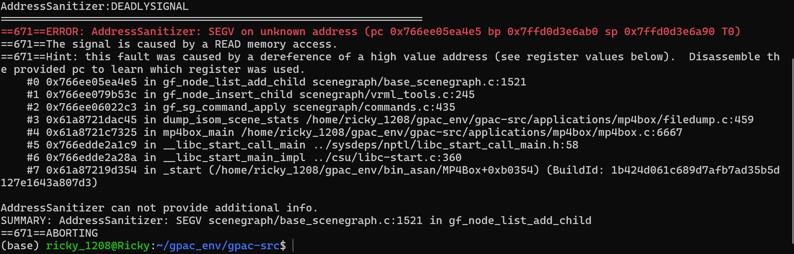
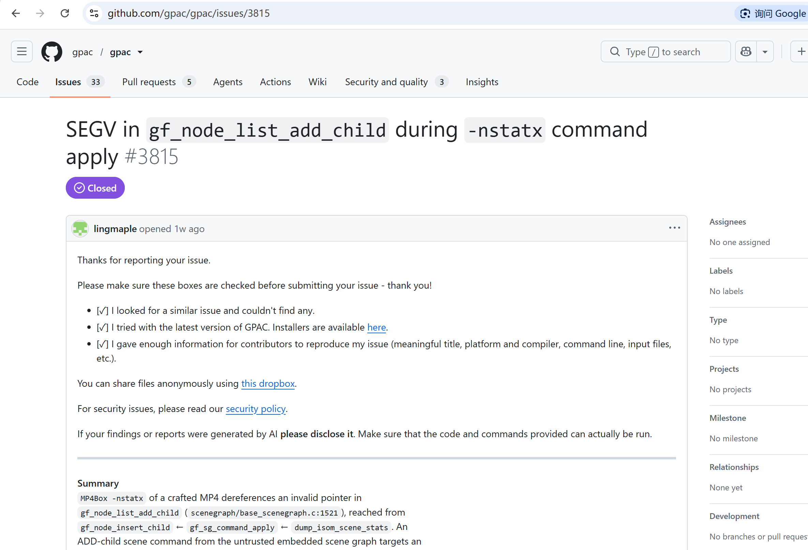

# Vuln: GPAC MP4Box gf_node_list_add_child SEGV

**Project:** gpac/gpac (https://github.com/gpac/gpac)  
**Version:** Vulnerable at commit `f1219cde` (master, 2026-07-25), fixed after issue closure (2026-07-28)  
**Date:** 2026-07-27  
**Severity:** MEDIUM  
**CWE:** CWE-824 - Access of Uninitialized Pointer  

---

## Affected File

```text
scenegraph/base_scenegraph.c:1521 (gf_node_list_add_child)
scenegraph/vrml_tools.c:245 (gf_node_insert_child)
scenegraph/commands.c:435 (gf_sg_command_apply)
applications/mp4box/filedump.c:459 (trigger path via -nstatx)
```

## Root Cause

GPAC does not validate the parent node pointer before passing it to `gf_node_list_add_child` during scene command application. When MP4Box processes a crafted MP4 file with `-nstatx`, an ADD-child scene command from the untrusted embedded scene graph targets an invalid parent node, leading to a SEGV when the function attempts to read from the corrupted pointer.

This issue is different from https://github.com/gpac/gpac/issues/3811.


## Steps to Reproduce

```bash
git clone https://github.com/gpac/gpac.git gpac-vuln
cd gpac-vuln
git checkout f1219cde

sudo apt install -y zlib1g-dev build-essential

./configure --enable-sanitizer
make -j"$(nproc)"

curl -L -o poc_23_nstatx.zip \
  https://github.com/user-attachments/files/30400773/poc_23_nstatx.zip
python3 -c "import zipfile; zipfile.ZipFile('poc_23_nstatx.zip').extractall('.')"

./bin/gcc/MP4Box -nstatx poc_23_nstatx
```

Expected result on the vulnerable commit:

```text
==671==ERROR: AddressSanitizer: SEGV on unknown address (pc 0x766ee05ea4e5 bp 0x7ffd0d3e6ab0 sp 0x7ffd0d3e6a90 T0)
==671==The signal is caused by a READ memory access.
==671==Hint: this fault was caused by a dereference of a high value address (see register values below).  Disassemble the provided pc to learn which register was used.
    #0 0x766ee05ea4e5 in gf_node_list_add_child scenegraph/base_scenegraph.c:1521
    #1 0x766ee079b53c in gf_node_insert_child scenegraph/vrml_tools.c:245
    #2 0x766ee06022c3 in gf_sg_command_apply scenegraph/commands.c:435
    #3 0x61a8721dac45 in dump_isom_scene_stats /home/ricky_1208/gpac_env/gpac-src/applications/mp4box/filedump.c:459
    #4 0x61a8721c7325 in mp4box_main /home/ricky_1208/gpac_env/gpac-src/applications/mp4box/mp4box.c:6667
    #5 0x766edde2a1c9 in __libc_start_call_main ../sysdeps/nptl/libc_start_call_main.h:58
    #6 0x766edde2a28a in __libc_start_main_impl ../csu/libc-start.c:360
    #7 0x61a87219d354 in _start (/home/ricky_1208/gpac_env/bin_asan/MP4Box+0xb0354)

AddressSanitizer can not provide additional info.
SUMMARY: AddressSanitizer: SEGV scenegraph/base_scenegraph.c:1521 in gf_node_list_add_child
==671==ABORTING
```



The public issue for this bug is:

- https://github.com/gpac/gpac/issues/3815



## Impact

A crafted MP4 file can trigger a segmentation fault in MP4Box when using the `-nstatx` option, causing a process crash and resulting in denial of service.

## Recommended Fix

Apply the upstream fix that validates parent node pointers before passing them to `gf_node_list_add_child` during scene command application.

---

## References

- GPAC issue #3815: https://github.com/gpac/gpac/issues/3815
- Different from issue #3811: https://github.com/gpac/gpac/issues/3811
