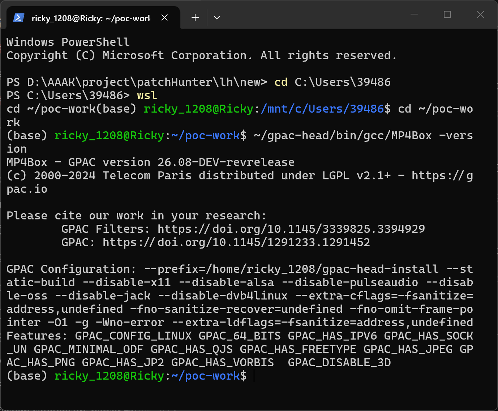
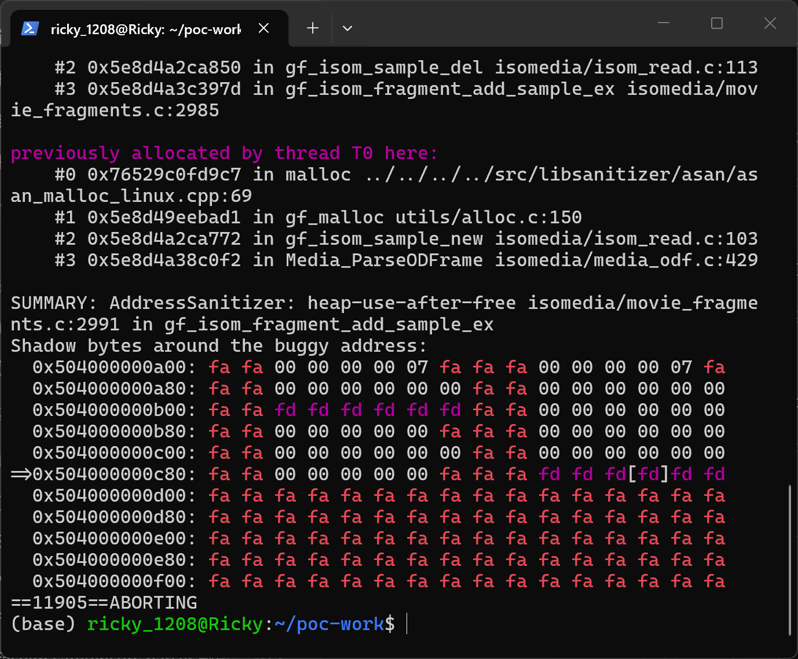
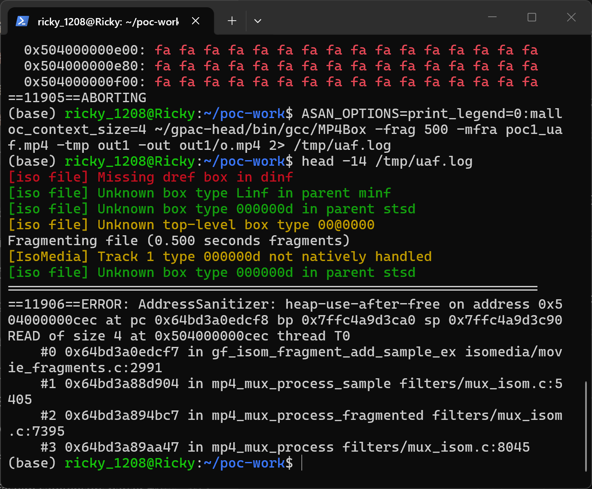

# gpac-heap-use-after-free-in-gf-isom-fragment-add-sample-ex

| Field | Value |
|---|---|
| Vendor | GPAC |
| Product | GPAC (MP4Box) |
| Affected version | master `a23ae2dc01c8d6985c70a5498d606147d591a68c` (2026-10-02); also reproduced on `9edee648` (2026-09-17) |
| Component | `src/isomedia/movie_fragments.c` — `gf_isom_fragment_add_sample_ex()` |
| Vulnerability type | CWE-416: Use After Free |
| Discovered | 2026-10-02 (fuzzer crash timestamp) |
| Reported at | [pending：提交后回填 issue URL] |
| Fix commit | `[unfixed]` |

## Summary

GPAC (master `a23ae2dc`) is affected by a heap use-after-free in `gf_isom_fragment_add_sample_ex()` (`src/isomedia/movie_fragments.c`). When an MP4 input containing OD-frame fragments is re-fragmented with `MP4Box -frag ... -mfra`, the function frees the sample through `gf_isom_sample_del()` and then reads `sample->IsRAP` / `sample->DTS` / `sample->CTS_Offset` from the freed allocation while updating the `tfra` random-access index. An attacker who can make a user process a crafted MP4 file crashes the process (denial of service); heap grooming may further raise the impact.

## Affected versions

GPAC master HEAD `a23ae2dc01c8d6985c70a5498d606147d591a68c` (verified) and commit `9edee648` (verified). Build platform: Ubuntu 24.04 WSL2, GCC 13.3.0 with `-fsanitize=address,undefined`.

## Reproduction

### Build

```
git clone https://github.com/gpac/gpac.git gpac-head
cd gpac-head
./configure --static-build --disable-x11 --disable-alsa --disable-pulseaudio --disable-oss --disable-jack --disable-dvb4linux --extra-cflags='-fsanitize=address,undefined -fno-sanitize-recover=undefined -fno-omit-frame-pointer -O1 -g' --extra-ldflags='-fsanitize=address,undefined'
make -j$(nproc)
```

### Run

```
./bin/gcc/MP4Box -frag 500 -mfra poc1_uaf.mp4 -tmp out -out out/o.mp4
```

`poc1_uaf.mp4` (SHA-256 `bdf4fefef11fe879aadc26195b1e939277d40b10e36361e4c4dbc120d903b4e3`, see `poc/SHA256SUMS.txt`) is the proof-of-concept input.



`01-version.png` evidences the tested build (GPAC master HEAD, sanitizer build).





The screenshots show a real terminal session executing the command against GPAC master HEAD: `02-trigger.png` shows ASan reporting the free performed by `gf_isom_fragment_add_sample_ex` at `movie_fragments.c:2985`, the allocation origin (`gf_isom_sample_new` via `Media_ParseODFrame` at `movie_fragments.c:2928`), and `SUMMARY: AddressSanitizer: heap-use-after-free isomedia/movie_fragments.c:2991`; `03-asan-report.png` shows the head of the same report with the ERROR line and the read stack.

### Sanitizer output

```
==10939==ERROR: AddressSanitizer: heap-use-after-free on address 0x504000000cec at pc 0x592c58ee0cf8 bp 0x7ffc769f4ac0 sp 0x7ffc769f4ab0
READ of size 4 at 0x504000000cec thread T0
    #0 0x592c58ee0cf7 in gf_isom_fragment_add_sample_ex isomedia/movie_fragments.c:2991
    #1 0x592c59680904 in mp4_mux_process_sample filters/mux_isom.c:5405
    #2 0x592c59687bc7 in mp4_mux_process_fragmented filters/mux_isom.c:7395
    #3 0x592c5968da47 in mp4_mux_process filters/mux_isom.c:8045
    #4 0x592c59719d15 in gf_filter_process_task filter_core/filter.c:3257
0x504000000cec is located 28 bytes inside of 48-byte region [0x504000000cd0,0x504000000d00)
freed by thread T0 here:
    #1 in gf_free utils/alloc.c:165
    #2 in gf_isom_sample_del isomedia/isom_read.c:113
    #3 in gf_isom_fragment_add_sample_ex isomedia/movie_fragments.c:2985
previously allocated by thread T0 here:
    #2 in gf_isom_sample_new isomedia/isom_read.c:103
    #3 in Media_ParseODFrame isomedia/media_odf.c:429
    #4 in gf_isom_fragment_add_sample_ex isomedia/movie_fragments.c:2928
SUMMARY: AddressSanitizer: heap-use-after-free isomedia/movie_fragments.c:2991 in gf_isom_fragment_add_sample_ex
```

## Root cause

**Location:** `src/isomedia/movie_fragments.c:2985-2991` (`gf_isom_fragment_add_sample_ex`)

The function re-points its `sample` parameter at a freshly parsed OD sample and then frees that same object before a later block still dereferences it:

```c
2928:		GF_Err e = Media_ParseODFrame(traf->trex->track->Media, sample, &od_sample);
2929:		if (!od_sample) return e;
2930:		sample = od_sample;          /* sample now aliases od_sample */
...
2985:	if (od_sample) gf_isom_sample_del(&od_sample);   /* frees the aliased object */
...
2988:	if (traf->trex->tfra) {
2990:		if (!raf->trun_number && sample->IsRAP) {    /* UAF read */
2991:			raf->time = sample->DTS + sample->CTS_Offset;
```

The tfra block only executes when `traf->trex->tfra` is present, which is why the crash surfaces with `-mfra` / tfra-writing remuxes of OD-frame fragments.

## Impact

- Confidentiality: None — no information is returned to the attacker.
- Integrity: None — memory is only read after free.
- Availability: High — deterministic abort of MP4Box / any filter-session process parsing the attacker's file.

CVSS v3.1: `AV:N/AC:L/PR:N/UI:R/S:U/C:N/I:N/A:H` — 6.5 (Medium). Assessment assumes the victim processes an attacker-supplied MP4 (typical media-parser threat model); if only local files are considered the vector drops to `AV:L`.

## Workaround

Do not run `MP4Box -frag` / `-dash` remuxes on untrusted MP4 files with tfra writing enabled; upstream builds without sanitizers crash with the same deterministic abort.

## Fix

`[unfixed]` — suggested: move `gf_isom_sample_del(&od_sample)` below the tfra update block, or cache `IsRAP`/`DTS`/`CTS_Offset` in locals before the free.

## References

- Repository: https://github.com/gpac/gpac
- Security policy: https://github.com/gpac/gpac/blob/master/SECURITY.md
- CWE: https://cve.mitre.org/data/definitions/416.html
- Fix commit: `[none]`
