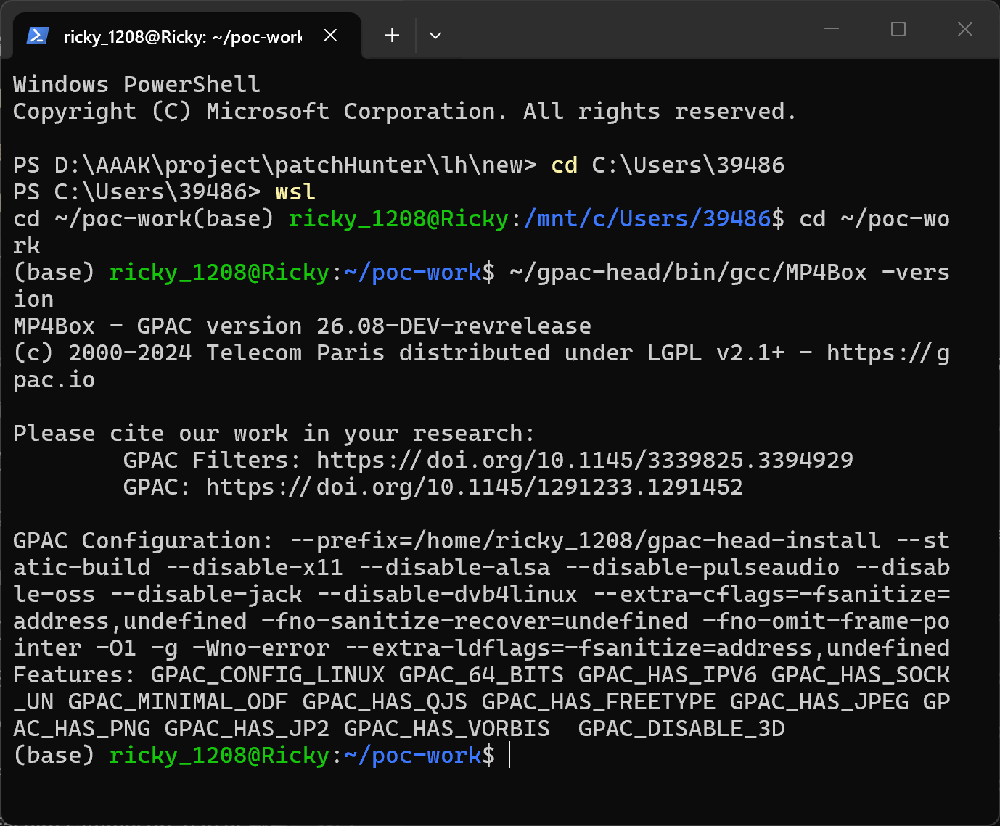
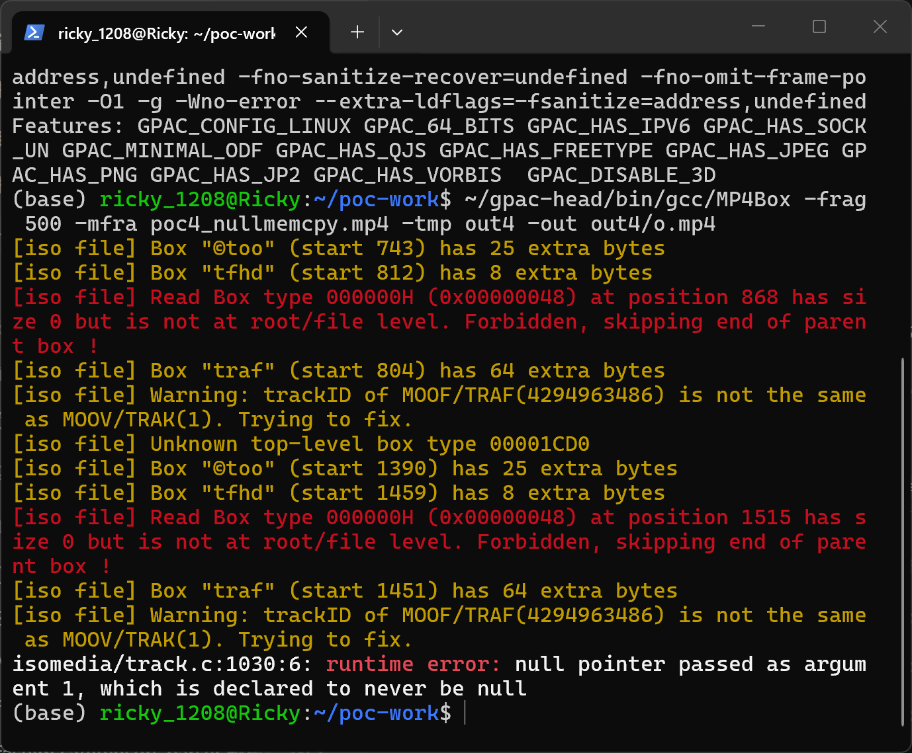
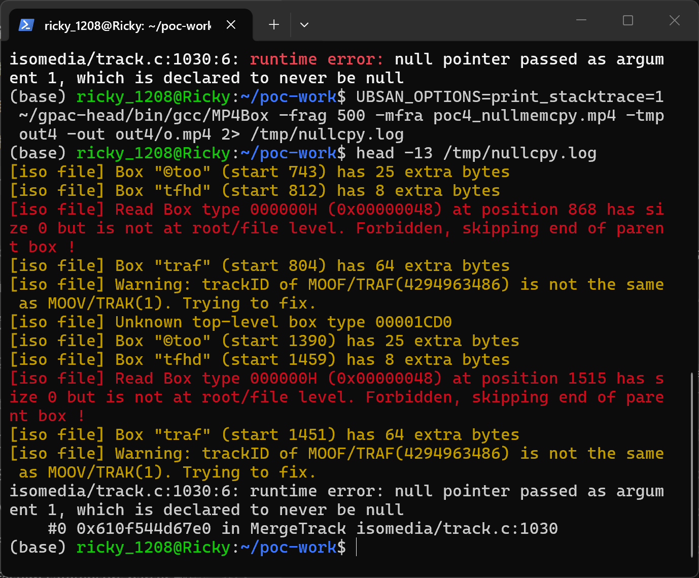

# gpac-null-memcpy-in-mergetrack-via-mp4box-frag

| Field | Value |
|---|---|
| Vendor | GPAC |
| Product | GPAC (MP4Box) |
| Affected version | master `a23ae2dc01c8d6985c70a5498d606147d591a68c` (2026-10-02); also reproduced on `9edee648` (2026-09-17) |
| Component | `src/isomedia/track.c` — `MergeTrack()` |
| Vulnerability type | CWE-690: Unchecked Return Value to NULL Pointer Dereference |
| Discovered | 2026-10-04 (fuzzer crash timestamp) |

## Summary

GPAC (master `a23ae2dc`) is affected by an unchecked `gf_realloc()` return value in `MergeTrack()` (`src/isomedia/track.c`). When opening a crafted fragmented MP4 whose fragment sample groups take the "indices differ" merge branch, the realloc at line 1029 can return NULL, and the `memcpy` at line 1030 uses a destination computed from the NULL base pointer. UBSan reports `null pointer passed as argument 1, which is declared to never be null` at `isomedia/track.c:1030` during `gf_isom_open_file()`. The defect is distinct from the nullguard added for issue #3549 (which covers the `trak`/`trex` lookup in `MergeFragment()`); the sample-group merge path inside `MergeTrack()` remains unguarded on master.

## Affected versions

GPAC master HEAD `a23ae2dc01c8d6985c70a5498d606147d591a68c` (verified) and commit `9edee648` (verified). Build platform: Ubuntu 24.04 WSL2, GCC 13.3.0 with `-fsanitize=address,undefined`. This issue is an incomplete fix of #3549: the nullguard added in commit `525bf1af64` (2026-04-29) covers only the `trak`/`trex` lookup in `MergeFragment()`, while the same UBSan class remains reachable through the sample-group merge `memcpy` inside `MergeTrack()`; `src/isomedia/track.c` has had no commits since that fix.

## Reproduction

### Build

```
git clone https://github.com/gpac/gpac.git gpac-head
cd gpac-head
./configure --static-build --disable-x11 --disable-alsa --disable-pulseaudio --disable-oss --disable-jack --disable-dvb4linux --extra-cflags='-fsanitize=address,undefined -fno-sanitize-recover=undefined -fno-omit-frame-pointer -O1 -g' --extra-ldflags='-fsanitize=address,undefined'
make -j$(nproc)
```

### Run

```
./bin/gcc/MP4Box -frag 500 -mfra poc4_nullmemcpy.mp4 -tmp out -out out/o.mp4
```

`poc4_nullmemcpy.mp4` (SHA-256 `c5ff6701cd394584b937a6fc80fa3b4da77aa9e55ac3daec3194d566226fab50`, see `poc/SHA256SUMS.txt`) is the proof-of-concept input.



`01-version.png` evidences the tested build (GPAC master HEAD, sanitizer build).





The screenshots show a real terminal session executing the command against GPAC master HEAD: `02-trigger.png` shows UBSan reporting `isomedia/track.c:1030:6: runtime error: null pointer passed as argument 1, which is declared to never be null` while parsing the malformed fragment boxes; `03-ubsan-report.png` shows the same runtime error with the symbolized stack (`MergeTrack` at `isomedia/track.c:1030` ← `MergeFragment` ← `gf_isom_open_file`).

### Sanitizer output

```
isomedia/track.c:1030:6: runtime error: null pointer passed as argument 1, which is declared to never be null
    #0 in MergeTrack isomedia/track.c:1030
    #1 in MergeFragment isomedia/isom_intern.c:91
    #2 in gf_isom_parse_movie_boxes_internal isomedia/isom_intern.c:788
    #3 in gf_isom_parse_movie_boxes isomedia/isom_intern.c:951
    #4 in gf_isom_open_file isomedia/isom_intern.c:1085
    #5 in gf_isom_open isomedia/isom_read.c:536
    #6 in mp4box_main applications/mp4box/mp4box.c:6558
```

## Root cause

**Location:** `src/isomedia/track.c:1028-1032` (`MergeTrack`)

```c
1028:			} else {
1029:				stbl_group->sample_entries = gf_realloc(stbl_group->sample_entries, sizeof(GF_SampleGroupEntry) * (stbl_group->entry_count + frag_group->entry_count));
1030:				memcpy(&stbl_group->sample_entries[stbl_group->entry_count], &frag_group->sample_entries[0], sizeof(GF_SampleGroupEntry) * frag_group->entry_count);
1031:				stbl_group->entry_count += frag_group->entry_count;
```

`gf_realloc()` may return NULL (allocation failure), and its result is used unchecked both to compute the destination address and as the `memcpy` destination. The entry counts originate from attacker-controlled `moof/traf` sample-group boxes, so the allocation size is attacker-influenced. UBSan flags the NULL-destination contract violation; if the count is non-zero together with a NULL destination, a non-sanitizer build would perform an out-of-bounds write.

## Impact

- Confidentiality: None.
- Integrity: Low — under the observed conditions the write does not land (NULL destination); the unchecked-contract pattern is a memory-write hazard if entry_count and a NULL allocation ever coincide in a non-sanitizer build.
- Availability: Low — no crash was observed in the sanitizer build (UBSan reports and the process terminates normally on this input); reported as a memory-safety defect per the memcpy contract rather than a confirmed crasher.

CVSS v3.1: `AV:N/AC:L/PR:N/UI:R/S:U/C:N/I:L/A:N` — 4.3 (Medium). This is a conservative estimate for an unchecked-allocation-to-NULL-memcpy pattern reachable from file open; the true impact depends on whether a non-zero-size write with a NULL destination is reachable, which we could not construct.

## Workaround

Do not open untrusted fragmented MP4 files with GPAC/MP4Box.

## Fix

`[unfixed]` — suggested: check the `gf_realloc()` results at lines 1024 and 1029 and return `GF_OUT_OF_MEM` on NULL before the `memcpy` calls.

## References

- Repository: https://github.com/gpac/gpac
- Security policy: https://github.com/gpac/gpac/blob/master/SECURITY.md
- Incomplete fix of: https://github.com/gpac/gpac/issues/3549 (fix commit 525bf1af64 did not cover this site)
- CWE: https://cve.mitre.org/data/definitions/690.html
- Fix commit: `[none]`
