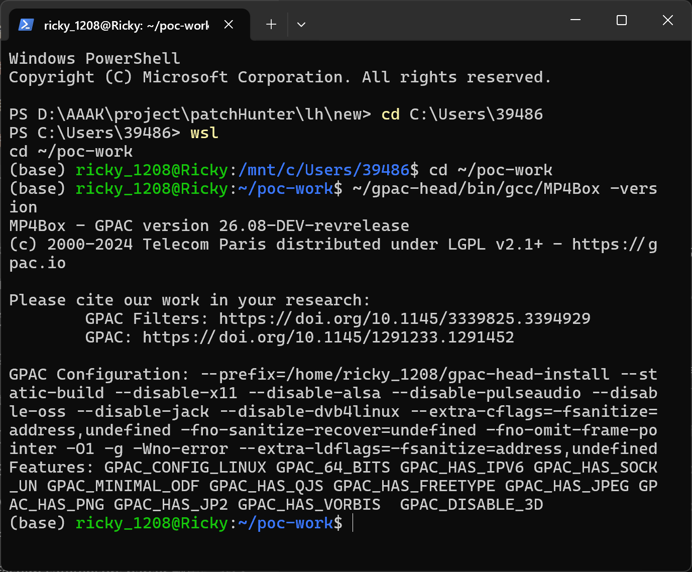
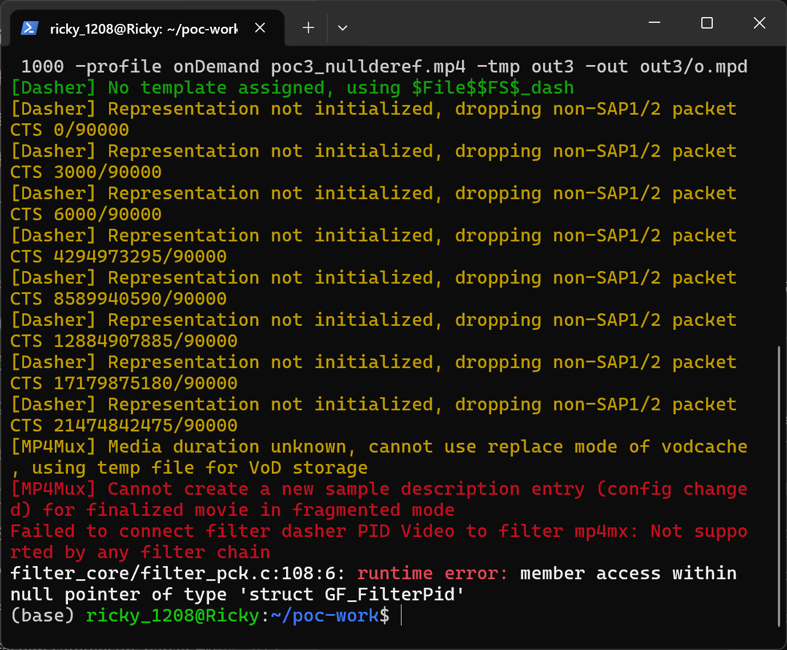
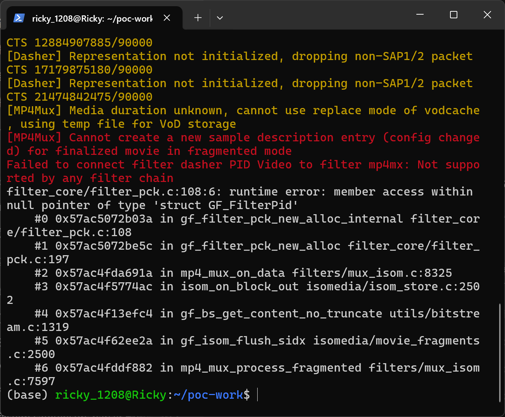

# gpac-null-pointer-dereference-in-mp4-mux-on-data

| Field | Value |
|---|---|
| Vendor | GPAC |
| Product | GPAC (MP4Box) |
| Affected version | master `a23ae2dc01c8d6985c70a5498d606147d591a68c` (2026-10-02); also reproduced on `9edee648` (2026-09-17) |
| Component | `src/filters/mux_isom.c` — `mp4_mux_on_data()` / `src/filter_core/filter_pck.c` — `gf_filter_pck_new_alloc_internal()` |
| Vulnerability type | CWE-476: NULL Pointer Dereference |
| Discovered | 2026-10-03 (fuzzer crash timestamp) |


## Summary

GPAC (master `a23ae2dc`) is affected by a NULL pointer dereference in the ISOBMFF mux filter. When dashing a crafted fragmented MP4 with `MP4Box -dash 1000 -profile onDemand`, the mp4 mux fails to create a new sample description for a config change on a finalized fragmented movie, the PID connection to `mp4mx` fails, and subsequent SIDF/SIDX flush data is still delivered to `mp4_mux_on_data()` while `ctx->opid` is NULL. The call chain reaches `gf_filter_pck_new_alloc_internal()`, which dereferences the NULL `GF_FilterPid` at `filter_core/filter_pck.c:108`. In a non-sanitizer build the same near-NULL access terminates the process.

## Affected versions

GPAC master HEAD `a23ae2dc01c8d6985c70a5498d606147d591a68c` (verified) and commit `9edee648` (verified). Build platform: Ubuntu 24.04 WSL2, GCC 13.3.0 with `-fsanitize=address,undefined`.

## Reproduction

### Build

```
git clone https://github.com/gpac/gpac.git gpac-head
cd gpac-head
./configure --static-build --disable-x11 --disable-alsa --disable-pulseaudio --disable-oss --disable-jack --disable-dvb4linux --extra-cflags='-fsanitize=address,undefined -fno-sanitize-recover=undefined -fno-omit-frame-pointer -O1 -g' --extra-ldflags='-fsanitize=address,undefined'
make -j$(nproc)
```

### Run

```
./bin/gcc/MP4Box -dash 1000 -profile onDemand poc3_nullderef.mp4 -tmp out -out out/o.mpd
```

`poc3_nullderef.mp4` (SHA-256 `470e95dcd2baddd8951bcc021501bdf96f4e61dddd7b1bf9ca187c9e82329af0`, see `poc/SHA256SUMS.txt`) is the proof-of-concept input.



`01-version.png` evidences the tested build (GPAC master HEAD, sanitizer build).





The screenshots show a real terminal session executing the command against GPAC master HEAD: `02-trigger.png` shows the run reaching `[MP4Mux] Cannot create a new sample description entry (config changed) for finalized movie in fragmented mode` and the mp4mx PID connection failure, followed by `filter_core/filter_pck.c:108:6: runtime error: member access within null pointer of type 'struct GF_FilterPid'`; `03-ubsan-report.png` shows the same runtime error with the full symbolized stack down to `mp4_mux_on_data` (`filters/mux_isom.c:8325`).

### Sanitizer output

```
[MP4Mux] Cannot create a new sample description entry (config changed) for finalized movie in fragmented mode
Failed to connect filter dasher PID Video to filter mp4mx: Not supported by any filter chain
filter_core/filter_pck.c:108:6: runtime error: member access within null pointer of type 'struct GF_FilterPid'
    #0 in gf_filter_pck_new_alloc_internal filter_core/filter_pck.c:108
    #1 in gf_filter_pck_new_alloc filter_core/filter_pck.c:197
    #2 in mp4_mux_on_data filters/mux_isom.c:8325
    #3 in isom_on_block_out isomedia/isom_store.c:2502
    #4 in gf_bs_get_content_no_truncate utils/bitstream.c:1319
    #5 in gf_isom_flush_sidx isomedia/movie_fragments.c:2500
    #6 in mp4_mux_process_fragmented filters/mux_isom.c:7597
    #7 in mp4_mux_process filters/mux_isom.c:8045
    #8 in gf_filter_process_task filter_core/filter.c:3257
```

## Root cause

**Location:** `src/filters/mux_isom.c:8325` (`mp4_mux_on_data`) calling into `src/filter_core/filter_pck.c:108` (`gf_filter_pck_new_alloc_internal`)

```c
/* mux_isom.c, mp4_mux_on_data() */
ctx->dst_pck = gf_filter_pck_new_alloc(ctx->opid, block_size, &output);   /* ctx->opid == NULL */

/* filter_pck.c, gf_filter_pck_new_alloc_internal() */
108:	count = gf_fq_count(pid->filter->pcks_alloc_reservoir);   /* pid is NULL */
```

After the sample-description update failure, the mux output PID was never created/connected, but the ISO file layer still flushes the pending SIDX content into the mux (`gf_isom_flush_sidx` → `isom_on_block_out` → `mp4_mux_on_data`). `mp4_mux_on_data()` does not verify `ctx->opid` before allocating packets on it, so the NULL PID flows into `gf_filter_pck_new_alloc_internal()` and is dereferenced.

## Impact

- Confidentiality: None — no information is returned to the attacker.
- Integrity: None — the access is a read from a near-NULL address.
- Availability: High — deterministic crash of the dashing process on the attacker's file.

CVSS v3.1: `AV:N/AC:L/PR:N/UI:R/S:U/C:N/I:N/A:H` — 6.5 (Medium). Assessment assumes the victim processes an attacker-supplied MP4; if only local files are considered the vector drops to `AV:L`.

## Workaround

Do not run `MP4Box -dash` on untrusted fragmented MP4 files.

## Fix

`[unfixed]` — suggested: NULL-check `ctx->opid` in `mp4_mux_on_data()` (return `GF_BAD_PARAM`/disconnect), or tear down the mux input PID when the connection fails so later block-outs cannot arrive.

## References

- Repository: https://github.com/gpac/gpac
- Security policy: https://github.com/gpac/gpac/blob/master/SECURITY.md
- CWE: https://cve.mitre.org/data/definitions/476.html
- Fix commit: `[none]`

