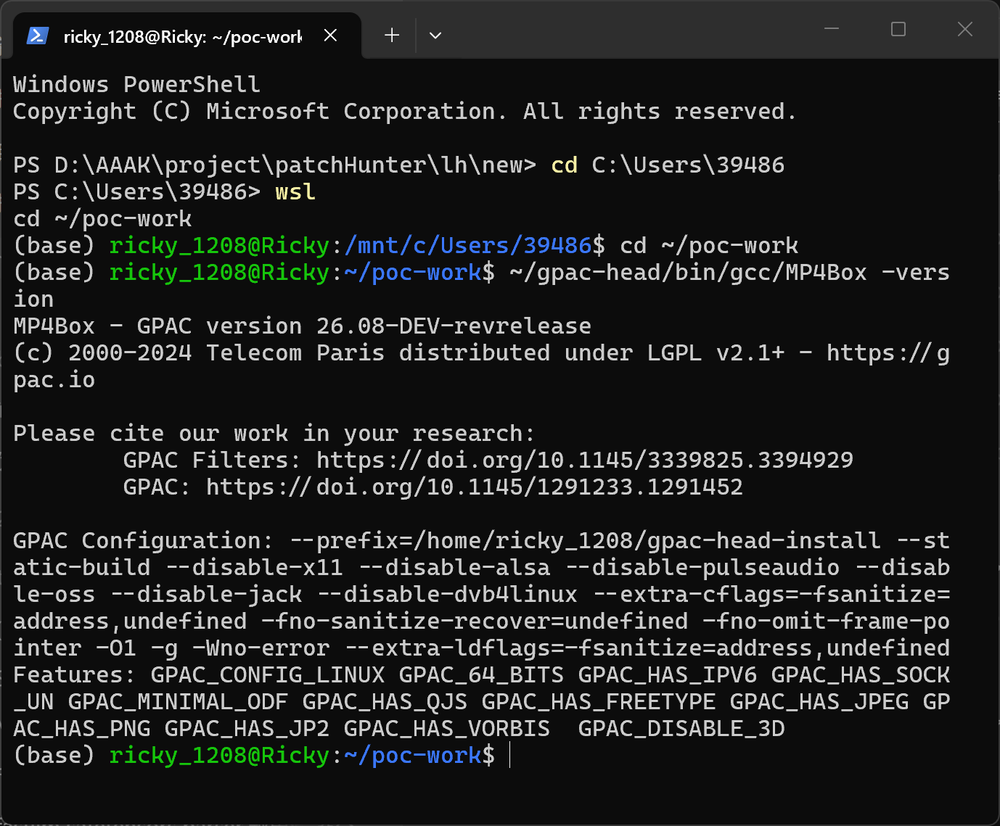
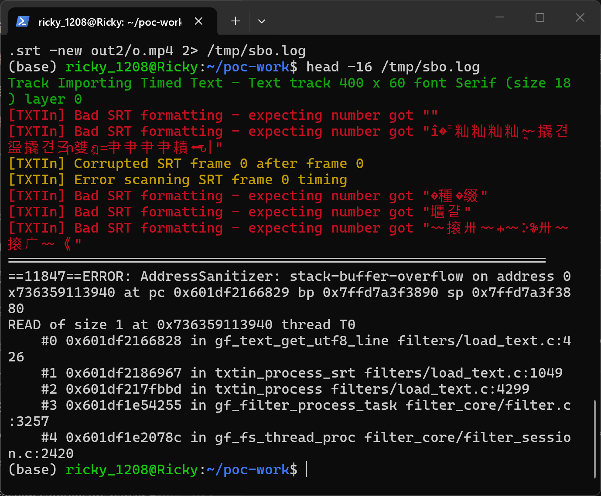

# gpac-stack-buffer-overflow-read-in-gf-text-get-utf8-line

| Field | Value |
|---|---|
| Vendor | GPAC |
| Product | GPAC (MP4Box) |
| Affected version | master `a23ae2dc01c8d6985c70a5498d606147d591a68c` (2026-10-02); also reproduced on `9edee648` (2026-09-17) |
| Component | `src/filters/load_text.c` — `gf_text_get_utf8_line()` |
| Vulnerability type | CWE-126: Buffer Over-read |
| Discovered | 2026-10-02 (fuzzer crash timestamp) |


## Summary

GPAC (master `a23ae2dc`) is affected by a stack buffer over-read in `gf_text_get_utf8_line()` (`src/filters/load_text.c`). The in-place UTF-16 byte-swap loop terminates only when two consecutive NUL bytes are observed at an even offset. A crafted UTF-16 subtitle file (SRT/TTXT/VTT importer paths) whose terminator does not align makes the loop step past the end of the caller's `szLine[2048]` stack buffer, and the sentinel check at line 426 reads out of bounds. Processing a malicious subtitle file crashes the importing process.

## Affected versions

GPAC master HEAD `a23ae2dc01c8d6985c70a5498d606147d591a68c` (verified) and commit `9edee648` (verified). Build platform: Ubuntu 24.04 WSL2, GCC 13.3.0 with `-fsanitize=address,undefined`. This issue is an incomplete fix of #3727: commit `b325a93c44` ("fuzz: fix utf stack overflow + null deref", 2026-07-23) hardened this exact `szLine[2048]` buffer by forcing tail NULs after the swap loop (`szLine[lineSize-2]=0; szLine[lineSize-1]=0;` on current master), but the swap loop itself was left unbounded, so the over-read survives on master; the `szLineConv` write clamps from #2647 cover a different statement in the same function.

## Reproduction

### Build

```
git clone https://github.com/gpac/gpac.git gpac-head
cd gpac-head
./configure --static-build --disable-x11 --disable-alsa --disable-pulseaudio --disable-oss --disable-jack --disable-dvb4linux --extra-cflags='-fsanitize=address,undefined -fno-sanitize-recover=undefined -fno-omit-frame-pointer -O1 -g' --extra-ldflags='-fsanitize=address,undefined'
make -j$(nproc)
```

### Run

```
./bin/gcc/MP4Box -tmp out -add poc2_sbo.srt -new out/o.mp4
```

`poc2_sbo.srt` (SHA-256 `285ae05879ba4d05fd994e4a05c6e3e75d6df0f8f03bb653b9026e846ee864a1`, see `poc/SHA256SUMS.txt`) is the proof-of-concept input; the same file also triggers through the `.ttxt`/`.vtt` importer paths.



`01-version.png` evidences the tested build (GPAC master HEAD, sanitizer build).

![Trigger run: overflowed stack object szLine[2048] with access past its end, SUMMARY at load_text.c:426](images/gpac-stack-buffer-overflow-read-in-gf-text-get-utf8-line-02-trigger.png)



The screenshots show a real terminal session executing the command against GPAC master HEAD: `02-trigger.png` shows ASan identifying the overflowed stack object `'szLine' (line 1020)` in `txtin_process_srt` and printing `SUMMARY: AddressSanitizer: stack-buffer-overflow filters/load_text.c:426 in gf_text_get_utf8_line`; `03-asan-report.png` shows the head of the same report with the ERROR line and the read stack.

### Sanitizer output

```
==10940==ERROR: AddressSanitizer: stack-buffer-overflow on address 0x73676e713940 at pc 0x5bdcf9d08829 bp 0x7fffc1f20360 sp 0x7fffc1f20350
READ of size 1 at 0x73676e713940 thread T0
    #0 0x5bdcf9d08828 in gf_text_get_utf8_line filters/load_text.c:426
    #1 0x5bdcf9d28967 in txtin_process_srt filters/load_text.c:1049
    #2 0x5bdcf9d21bbd in txtin_process filters/load_text.c:4299
    #3 0x5bdcf99f6255 in gf_filter_process_task filter_core/filter.c:3257
Address 0x73676e713940 is located in stack of thread T0 at offset 2368 in frame
    #0 0x5bdcf9d27f0f in txtin_process_srt filters/load_text.c:1015
    [320, 2368) 'szLine' (line 1020) <== Memory access at offset 2368 overflows this variable
SUMMARY: AddressSanitizer: stack-buffer-overflow filters/load_text.c:426 in gf_text_get_utf8_line
```

## Root cause

**Location:** `src/filters/load_text.c:424-431` (`gf_text_get_utf8_line`), UTF-16 swap path

```c
423:		i=0;
424:		while (1) {
425:			char c;
426:			if (!szLine[i] && !szLine[i+1]) break;   /* OOB read when i+1 passes the buffer */
427:			c = szLine[i+1];
428:			szLine[i+1] = szLine[i];
429:			szLine[i] = c;
430:			i+=2;
431:		}
```

The loop relies on a double-NUL sentinel at an even stride. If the line data ends with a single NUL at an odd offset (or contains no in-buffer double NUL), the loop walks past the end of the caller's `char szLine[2048]` stack buffer and the check at line 426 (`szLine[i+1]`) reads out of bounds. The function knows the number of bytes actually read, but the loop is not bounded by it.

## Impact

- Confidentiality: Low — adjacent stack bytes can be absorbed into the decoded line, but the import result is typically discarded.
- Integrity: None — read-only overflow.
- Availability: High — deterministic abort while parsing the attacker's subtitle file.

CVSS v3.1: `AV:N/AC:L/PR:N/UI:R/S:U/C:L/I:N/A:H` — 7.1 (High). Assessment assumes the victim imports an attacker-supplied subtitle file; if only local files are considered the vector drops to `AV:L`.

## Workaround

Do not import untrusted UTF-16 subtitle files; ASCII/UTF-8 subtitle input does not enter the affected swap loop (`unicode_type` 2/3 only).

## Fix

`[unfixed]` — suggested: bound the loop by the number of bytes actually read (available in the function) instead of the double-NUL sentinel, e.g. `while (i + 1 < line_size && ...)`, and handle a single trailing NUL at an odd offset.

## References

- Repository: https://github.com/gpac/gpac
- Security policy: https://github.com/gpac/gpac/blob/master/SECURITY.md
- Incomplete fix of: https://github.com/gpac/gpac/issues/3727 (commit b325a93c44); earlier related hardening: https://github.com/gpac/gpac/issues/2647
- CWE: https://cve.mitre.org/data/definitions/126.html
- Fix commit: `[none]`
